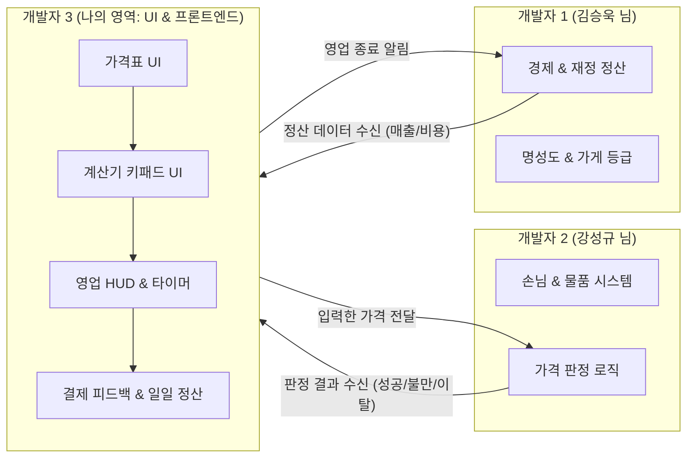

# 📘 [개발자 3 전용] UI · 입력 · 가격표 · 피드백 구현 가이드 및 로드맵

> **작성 대상**: 개발자 3 (이규영 님 전용 개인 개발 가이드)  
> **담당 영역**: **가격표 · 입력 · UI · 피드백 시스템**  
> **기준 문서**: 기획 문서 (2D 퍼즐게임 아이디어) 및 [개발 체크리스트](https://docs.google.com/spreadsheets/d/1PAsKzteDN3awiqwOH331VnG9f0Ljog7MJ6owkTJPNhE/edit?gid=0#gid=0)

---

## 1. 나의 역할 및 전체 업무 요약

개발자 3의 핵심 미션은 **"플레이어가 직접 보고 만지는 모든 프론트엔드 UI와 인터랙션"**을 완성하는 것입니다.  
다른 팀원들이 복잡한 경제 계산(개발자 1)이나 손님 판정 로직(개발자 2)을 만드는 동안, 나는 **플레이어에게 정보를 보여주고(가격표/HUD), 입력을 받고(계산기 키패드), 결과를 피드백(효과음/연출/정산창)**하는 역할을 전담합니다.



---

## 2. 세부 구현 과제 및 체크리스트

기획 문서 및 팀 체크리스트에서 도출된 나의 4대 핵심 과제입니다.

### 📌 1) 계산기 / 포스기 입력 및 검증 시스템
- [ ] **숫자 키패드 UI**: 0~9 숫자 버튼 터치/클릭 입력
- [ ] **수정 기능**: 한 글자 지우기(Backspace), 전체 지우기(Clear) 버튼
- [ ] **입력 가격 표시**: 현재 입력 중인 금액을 실시간 텍스트(`TextMeshProUGUI`)로 표시 (예: 천 단위 콤마 `1,500원`)
- [ ] **가격 확정 (Enter/결제)**: 입력한 금액을 개발자 2의 판정 시스템으로 전달
- [ ] **유효성 검사 (Validation)**: 
  - 0원으로 시작하는 비정상 입력 방지
  - 최대 자릿수 제한 (예: 999,999원 초과 입력 차단)
  - 빈 값 상태에서 결제 버튼 비활성화

### 📌 2) 가격표 시스템 (Price List)
- [ ] **가격표 UI 창 (Popup/Panel)**: 하루 시작 전 또는 영업 중 수시로 열어볼 수 있는 가격표 창
- [ ] **기본 가격 목록 표시**: 판매하는 물품의 아이콘, 이름, 기본 가격 표시
- [ ] **특이사항 반영 표시**:
  - 세일 이벤트 (예: 사과 20% 할인)
  - 1+1 묶음 이벤트 (예: 우유 1+1)
  - 인상/인하 강조 뱃지 또는 취소선 표시

### 📌 3) 영업 화면 UI & 타이머 (HUD & Screen Flow)
- [ ] **상단 HUD**:
  - 현재 날짜 (Day 1, Day 2...)
  - 현재 소지금 (개발자 1의 데이터 연동)
  - 가게 명성도 (하트 또는 별점)
- [ ] **영업시간 타이머 UI**:
  - 남은 영업시간 슬라이더(Gauge) 및 디지털 시계 텍스트 표시
  - 시간이 다 되었을 때 "영업 종료!" 알림 연출
- [ ] **화면 전환 플로우**:
  - `하루 시작(브리핑)` ➔ `영업 중(Main Game)` ➔ `일일 정산(Result)` 화면 간의 부드러운 전환

### 📌 4) 일일 결과 및 피드백 연출 (Feedback & Daily Result)
- [ ] **결제 성공 피드백**:
  - '팅~' 경쾌한 동전 효과음 재생
  - 계산대 위로 돈(+1,500) 텍스트가 위로 떠오르며 사라지는 애니메이션(DOTween)
- [ ] **결제 실패 / 불만 원인 표시**:
  - 가격 바가지 (손님 불만 아이콘 띄우기)
  - 손님 대기시간 초과로 인한 이탈 표시
- [ ] **일일 정산 결과 창**:
  - 오늘 총 매출, 유지비/재료비 지출, 순이익, 명성도 변화 요약 표시
  - '다음 날로 진행' 버튼

---

## 3. 단계별 추천 개발 로드맵 (초보자 맞춤형)

처음부터 씬 전체를 다 만들려고 하면 막막합니다.  
**가장 독립적이고 다른 팀원의 코드가 없어도 나 혼자 테스트할 수 있는 것부터** 순서대로 만듭니다.

```text
[Step 1] 계산기 키패드 UI  -->  [Step 2] 가격표 UI  -->  [Step 3] 영업 HUD & 타이머  -->  [Step 4] 결과창 & 피드백
 (혼자 100% 개발 가능)         (데이터 표시 중심)          (화면 배치 & 시간 흐름)       (팀원 시스템과 최종 연결)
```

---

### 🟢 Step 1: 계산기 키패드 UI 만들기 (가장 추천!)
- **목표**: 화면에 0~9 버튼과 지우기, 결제 버튼을 만들고, 숫자를 누르면 화면에 찍히게 하기.
- **왜 먼저 하나요?**: 다른 팀원의 시스템(손님, 경제 등)이 아직 완성되지 않았어도, **완전히 독립적으로 혼자 테스트**할 수 있기 때문입니다.

#### 1) 폴더 및 파일 생성
- 스크립트: `Assets/Scripts/UI/KeypadController.cs`
- 프리팹: `Assets/Prefabs/UI/KeypadPanel.prefab`

#### 2) 스크립트 뼈대 예시 (`KeypadController.cs`)
```csharp
using UnityEngine;
using TMPro;
using System;

/// <summary>
/// 계산대 포스기 키패드 입력 및 가격 검증 컨트롤러 (개발자 3 담당)
/// </summary>
public class KeypadController : MonoBehaviour
{
    [Header("UI References")]
    [SerializeField] private TextMeshProUGUI priceDisplayText;
    
    [Header("Settings")]
    [SerializeField] private int maxDigits = 6; // 최대 6자리 (999,999원)

    private long currentPrice = 0;

    // 가격 확정 시 다른 시스템(개발자 2)으로 알리는 이벤트
    public event Action<long> OnPriceConfirmed;

    private void Start()
    {
        UpdateDisplay();
    }

    /// <summary>0~9 숫자 버튼 클릭 시 호출 (버튼 OnClick에 연결)</summary>
    public void OnNumberButtonClick(int number)
    {
        if (currentPrice.ToString().Length >= maxDigits) return;

        currentPrice = (currentPrice * 10) + number;
        UpdateDisplay();
    }

    /// <summary>지우기 (← Backspace) 버튼 클릭</summary>
    public void OnBackspaceButtonClick()
    {
        currentPrice /= 10;
        UpdateDisplay();
    }

    /// <summary>전체 지우기 (Clear) 버튼 클릭</summary>
    public void OnClearButtonClick()
    {
        currentPrice = 0;
        UpdateDisplay();
    }

    /// <summary>결제/확정 (Enter) 버튼 클릭</summary>
    public void OnConfirmButtonClick()
    {
        if (currentPrice <= 0)
        {
            Debug.LogWarning("[Keypad] 0원은 결제할 수 없습니다!");
            return;
        }

        Debug.Log($"<color=cyan>[Keypad] 가격 확정: {currentPrice:N0}원</color>");
        OnPriceConfirmed?.Invoke(currentPrice);

        // 결제 후 입력창 초기화
        OnClearButtonClick();
    }

    private void UpdateDisplay()
    {
        if (priceDisplayText != null)
        {
            // 천 단위 콤마 포맷 (예: 1,500원)
            priceDisplayText.text = $"{currentPrice:N0} 원";
        }
    }
}
```

---

### 🟡 Step 2: 가격표 UI 만들기
- **목표**: 상품 이름과 가격이 적힌 메뉴판/가격표 팝업 만들기.
- **연동 지점**: 나중에는 CSV 데이터 테이블(`DataTableManager`)에서 읽어오겠지만, 지금은 임시 데이터로 UI 슬롯 목록을 만들어 둡니다.

#### 구조 가이드
- `PriceListPanel.cs`: 가격표 창 열기/닫기 제어
- `PriceItemSlot.cs`: 개별 상품 1줄 (아이콘 Image + 상품명 Text + 가격 Text + 특이사항 뱃지)
- `PriceItemSlot.prefab`을 만들어 ScrollView의 Content 밑에 복제하여 배치

---

### 🟠 Step 3: 영업 HUD & 타이머 만들기
- **목표**: 상단에 남은 시간 바가 줄어들고, 0초가 되면 영업 종료 이벤트를 발생시키기.

#### 스크립트 뼈대 예시 (`DayTimerController.cs`)
```csharp
using UnityEngine;
using UnityEngine.UI;
using TMPro;
using System;

/// <summary>
/// 영업시간 실시간 카운트다운 타이머 (개발자 3 담당)
/// </summary>
public class DayTimerController : MonoBehaviour
{
    [SerializeField] private Slider timeSlider;
    [SerializeField] private TextMeshProUGUI timeText;

    private float totalBusinessTime = 60f; // 영업시간 60초 (기획에 따라 조정)
    private float remainingTime = 0f;
    private bool isRunning = false;

    public event Action OnBusinessDayEnded;

    public void StartTimer(float businessTimeSeconds)
    {
        totalBusinessTime = businessTimeSeconds;
        remainingTime = businessTimeSeconds;
        isRunning = true;
    }

    private void Update()
    {
        if (!isRunning) return;

        remainingTime -= Time.deltaTime;
        if (remainingTime <= 0f)
        {
            remainingTime = 0f;
            isRunning = false;
            UpdateUI();
            Debug.Log("<color=yellow>[DayTimer] 영업시간 종료!</color>");
            OnBusinessDayEnded?.Invoke();
            return;
        }

        UpdateUI();
    }

    private void UpdateUI()
    {
        if (timeSlider != null) timeSlider.value = remainingTime / totalBusinessTime;
        if (timeText != null) timeText.text = $"{Mathf.CeilToInt(remainingTime)}초";
    }
}
```

---

### 🔴 Step 4: 피드백 연출 및 일일 정산 화면
- **목표**:
  - 결제 성공 시 DOTween을 활용한 팝업 애니메이션 (`transform.DOScale(...)`)
  - '동전 짤랑' 효과음 재생 (`ResourceManager.Instance.LoadAssetAsync<AudioClip>(...)`)
  - 정산 창(`DailyResultPanel.cs`)에서 매출/지출/순익 표시

---

## 4. 나만의 개인 로컬 씬 작업 워크플로우

1. **개인 씬 만들기**:
   - Unity에서 빈 씬을 생성하고 `Assets/Scenes/Local/Dev3_UI_Sandbox.unity`로 저장합니다.
   - (주의: `Assets/Scenes/Local/` 폴더는 `.gitignore` 처리되어 있어 Git에 올라가지 않으므로 안전합니다.)
2. **에디터 설정 등록**:
   - Unity 상단 메뉴에서 `Cashier > Gameplay Scene Settings`를 엽니다.
   - `Personal Scene` 항목에 방금 만든 `Dev3_UI_Sandbox.unity`를 등록합니다.
3. **실행 테스트**:
   - `Assets/Scenes/InitScene.unity`를 열고 Play를 누릅니다.
   - 매니저 초기화 후 자동으로 내 개인 씬으로 진입합니다!
4. **결과물 통합 시**:
   - 내 씬 파일은 그대로 두고, 내가 완성한 **프리팹(`KeypadPanel.prefab`, `PriceListPanel.prefab` 등)과 스크립트**만 Git에 올리면 됩니다.

---

## 5. 다른 팀원들과 대화할 때 쓸 수 있는 치트키 질문들

팀 회의나 메신저에서 아래 문장들을 그대로 사용하시면 매우 프로페셔널하게 소통하실 수 있습니다!

- **개발자 2(강성규 님)에게**:
  > *"성규 님, 제가 계산대 키패드에서 가격을 확정했을 때 넘겨드릴 `OnPriceConfirmed(long price)` 이벤트를 만들어 두었습니다. 나중에 손님 물품 총액 비교하실 때 이 이벤트 구독해서 판정 로직 연결하시면 될 것 같아요!"*
- **개발자 1(김승욱 님)에게**:
  > *"승욱 님, 하루 영업이 끝났을 때 일일 정산창에 띄워야 할 데이터(총매출, 재료비, 순수익, 명성 변화)가 어떤 DTO나 클래스 형태로 넘어오는지 알 수 있을까요? UI 텍스트 연결해 두겠습니다!"*
- **공통/팀 리더(김기도 님)에게**:
  > *"UI에 사용할 효과음(결제 성공 팅 소리, 손님 불만 부저 소리)이나 버튼 스프라이트 에셋이 리소스 폴더(Addressables)에 올라오면 알려주세요. 바로 연결하겠습니다!"*
