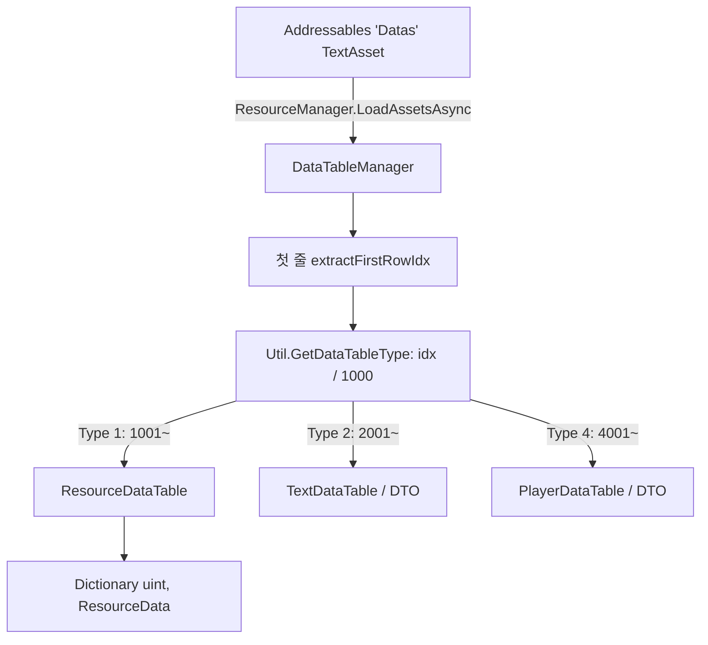
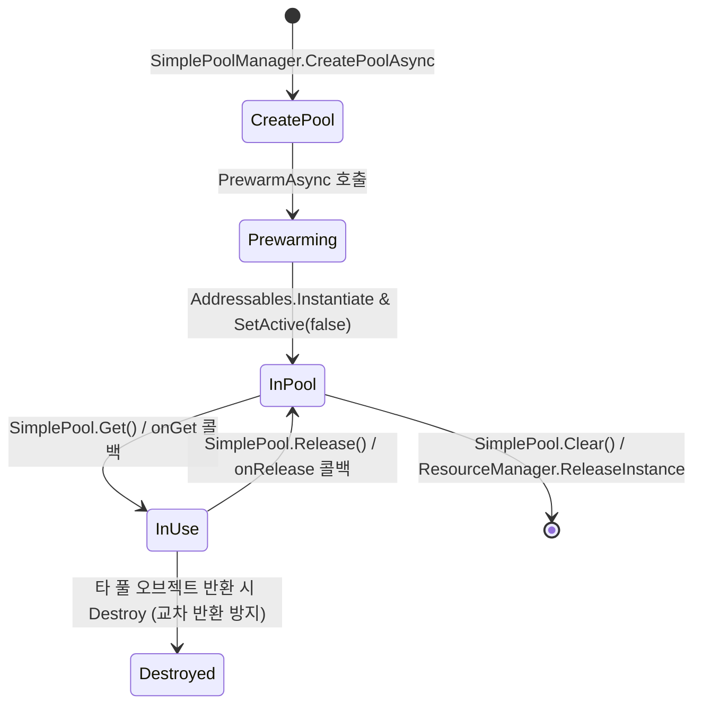
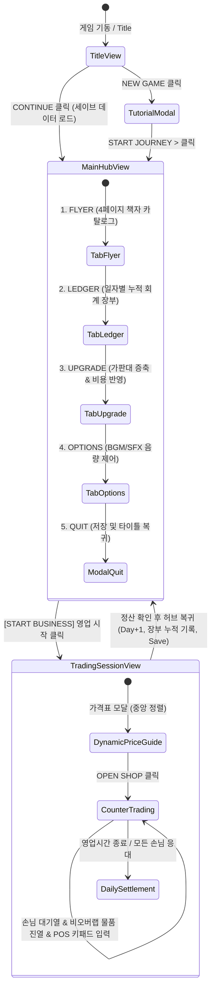

# Cashier 프로젝트 스크립트 가이드 (SCRIPT_GUIDE.md)

이 문서는 `c:\unityProject\Cashier` 프로젝트에 존재하는 C# 스크립트들의 구조, 역할, 주요 API 및 시스템 간 데이터·실행 흐름을 설명합니다.

---

## 1. 스크립트 개요 및 디렉터리 구성

현재 프로젝트의 스크립트는 `Assets/Scripts/` 하위에 위치하며, 기능 및 책임에 따라 공용 계약(`Commons`), 핵심 서비스 매니저(`Manager`), 씬 수명 컴포넌트(`Scene`), 프론트엔드 UI 및 인터랙션(`UI`), 범용 유틸리티(`Utils`), 에디터 도구(`Scene/Editor`) 및 루트 임시 스크립트로 구성되어 있습니다.

### 디렉터리 구조 요약

```text
Assets/Scripts/
├── Commons/
│   └── Commons.cs               # 공용 enum, 인터페이스, DTO, 상수
├── Manager/
│   ├── DataTableManager.cs      # CSV 데이터 테이블 로딩·캐싱 관리자 (Singleton)
│   ├── GameSceneManager.cs      # 씬 전환 및 로딩 제어 관리자 (Singleton)
│   ├── ResourceDataTable.cs     # 리소스 키 매핑 데이터 테이블 (IDataLoad 구현)
│   ├── ResourceManager.cs       # Addressables 기반 리소스 로딩/인스턴스화/캐싱 (Singleton)
│   └── SimplePoolManager.cs     # 오브젝트 풀 컨테이너 관리자 (Singleton)
├── Scene/
│   ├── InitScene.cs             # 부팅 씬 진입점 (매니저 및 데이터 초기화)
│   ├── LoadingScene.cs          # 로딩 UI (프로그레스 바, 텍스트, CanvasGroup 페이드)
│   ├── HubScene.cs              # 부트 후 게임 씬 분기 진입점
│   └── Editor/
│       └── GameplaySceneSettings.cs # 개인 개발 씬 설정 및 진입 검증 에디터 윈도우
├── UI/
│   ├── Contracts/
│   │   └── UIContracts.cs           # UI 표현 계층 데이터 계약 (ViewData 스냅샷 구조체군 & GameDayPhase)
│   ├── Presenters/
│   │   ├── BusinessTimerPresenter.cs # 영업시간 표시 및 일시정지/재개 요청 Presenter
│   │   ├── CustomerPresenter.cs      # 손님 외형, 대사, 장바구니 표시 Presenter
│   │   ├── DailySettlementPresenter.cs # 일일 정산 표시 및 다음 단계 요청 Presenter
│   │   ├── EconomyStatusPresenter.cs # 재정 상태(보유금, 일일 판매수입) 표시 Presenter
│   │   ├── GameDayPresenter.cs       # 날짜, 정산일 여부, 진행 상태 표시 Presenter
│   │   └── PriceInputPresenter.cs    # 포스기 키패드 입력 및 가격 확정/취소 요청 Presenter
│   ├── CashierSaveData.cs       # 일일 장부(LedgerRecord), 세이브 데이터 컨테이너 및 PlayerPrefs 관리자
│   ├── CashierSession.cs        # 코어 세션 엔진 (Phase, 손님 생성, 바구니, 게이지, 가격 판정, 공물)
│   ├── DailyResultPanel.cs      # 영업 종료 후 일일 정산 UI 패널 (DailySettlementViewData 지원)
│   ├── DayTimerController.cs    # 실시간 영업시간 카운트다운 게이지 및 시계 타이머 (BusinessTimerViewData 지원)
│   ├── Dev3SandboxTester.cs     # 개발자 3 전용 단일 씬 통합 UI 테스터 및 샌드박스 코디네이터
│   ├── KeypadController.cs      # 포스기 숫자 키패드 (마우스/키보드 입력, 자릿수 검증, 확정 이벤트)
│   ├── PriceItemSlot.cs         # 가격표 개별 상품 항목 1줄 UI 슬롯 (이름, 가격, 특이사항 뱃지, 아이콘)
│   └── PriceListPanel.cs        # 가격표(전단지/카탈로그) 팝업 패널 제어기
├── Utils/
│   ├── CollectionExtensions.cs  # 컬렉션 셔플 확장 메서드
│   ├── FloatArrayConverter.cs   # CsvHelper: string -> float[] 변환기 ('_')
│   ├── IntArrayConverter.cs     # CsvHelper: string -> int[] 변환기 ('_')
│   ├── UIntArrayConverter.cs    # CsvHelper: string -> uint[] 변환기 ('_')
│   ├── ZeroOneBooleanConverter.cs # CsvHelper: string("0"/"1") <-> bool 변환기
│   ├── LoadingBarController.cs  # 로딩 바 UI 연동 제어기 (Singleton)
│   ├── SimplePool.cs            # 제네릭 오브젝트 풀 구현체 (IPool)
│   ├── Singleton.cs             # MonoBehaviour 제네릭 싱글톤 기반 클래스
│   └── Util.cs                  # 인덱스 규칙, CSV 파싱, 좌표 변환, 난수, 베지어 유틸
└── Test.cs                      # 개발/테스트용 임시 컴포넌트
```

### 스크립트 목록 요약

| 파일 경로 | 주요 클래스/타입 | 상속 / 구현 | 핵심 역할 |
|---|---|---|---|
| `Commons/Commons.cs` | `DataTableType`, `IDataLoad`, `CommonConstants`, `ResourceData`, `TextData` | - / `IDataLoad` | 전역 enum, CSV 로더 인터페이스, DTO 및 전역 상수 정의 |
| `Manager/ResourceManager.cs` | `ResourceManager` | `Singleton<ResourceManager>` | Addressables 초기화, 카탈로그 업데이트, 의존성 다운로드, 에셋 로드 및 인스턴스화, SpriteAtlas 연동 |
| `Manager/DataTableManager.cs` | `DataTableManager` | `Singleton<DataTableManager>` | CSV 데이터 비동기 로딩, 파싱, 캐싱 총괄. `idx` 기반 데이터 테이블 자동 식별 |
| `Manager/ResourceDataTable.cs` | `ResourceDataTable` | `IDataLoad` | Addressable 에셋 키 참조 테이블 (`ResourceData.csv` 1:1 매핑) |
| `Manager/GameSceneManager.cs` | `GameSceneManager` | `Singleton<GameSceneManager>` | Addressables 기반 씬 전환, `LoadingScene` 경유 전환, 로컬 개인 씬 분기 처리 |
| `Manager/SimplePoolManager.cs` | `SimplePoolManager` | `Singleton<SimplePoolManager>` | Addressables 및 일반 프리팹 기반의 풀 생성, 대여(`Get`), 반환(`Release`), 해제 관리 |
| `Scene/InitScene.cs` | `InitScene` | `MonoBehaviour` | 게임 기동 시 최초 실행되는 부트 컴포넌트. 필수 매니저 및 데이터 준비 후 Hub 씬으로 전환 |
| `Scene/LoadingScene.cs` | `LoadingScene` | `MonoBehaviour` | 씬 전환 도중 로딩 프로그레스 바 및 텍스트 표시, DOTween 페이드 연출 |
| `Scene/HubScene.cs` | `HubScene` | `MonoBehaviour` | 부트스트랩 완료 후 개인 씬 또는 `MainScene`으로 게임플레이 진입 위임 |
| `Scene/Editor/GameplaySceneSettings.cs` | `GameplaySceneSettings` | `EditorWindow` | Git에 커밋되지 않는 로컬 개인 씬(`Assets/Scenes/Local/`) 선택 및 진입 검증 도구 |
| `UI/Contracts/UIContracts.cs` | `EconomyStatusViewData`, `GameDayViewData`, `BusinessTimerViewData`, `ItemPriceViewData`, `CustomerViewData`, `PriceInputViewData`, `DailySettlementViewData`, `GameDayPhase` | - | UI 표현 계층 데이터 계약 스냅샷 DTO 및 진행 Phase 열거형 |
| `UI/Presenters/EconomyStatusPresenter.cs` | `EconomyStatusPresenter` | `MonoBehaviour` | 상단 HUD 재정 상태(보유금, 일일 판매수입) 표시 Presenter |
| `UI/Presenters/GameDayPresenter.cs` | `GameDayPresenter` | `MonoBehaviour` | 날짜, 상납/정산일까지 남은 일수, 정산일 여부, 진행 상태 표시 Presenter |
| `UI/Presenters/BusinessTimerPresenter.cs` | `BusinessTimerPresenter` | `MonoBehaviour` | 영업시간 타이머 게이지 및 시계 표시, 일시정지/재개 요청 Presenter |
| `UI/Presenters/CustomerPresenter.cs` | `CustomerPresenter` | `MonoBehaviour` | 손님 외형(컬러/스프라이트), 대사, 장바구니 품목 표시 Presenter |
| `UI/Presenters/PriceInputPresenter.cs` | `PriceInputPresenter` | `MonoBehaviour` | 포스기 키패드 입력값 및 검증 상태 표시, 가격 확정/취소 요청 Presenter |
| `UI/Presenters/DailySettlementPresenter.cs` | `DailySettlementPresenter` | `MonoBehaviour` | 일일 정산(매출, 지출, 순익, 잔액, 평판, 손님 통계) 표시 및 다음 단계 요청 Presenter |
| `UI/Dev3SandboxTester.cs` | `Dev3SandboxTester`, `GameViewState` | `MonoBehaviour` | 개발자 3 통합 샌드박스 UI 제어기. Full HD 1920x1080 동적 캔버스 생성 및 타이틀·튜토리얼·메인 허브(전단지/장부/증축/설정)·포스기 화면 총괄 |
| `UI/KeypadController.cs` | `KeypadController` | `MonoBehaviour` | 포스기 키패드 입력 컨트롤러. 마우스/키보드(0~9, -, ., Backspace, Enter) 입력 처리, 자릿수 유효성 검증 및 `OnPriceConfirmed` 이벤트 발신 |
| `UI/PriceListPanel.cs` | `PriceListPanel`, `ItemPriceInfo` | `MonoBehaviour` | 가격표(전단지) 팝업 패널. 상품 목록 동적 생성, 열기/닫기/토글 및 샘플 데이터 바인딩 |
| `UI/PriceItemSlot.cs` | `PriceItemSlot` | `MonoBehaviour` | 가격표 내 개별 상품 1개 행 슬롯 UI. 상품명, 가격, 특이사항 뱃지(세일/이벤트), 아이콘 표시 |
| `UI/DayTimerController.cs` | `DayTimerController` | `MonoBehaviour` | 실시간 영업시간 카운트다운 타이머. 슬라이더 게이지 및 디지털 시계 UI 갱신, `OnBusinessDayEnded` 이벤트 발신 |
| `UI/DailyResultPanel.cs` | `DailyResultPanel` | `MonoBehaviour` | 일일 정산 및 경영 피드백 패널. 총매출, 지출, 순이익, 명성도 변화 표시 및 '다음 날로 진행' 이벤트 연동 |
| `UI/CashierSession.cs` | `CashierSession`, `CashierSettings`, `CashierProduct`, `CashierCustomer`, `CashierBasketLine`, `CashierPhase` | - | 프로토타입 기반 순수 C# 세션 엔진. 7단계 Phase, 손님 및 장바구니 생성, 인내심 게이지, 가격 판정 및 공물(Tribute) 규칙 관리 |
| `UI/CashierSaveData.cs` | `LedgerRecord`, `GameSaveData`, `CashierSaveManager` | - | 세이브 데이터 컨테이너 및 영구 저장 관리자. 일자별 회계 장부 이력, 소지금, 명성도, 증축 티어 직렬화 및 PlayerPrefs 저장 |
| `Utils/Singleton.cs` | `Singleton<T>` | `MonoBehaviour` | `DontDestroyOnLoad` 및 중복 방지 로직이 포함된 제네릭 싱글톤 기반 추상 클래스 |
| `Utils/Util.cs` | `Util` | - | `idx` 기반 테이블/아이디 추출, CsvHelper 파싱 헬퍼, 난수 추첨, UI 좌표 변환, 베지어 곡선 |
| `Utils/SimplePool.cs` | `IPool`, `SimplePool<T>` | `IPool` | 큐 기반 제네릭 오브젝트 풀. 인스턴스 소유권 추적, 용량 제한, 사전 생성(`Prewarm`) 지원 |
| `Utils/LoadingBarController.cs` | `LoadingBarController` | `Singleton<LoadingBarController>` | 로딩 진행률 이벤트를 활성 `LoadingScene`에 전달하는 브리지 |
| `Utils/CollectionExtensions.cs` | `CollectionExtensions` | - | `IEnumerable<T>` 대상 Fisher-Yates 기반 `Shuffle<T>` 확장 메서드 |
| `Utils/IntArrayConverter.cs` | `IntArrayConverter` | `DefaultTypeConverter` | CSV 파싱 시 `_` 구분 문자열을 `int[]`로 변환 |
| `Utils/UIntArrayConverter.cs` | `UIntArrayConverter` | `DefaultTypeConverter` | CSV 파싱 시 `_` 구분 문자열을 `uint[]`로 변환 |
| `Utils/FloatArrayConverter.cs` | `FloatArrayConverter` | `DefaultTypeConverter` | CSV 파싱 시 `_` 구분 문자열을 `float[]`로 변환 (InvariantCulture) |
| `Utils/ZeroOneBooleanConverter.cs` | `ZeroOneBooleanConverter` | `DefaultTypeConverter` | CSV 파싱 시 `"0"`/`"1"`을 `bool`로 상호 변환 |
| `Test.cs` | `Test` | `MonoBehaviour` | 단순 디버그 로그 출력용 테스트 컴포넌트 |

---

## 2. 세부 스크립트 분석

### 2.1 Commons 계층 (`Assets/Scripts/Commons/`)

#### `Commons.cs`
- **책임**: 여러 시스템 간에 공유되는 핵심 타입, 인터페이스, 상수, DTO를 정의합니다.
- **주요 구성 요소**:
  - `DataTableType` (Enum): 데이터 테이블 고유 타입 (None=0, Resource=1, Text=2, PlayerData=4, DataTableType_End). `idx / 1000` 규칙과 1:1 대응합니다.
  - `IDataLoad` (Interface): CSV 데이터 테이블 표준 계약.
    - `int GetDataCount()`: 캐싱된 행 개수 반환.
    - `void LoadData(string csvText)`: CSV 텍스트 파싱 및 메모리 적재.
    - `void Release()`: 캐시된 데이터 해제.
  - `CommonConstants` (Static Class): 전역 공통 상수 (`AddressableLabelDatas = "Datas"`, `AddressableLabelAnims = "Anims"`, `AddressableLabelPrefabs = "Prefabs"`, `ParryWindowDuration = 0.15f`).
  - `ResourceData` (Class): `ResourceData.csv` 1:1 DTO (`Idx`, `Path`).
  - `TextData` (Class): `TextData.csv` 1:1 DTO (`Idx`, `Kr`).

---

### 2.2 Manager 계층 (`Assets/Scripts/Manager/`)

#### `ResourceManager.cs`
- **책임**: Unity Addressables 기반의 모든 리소스 로딩, 인스턴스화, 캐싱, 카탈로그 동기화, 메모리 해제를 총괄합니다.
- **주요 특징**:
  - `Singleton<ResourceManager>`을 상속하여 전역 수명을 가집니다.
  - UniTask 기반 비동기 파이프라인과 엄격한(strict) 에러 처리를 채택합니다.
  - `SpriteAtlasManager.atlasRequested` 이벤트를 구독하여 아틀라스 에셋 요청을 자동 처리합니다.
- **주요 메서드**:
  - `UniTask InitAsync(Action onComplete, CancellationToken cancellationToken)`: Addressables 시스템 초기화, 원격 카탈로그 검사/업데이트, `"Datas"` 라벨 기반 의존성 다운로드를 순차 수행합니다.
  - `void LoadAssetAsync<T>(string key, Action<T> onLoaded)`: 콜백 방식 에셋 로드 (기존 핸들 재사용).
  - `UniTask<T> LoadAssetAsync<T>(string key)`: UniTask 비동기 에셋 로드.
  - `Task<T> LoadAssetAsyncTask<T>(string key)`: TaskCompletionSource 기반 C# Task 에셋 로드.
  - `void LoadAssetsAsync<T>(IList<IResourceLocation> locList, Action<T> onComp, ...)`: 리소스 위치 목록 일괄 비동기 로드.
  - `Task<GameObject> InstantiateAsyncTask(string key, Transform parent, Vector3?, Quaternion?)`: Addressables 기반 비동기 게임오브젝트 인스턴스화 및 핸들 추적.
  - `T GetResource<T>(string key)`: 이미 로드되어 캐싱된 핸들의 결과 반환.
  - `Sprite GetSpriteFromAtlas(string atlasKey, string key)`: 로드된 `SpriteAtlas`에서 스프라이트 추출.
  - `void ReleaseInstance(GameObject go)`: 인스턴스화 핸들을 찾아 `Addressables.ReleaseInstance` 수행.
  - `void Release(string key)` / `void ReleaseAll()`: 로드 핸들 및 인스턴스 핸들 일괄 해제.

#### `DataTableManager.cs`
- **책임**: 게임 내 모든 CSV 데이터 테이블의 비동기 로딩, 파싱, 인메모리 캐싱을 총괄합니다.
- **주요 특징**:
  - `Singleton<DataTableManager>` 상속.
  - 파일명이나 라벨에 의존하지 않고, **CSV 첫 행의 `idx` 값(`Util.GetDataTableType`)을 기준으로 `DataTableType`을 판별**하는 무결성 검증 규칙을 사용합니다.
  - Addressables `"Datas"` 라벨의 `TextAsset`을 우선 검색하며, 미준비 시 `Resources/datas` 또는 Editor `AssetDatabase`를 통한 Fallback 로드를 지원합니다.
- **주요 메서드**:
  - `UniTask EnsureDataLoadedAsync()`: 데이터 테이블 비동기 로딩 및 캐싱 완료 대기.
  - `T GetDB<T>(uint idx)` / `T GetDB<T>(DataTableType dataTableType)`: 등록된 `IDataLoad` 테이블 조회.
  - `int GetDataCount<T>(DataTableType dataTableType)`: 해당 테이블의 레코드 수 조회.
  - `preloadDataTablesAsync()`: Addressables `"Datas"` 위치 로드 후 파일 단위 격리 파싱 진행.
  - `parseAndCacheCsv(string assetName, string csvText)`: 첫 줄 `idx` 파싱 -> `DataTableType` 도출 -> 해당 로더의 `LoadData(csvText)` 호출.

#### `ResourceDataTable.cs`
- **책임**: `ResourceData.csv` (1001번대) 데이터를 메모리에 보관하고 빠른 경로 검색을 제공합니다.
- **주요 특징**:
  - `IDataLoad` 인터페이스 구현체.
  - `Dictionary<uint, ResourceData>`를 내부 저장소로 사용.
  - CsvHelper를 통해 `csvText`를 파싱하여 `Idx`를 키로 캐싱.
- **주요 메서드**:
  - `bool TryGetResource(uint idx, out ResourceData data)`: `idx`로 `ResourceData` 조회.
  - `string GetResourcePath(uint idx)`: Addressable Key 문자열(경로) 반환.
  - `Release()`: 딕셔너리 정리.

#### `GameSceneManager.cs`
- **책임**: 전역 수명으로 공유 씬 및 로컬 개인 씬 간의 비동기 전환과 로딩 연출을 총괄합니다.
- **주요 특징**:
  - `Singleton<GameSceneManager>` 상속.
  - 전환 순서: **현재 씬 → `LoadingScene` 로드 및 대기(0.3초) → 목적지 씬 로드**.
  - `isTransitioning` 플래그를 통해 전환 중 재진입 및 중복 전환을 철저히 차단.
  - Editor 환경에서 `Assets/Scenes/Local/` 경로의 개인 개발 씬 로드를 지원(EditorPrefs 기반). 빌드 환경에서는 항상 `MainScene`으로 진입.
- **주요 메서드**:
  - `UniTask TransitionTo(SceneName target)`: 공유 씬(`Init`, `Hub`, `Main`)으로 전환.
  - `UniTask TransitionToGameplayAsync()`: Editor 설정을 읽어 로컬 개인 씬 또는 `MainScene`으로 전환.
  - `UniTask LoadSceneAsync(AssetReference sceneRef, ...)`: AssetReference 기반 전환.

#### `SimplePoolManager.cs`
- **책임**: 게임 전역의 오브젝트 풀 생성, 대여, 반환을 관리하는 매니저입니다.
- **주요 특징**:
  - `Singleton<SimplePoolManager>` 상속.
  - `Dictionary<string, IPool>` 컨테이너로 Addressable Key 기준 풀 인스턴스를 관리.
- **주요 메서드**:
  - `UniTask<bool> CreatePoolAsync<T>(string addressableKey, int capacity, int prewarmCount, ...)`: Addressables 키를 기반으로 `SimplePool<T>`을 비동기 생성하고 사전 생성(`PrewarmAsync`) 수행.
  - `T Get<T>(string addressableKey)`: 풀에서 오브젝트 대여 및 활성화.
  - `void Release<T>(string addressableKey, T instance)`: 오브젝트 반환 및 비활성화.
  - `void ClearPool(string addressableKey)` / `ClearAll()`: 특정 풀 또는 전체 풀 제거.

---

### 2.3 Scene 계층 (`Assets/Scripts/Scene/`)

#### `InitScene.cs`
- **책임**: 게임 실행(Boot) 시 가장 먼저 로드되는 씬의 진입 제어기입니다.
- **동작 흐름**:
  1. `GameSceneManager`, `ResourceManager`, `DataTableManager` 게임오브젝트 존재 여부 확인.
  2. `ResourceManager.Instance.InitAsync()` 호출 (Addressables 초기화 및 의존성 다운로드 완료 대기).
  3. `DataTableManager.Instance.EnsureDataLoadedAsync()` 대기 (CSV 데이터 캐싱 완료 대기).
  4. `GameSceneManager.Instance.TransitionTo(nextScene)` 호출하여 `HubScene`으로 전환.

#### `LoadingScene.cs`
- **책임**: 씬 전환 시 화면 가림 및 로딩 진행 상황을 시각화합니다.
- **주요 특징**:
  - `CanvasGroup`을 이용한 진입 페이드인(0.3초, `DOFade`).
  - `LoadingBarController.Instance.Register(this)`로 자신을 등록하여 진행률 이벤트를 수신.
  - `SetProgress(float p)`: 프로그레스 바 FillAmount 및 백분율 텍스트(TMP) 갱신.
  - `OnDisable` 시 트윈 강제 정리(`DOKill`) 및 등록 해제(`Unregister`).

#### `HubScene.cs`
- **책임**: 부트스트랩 완료 후 실제 게임플레이 씬으로 라우팅하는 허브 진입점입니다.
- **동작 흐름**:
  - `Start()`에서 1프레임 대기 후 `GameSceneManager.Instance.TransitionToGameplayAsync()`를 호출하여 개발자의 개인 씬 또는 `MainScene`으로 전환을 위임합니다.

#### `Scene/Editor/GameplaySceneSettings.cs`
- **책임**: 협업 환경에서 각 개발자가 공유 씬 충돌 없이 개별 작업 씬을 테스트할 수 있도록 지원하는 Unity Editor 확장 도구입니다.
- **메뉴 항목**:
  - `Cashier > Gameplay Scene Settings`: EditorWindow를 열어 `Assets/Scenes/Local/` 폴더 내 개인 씬을 선택하거나 `Use MainScene`으로 복원 (EditorPrefs에 GUID 저장).
  - `Cashier > Validate Gameplay Entry`: `InitScene`부터 시작하여 올바른 목적지 씬에 도달했는지 및 매니저들이 유지되는지 자동 검사.

---

### 2.4 Utils 계층 (`Assets/Scripts/Utils/`)

#### `Singleton.cs`
- **책임**: `MonoBehaviour` 기반 싱글톤 패턴의 전역 수명 표준 뼈대를 제공합니다.
- **주요 특징**:
  - `DontDestroyOnLoad(gameObject)` 적용.
  - 중복 인스턴스 씬 생성 시 새로 생성된 인스턴스를 즉시 `Destroy`하여 단일 인스턴스 보장.
  - 가상 메서드 `OnSingletonAwake()`, `OnSingletonDestroyed()`를 제공하여 파생 클래스가 수명주기 훅을 안전하게 오버라이드할 수 있음.

#### `Util.cs`
- **책임**: 게임 전반에서 재사용되는 수학, 좌표 변환, CSV 설정 및 ID 매핑 헬퍼를 제공하는 정적 클래스입니다.
- **주요 함수**:
  - `DataTableType GetDataTableType(uint idx)`: `idx / 1000`으로 데이터 테이블 타입 반환.
  - `uint GetDataInnerId(uint idx)`: `idx % 1000`으로 내부 고유 번호 반환.
  - `uint CreateDataIdx(DataTableType type, uint innerId)`: `(type * 1000) + innerId`로 복합 ID 생성.
  - `CsvConfiguration GetCsvConfiguration()`: InvariantCulture 및 소문자 헤더 매칭 설정 반환.
  - `List<T> ParseFromCSV<T>(string csvText)`: CsvReader를 통한 제네릭 파싱.
  - `int GetRandom(min, max, exclusive/exclusives)`: 특정 값을 제외한 난수 추출.
  - `Vector2 WorldToCanvasPosition(Canvas, Camera, Vector3)`: 월드 3D/2D 위치를 UI 캔버스 앵커 로컬 좌표로 변환.
  - `Vector3 CalcBezierPoint_Quadratic(float t, Vector3 p0, Vector3 p1, Vector3 p2)`: 2차 베지어 곡선 보간.

#### `SimplePool.cs`
- **책임**: 재사용 가능한 제네릭 오브젝트 풀링 클래스입니다.
- **주요 특징**:
  - 일반 프리팹(`Instantiate`) 및 Addressables(`ResourceManager.InstantiateAsyncTask`) 기반 비동기 인스턴스 생성을 모두 지원.
  - `ownedInstanceIds` (HashSet)와 `pooledInstanceIds`를 통해 풀 소유권과 이중 반환(Double-Release)을 엄격히 방어.
  - `Capacity` 상한 제한 및 `PrewarmAsync(count)` 사전 풀 생성 지원.

#### `LoadingBarController.cs`
- **책임**: 비동기 로딩 진행률을 활성화된 `LoadingScene`에 전달하는 싱글톤 중계자입니다.
- `Register`, `Unregister`, `SetProgress(float progress)` 제공.

#### `CollectionExtensions.cs`
- **책임**: `IEnumerable<T>` 컬렉션을 랜덤하게 섞는 `Shuffle<T>()` 확장 메서드 제공 (Fisher-Yates 알고리즘).

#### CsvHelper 커스텀 타입 컨버터들
- **`IntArrayConverter.cs`**: `1_2_3` 형식의 문자열을 `int[]`로 파싱.
- **`UIntArrayConverter.cs`**: `1_2_3` 형식의 문자열을 `uint[]`로 파싱.
- **`FloatArrayConverter.cs`**: `1.5_2.5_3.0` 형식의 문자열을 `float[]`로 파싱 (CultureInfo.InvariantCulture).
- **`ZeroOneBooleanConverter.cs`**: `"0"`을 `false`, `"1"`을 `true`로 양방향 직렬화/역직렬화.

---

### 2.5 UI 계층 (`Assets/Scripts/UI/`)

개발자 3(이규영 님)이 담당하는 프론트엔드 UI, 인터랙션, 입력 및 가격표·장부 시스템 스크립트 군입니다.
모든 화면은 Full HD(1920x1080) 해상도 기준 캔버스 스케일링을 준수하며, **UI 표현 계층 책임과 데이터 계약**에 따라 순수 **MVP(Model-View-Presenter)** 아키텍처를 따릅니다.
게임 규칙, 날짜 진행, 거래 판정, 재정 계산과 데이터 저장은 UI 계층에 포함하지 않으며, Presenter는 외부에서 주입받은 읽기 전용 `ViewData` 스냅샷만 렌더링하고 사용자 입력을 요청 이벤트로 전달합니다.

#### 2.5.1 데이터 계약 (`Assets/Scripts/UI/Contracts/UIContracts.cs`)
- **책임**: UI 시스템과 외부 도메인 로직(Finance, 진행, 손님 시스템) 간의 읽기 전용 스냅샷 DTO 정의.
- **주요 타입**:
  - `EconomyStatusViewData`: `CurrentBalance`, `DailySaleIncome`
  - `GameDayViewData`: `CurrentDay`, `DaysUntilSettlement`, `IsSettlementDay`, `GameDayPhase`
  - `BusinessTimerViewData`: `RemainingSeconds`, `NormalizedTime`, `IsPaused`
  - `ItemPriceViewData`: `ItemId`, `DisplayName`, `Price`, `SpecialNote`, `Icon`, `IsAvailable`
  - `CustomerBasketItemViewData`: `ItemId`, `DisplayName`, `Quantity`, `Icon`, `UnitPrice`
  - `CustomerViewData`: `HasCustomer`, `AppearanceColor`, `AppearanceSprite`, `DialogueText`, `Basket`
  - `PriceInputViewData`: `InputAmount`, `CanConfirm`, `IsInputEnabled`, `ValidationMessage`
  - `TransactionViewData`: `WasAccepted`, `OfferedPrice`, `FeedbackMessage`
  - `DailySettlementViewData`: `Day`, `SaleIncome`, `Expenses`, `NetProfit`, `CurrentBalance`, `ReputationDelta`, `SuccessfulSales`, `RefusedCustomers`, `DepartedCustomers`

#### 2.5.2 Presenter 컴포넌트군 (`Assets/Scripts/UI/Presenters/`)
- **`EconomyStatusPresenter.cs`**: 상단 HUD에 현재 재정 상태 표시 (`UpdateView(EconomyStatusViewData)`).
- **`GameDayPresenter.cs`**: 현재 날짜, 정산일까지 남은 일수, 정산일 여부, 진행 단계 표시 (`UpdateView(GameDayViewData)`).
- **`BusinessTimerPresenter.cs`**: 남은 시간 및 게이지 표시, `OnPauseRequested` / `OnResumeRequested` 이벤트 발신 (`UpdateView(BusinessTimerViewData)`).
- **`CustomerPresenter.cs`**: 손님 외형(스프라이트/색상), 대사, 장바구니 품목 표시, 손님 부재 시 UI 숨김 (`UpdateView(CustomerViewData)`).
- **`PriceInputPresenter.cs`**: 키패드 입력 금액, 유효성 메시지 표시, `OnPriceConfirmed(long)` / `OnInputCancelled` 이벤트 발신 (`UpdateView(PriceInputViewData)`).
- **`DailySettlementPresenter.cs`**: 하루 영업 마감 후 일일 정산 표시, `OnNextStepRequested` 이벤트 발신 (`UpdateView(DailySettlementViewData)`).

#### 2.5.3 View 및 오케스트레이터 (`Assets/Scripts/UI/`)

#### `Dev3SandboxTester.cs`
- **책임**: 개발자 3의 단일 씬 완결형 UI 샌드박스 테스터로, 게임 전체 흐름을 한 화면에서 검증하는 메인 오케스트레이터입니다.
- **주요 특징**:
  - `GameViewState` 4단계 뷰 상태 머신 관리 (`Title` → `Tutorial` → `MainHub` → `Trading`).
  - **Full HD 동적 캔버스**: 씬 시작 시 `Canvas`, `CanvasScaler`(1920x1080, `matchWidthOrHeight = 0.5f`), `GraphicRaycaster`를 자동 생성.
  - **MainHubView (화이트/라이트 감성)**:
    - **Tab 1 (FLYER)**: 4페이지 넘김식 카탈로그 책자 모달 (표지 추천 상품, 2~3페이지 전면 2단 그리드, 4페이지 고난도 품목 및 규칙).
    - **Tab 2 (LEDGER)**: Day 1부터 현재 날짜까지 누적된 스크롤 회계 장부(유지비, 증축비, 매출, 순익, 명성) 및 도장/서명 인장 연출.
    - **Tab 3 (UPGRADE)**: 가판대 Tier 1~3 아이소메트릭 카드, 혜택 안내 및 소지금 차감 후 장부에 자동 기입되는 증축 구매 시스템.
    - **Tab 4 (OPTIONS)**: BGM 및 SFX 음량 조절 (+ / -) 및 음소거 제어.
    - **Tab 5 (QUIT)**: 세이브 저장 및 종료 확인 모달.
    - **중앙 [START BUSINESS]**: 공물 납부일까지 남은 일수 카운트다운(`(Tribute in N Days)`) 및 납부 당일 경고 빨간색 하이라이트 표시.
  - **TradingSessionView (영업 및 계산대)**:
    - **동적 가격표 모달 (PriceGuide)**: 품목 수에 따라 1~4개는 1행 가로 중앙 정렬, 5개 이상은 2행 그리드로 유연하게 자동 재배치.
    - **0% 오버랩 진열대 (`renderBasket`)**: 줄바꿈 품목(`x 2`)을 실제 물리 단위 개별 오브젝트로 평탄화하여 겹침 없이 깔끔하게 진열.
    - **포스기 키패드 통합**: 마우스 클릭 및 키보드 입력(숫자, Backspace, Enter, 00)을 바인딩하여 가격 확정 전달.
    - **정산 및 복귀**: 손님 큐 종료 후 당일 정산 결과를 `currentSaveData.ledgerHistory`에 누적 기록하고 허브로 복귀.

#### `KeypadController.cs`
- **책임**: 계산대 포스기 숫자 키패드 입력 처리 및 가격 검증 컨트롤러입니다.
- **주요 특징**:
  - 마우스 클릭 및 키보드(숫자 0~9, NumPad, `-`/`.` 00키, Backspace, Enter) 입력을 모두 지원.
  - 선행 0 방지(0원 상태에서 0 추가 입력 무시), 최대 자릿수(`maxDigits = 6`, 최대 999,999원) 제한, 0원 결제 시도 차단.
- **주요 API**:
  - `OnNumberButtonClick(int number)`: 0~9 숫자 입력.
  - `OnDoubleZeroButtonClick()`: 00 추가.
  - `OnBackspaceButtonClick()`: 한 자리 지우기.
  - `OnConfirmButtonClick()`: 가격 확정 및 `OnPriceConfirmed(long price)` 이벤트 발행.

#### `PriceListPanel.cs` & `PriceItemSlot.cs`
- **책임**: 상품 목록과 가격, 특이사항(세일, 1+1)을 표시하는 가격표/전단지 UI 패널과 개별 행 슬롯입니다.
- **주요 특징**:
  - `PriceListPanel.SetPriceList(IEnumerable<ItemPriceInfo>)`를 통해 외부 데이터나 CSV 목록을 받아 동적으로 슬롯 생성.
  - `PriceItemSlot.SetData(itemName, price, specialNote, icon)`로 상품 아이콘, 천 단위 콤마 가격, 특이사항 뱃지 활성화.
  - 열기/닫기/토글(`Open`, `Close`, `Toggle`) 지원.

#### `DayTimerController.cs`
- **책임**: 영업시간 카운트다운 타이머 및 상단 게이지 표시기입니다.
- **주요 특징**:
  - 슬라이더 게이지 FillAmount 및 `mm:ss` 디지털 시계 텍스트 실시간 갱신.
  - 0초 도달 시 `OnBusinessDayEnded` 이벤트를 발생시켜 영업 종료 알림.
  - `StartTimer(float seconds)`, `PauseTimer()`, `ResumeTimer()`, `StopTimer()` 제어 지원.

#### `DailyResultPanel.cs`
- **책임**: 하루 영업 종료 후 일일 정산 및 경영 피드백 화면 패널입니다.
- **주요 특징**:
  - `ShowResult(long totalSales, long totalExpenses, int reputationChange)`를 호출하여 오늘 총매출, 지출, 순이익, 명성도 변화량을 색상 태그와 함께 시각화.
  - '다음 날로 진행' 버튼 클릭 시 `OnNextDayClicked` 이벤트 발생.

#### `CashierSession.cs`
- **책임**: 프로토타입(`DystopiaSession`) 기반의 순수 C# 게임플레이 세션 엔진입니다.
- **주요 특징**:
  - 7단계 Phase 관리: `PriceGuide`, `Trading`, `Result`, `Settlement`, `Tribute`, `Goal`, `Failed`.
  - 손님 생성, 장바구니(`CashierBasketLine`), 예산, 인내심 게이지 감쇠, 이탈 판정, 수용률에 따른 명성도·도덕성 변화 계산.
  - `DATA_RULES.md`를 준수하도록 `CashierProduct`에 PK `idx`, 식별자 `id`, 리소스 번호 `resourceIdx`, Addressables 경로 `resourcePath`, `Sprite` 참조를 포함하여 데이터 확장성 확보.

#### `CashierSaveData.cs`
- **책임**: 일자별 회계 장부 이력 및 게임 상태 영구 저장을 담당하는 데이터 컨테이너와 매니저입니다.
- **주요 구성 요소**:
  - `LedgerRecord`: 일차(`day`), 유지비(`maintenanceFee`), 증축비(`upgradeExpense`), 매출(`revenue`), 순현금(`netCash`), 명성 변화량(`reputationChange`), 최종 명성(`netReputation`) 직렬화 DTO.
  - `GameSaveData`: 현재 일자, 소지금, 명성도, 도덕성, 가판대 티어, 오디오 설정 및 `List<LedgerRecord>` 장부 이력 저장 컨테이너.
  - `CashierSaveManager`: `JsonUtility`와 `PlayerPrefs`를 활용한 정적 세이브/로드 도구 (`Save`, `Load`, `HasSave`, `DeleteSave`).

---

### 2.6 루트 스크립트 (`Assets/Scripts/`)

#### `Test.cs`
- **책임**: `Start()` 시점에 `"Test"` 콘솔 로그를 출력하는 최소 테스트 컴포넌트입니다.

---

## 3. 핵심 시스템 아키텍처 및 런타임 흐름

### 3.1 부팅 및 씬 전환 흐름

```mermaid
sequenceDiagram
    autonumber
    actor User as Player / Editor
    participant Init as InitScene
    participant RM as ResourceManager
    participant DTM as DataTableManager
    participant GSM as GameSceneManager
    participant LS as LoadingScene
    participant Hub as HubScene
    participant Game as MainScene / LocalScene

    User->>Init: 게임 실행 (Start)
    Init->>RM: InitAsync() (카탈로그 검사 & 의존성 다운로드)
    RM-->>Init: 초기화 완료
    Init->>DTM: EnsureDataLoadedAsync() (CSV 일괄 파싱)
    DTM-->>Init: 데이터 적재 완료
    Init->>GSM: TransitionTo(SceneName.Hub)
    
    rect rgb(30, 30, 45)
        note over GSM,LS: 씬 전환 프로세스
        GSM->>LS: LoadAddressableSceneAsync("LoadingScene")
        LS->>LS: CanvasGroup 페이드인 (0.3s)
        GSM->>Hub: LoadAddressableSceneAsync("HubScene")
    end

    Hub->>Hub: Start() (1프레임 대기)
    Hub->>GSM: TransitionToGameplayAsync()
    
    rect rgb(30, 30, 45)
        note over GSM,LS: 게임플레이 씬 전환
        GSM->>LS: LoadAddressableSceneAsync("LoadingScene")
        GSM->>Game: MainScene 또는 EditorPrefs의 LocalScene 로드
    end
```



### 3.2 CSV 데이터 로딩 및 인덱싱 구조



### 3.3 오브젝트 풀링 (SimplePool) 수명주기



### 3.4 UI 및 샌드박스 라이프사이클 흐름



---

## 4. 확장 및 개발 가이드

### 4.1 새 CSV 데이터 테이블 추가 시 절차
1. **`Commons.cs`**:
   - `DataTableType` enum에 새 타입 추가 (예: `Item = 3`, 3001~).
   - CSV 컬럼과 매핑될 CsvHelper DTO 클래스 정의 (예: `ItemData`).
2. **`Manager/` (또는 해당 기능 폴더)**:
   - `IDataLoad`를 구현하는 데이터 테이블 클래스 작성 (예: `ItemDataTable : IDataLoad`).
   - `LoadData(string csvText)` 내부에서 `Util.GetCsvConfiguration()` 또는 CsvReader를 사용해 파싱 및 딕셔너리 적재.
3. **`DataTableManager.cs`**:
   - `OnSingletonAwake()`의 `this.dataList`에 신규 테이블 인스턴스 등록:
     ```csharp
     this.dataList[DataTableType.Item] = new ItemDataTable();
     ```
4. **CSV 파일 생성 및 등록**:
   - 첫 번째 컬럼을 `idx`로 설정하고 해당 범위(예: 3001, 3002...) 준수.
   - Addressables의 `"Datas"` 라벨 그룹에 등록.

### 4.2 스크립트 작성 시 준수 규칙 (`AGENTS.md` 기반)
- **네임스페이스**: 현재 프로젝트는 Global Namespace를 사용하므로 개별 파일에 임의의 namespace를 선언하지 않습니다.
- **싱글톤 남용 금지**: 싱글톤은 이미 존재하는 전역 수명 매니저(`ResourceManager`, `DataTableManager`, `GameSceneManager`, `SimplePoolManager`)로 제한하며 일반 컴포넌트로 확산하지 않습니다.
- **Addressables 리소스 접근**: 개별 컴포넌트에서 임의로 로드 핸들을 생성하기보다 `ResourceManager` 또는 `SimplePoolManager`를 통해 안전하게 인스턴스 수명을 추적합니다.
