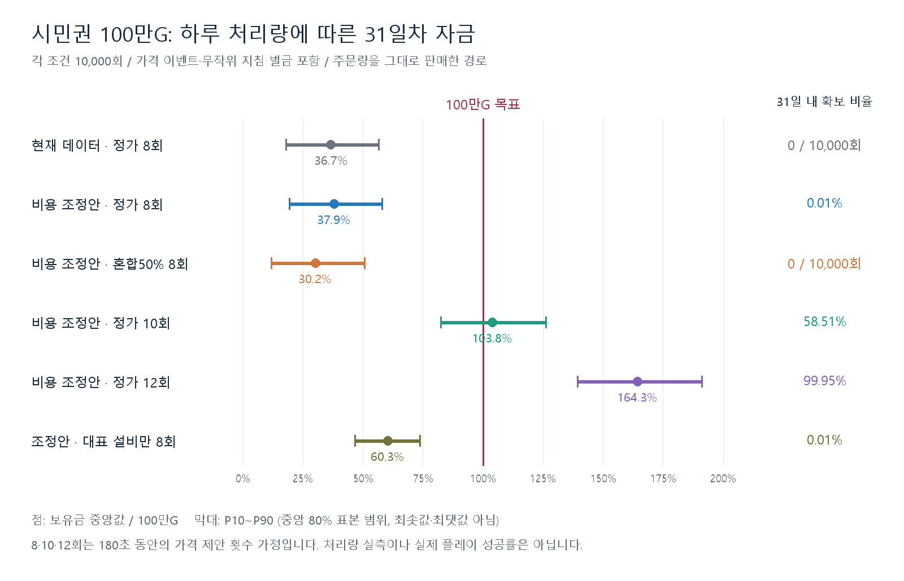
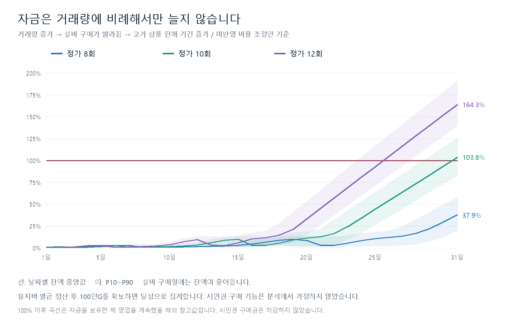

# 시민권 100만G 목표 달성 분석 — 2026-09-13

**기존 31일 목표 기간에서, 하루 8회 제안과 전체 상품 설비 구매를 유지하면 100만G 확보는 매우 드물다.** 현재 데이터에서는 31일 보유금 중앙값 366,600G, 목표의 **36.7%**다. 비용 조정안은 37.9%다. 조정안의 정가 10회 경로는 103.8%·31일 내 확보 58.51%, 12회는 164.3%·99.95%다. 이 결과는 처리량과 판매 정책을 고정한 조건부 모의실험이며 실제 이용자 성공률 조사 결과가 아니다.

## 지표와 계산 조건

- 기간은 앞서 사용한 1~31일이다. 100만G는 이번 요청의 분석 목표액이며 기존 감독관 대사·런타임 데이터·시민권 기능을 변경하지 않았다.
- **목표 자금 충당률 = 31일 정산 후 순보유금 ÷ 1,000,000G × 100.** 표의 대표값은 중앙값, P10~P90은 모의실험 중 중앙 80%의 범위다. 설비의 자산 가치를 현금으로 더하지 않는다.
- **31일 내 확보 비율 = 정산과 미납 해소 후, 선택적 설비 구매 직전에 현금 100만G 이상인 날이 한 번이라도 나온 실행 수 ÷ 10,000.** 이후 설비 구매는 멈추지만 자금을 보유한 채 영업을 계속해 31일 참고 잔액을 계산한다. 시민권 구매금 100만G는 차감하지 않는다.
- 기존 180초 동안 가격 제안을 매일 8회 하는 경로를 기본으로 하고, 매일 10·12회를 추가 비교했다. 정가는 전부 수락되지만 실수·폭리 거절은 수입 0이고 기회 1회를 사용한다. 제안 시각은 `(제안 순번 + 0.5) × 180 / 횟수`초로 균등 배치했다. 실제 조작 시간·방문 대기·이탈 측정값은 아니다.
- 기본 판매 정책은 **손님이 요청한 상품·수량을 그대로 판매**다. 무작위 지침과 충돌해도 상품을 빼지 않아 수락 거래에는 구현된 벌금이 발생한다. 이는 지침을 준수하는 숙련자의 예측이나 피할 수 없는 벌금이 아니다. 벌금 영향 제외 경로도 함께 제시하지만, 지침 준수 시 판매량 감소를 계산한 결과로 해석하면 안 된다.
- 시작금 1,000G, 31일 유지비 합계 52,700G. 제품 원가 컬럼은 현재 정산에서 차감하지 않으므로 제외했다. 미납 시 전액 납부 가능할 때만 차감하고 최초 미납일+3일의 유예를 적용했다. 이번 모든 표본에서 미납·게임오버는 0건이었다.
- 모든 경로 각 10,000회, 총 110,000개 31일 실행이다. 난수는 고정 seed로 재현하며 실제 C# Random 시드 재생이 아닌 동일 선택분포의 오프라인 모형이다.

## 결과

| 조건 | 31일 보유금 중앙값 | 목표 자금 충당률 | 충당률 P10~P90 | 31일 내 확보 비율 |
| --- | --- | --- | --- | --- |
| 현재 데이터 · 정가 8회 | 366,600G | 36.7% | 18.1~56.7% | 0.00% (0/10,000) |
| 비용 조정안 · 정가 8회 | 379,400G | 37.9% | 19.3~57.9% | 0.01% (1/10,000) |
| 비용 조정안 · 혼합 25% · 8회 | 342,688G | 34.3% | 15.7~54.5% | 0.00% (0/10,000) |
| 비용 조정안 · 혼합 50% · 8회 | 301,628G | 30.2% | 11.9~50.6% | 0.00% (0/10,000) |
| 비용 조정안 · 혼합 100% · 8회 | 210,362G | 21.0% | 5.8~41.0% | 0.00% (0/10,000) |
| 비용 조정안 · 기존 비교선 | 441,300G | 44.1% | 26.2~63.7% | 0.05% (5/10,000) |
| 비용 조정안 · 가격 이벤트만 | 447,675G | 44.8% | 26.8~64.2% | 0.05% (5/10,000) |
| 비용 조정안 · 혼합50% · 가격만 | 368,612G | 36.9% | 18.8~56.8% | 0.00% (0/10,000) |
| 비용 조정안 · 정가 10회 | 1,038,440G | 103.8% | 82.5~126.2% | 58.51% (5,851/10,000) |
| 비용 조정안 · 정가 12회 | 1,643,128G | 164.3% | 139.5~191.2% | 99.95% (9,995/10,000) |
| 비용 조정안 · 대표 설비만 · 8회 | 603,415G | 60.3% | 46.7~73.8% | 0.01% (1/10,000) |

0/10,000회는 수학적 불가능이나 정확한 확률 0%를 뜻하지 않는다. 이 모형에서 0건 관찰 시 독립 실행을 가정한 단측 95% 성공확률 상한은 약 0.030%다. 1/10,000회의 추정치 0.01%도 정밀한 확률로 확정하지 않는다. 조정안 정가 10회 확보 비율의 Wilson 95% 구간은 57.54~59.47%, 12회는 99.88~99.98%다. 이 구간은 표본 오차만 나타내며 플레이 정책·실제 처리량의 불확실성은 포함하지 않는다.

## 반영한 랜덤 요소

1. **진열·손님·주문:** 현재 21종, 보유 설비와 날짜에 따른 당일 4/6/8종 진열, 실제 진열 가중치, 성향과 단계별 선호, 선호 추첨·품목 수·수량을 재사용했다. 거래 결과에 따른 명성을 정산하고 다음 날 성향 가중치에 반영했다. 가게 확장 단계와 설비 구매 조건도 그대로 적용했다.
2. **가격 이벤트:** 식량 -10% 신문은 표시일 3·10·17·24·31일, 물 +15G와 약품 +15% 라디오는 각각 매일 1/6, 무변동 라디오는 4/6이다. 라디오는 영업 시작 0~60초 미만의 임의 시각에 방송된다. 제출 시점의 현재가를 기준으로 정가·과다 제안을 계산하고, 중복 사건은 한 번만 적용하며 매일 기본가에서 재계산한다. 신문 날짜 자체는 확정 스케줄이다.
3. **일일지침·손님 속성:** 1~9일 0개, 10~19일 1개, 20~31일 2개. 당일 상품에서 중복 없이 대상 상품을 선택하고, 금지/1개 제한을 동일 비중으로 뽑는다. 모든 손님 70%, 남·여·아이·성인·노인 각각 6%다. 성별은 첫 손님만 무작위이고 이후 교대하며 연령은 1/3씩이다. 수락 거래가 해당 지침을 위반하면 지침당 500G를 정산에 더한다. 두 지침 위반은 1,000G이며 초과 수량만큼 곱하지 않는다.
4. **중반 실수·고의폭리:** 12~18일 문제 거래 비중을 25/50/100%로 나눴다. 그 안에서 실수 40%(현재가 150%)·고의폭리 60%(현재가 110%)다. 혼합50%는 전체 제안의 정가50%·실수20%·고의폭리30%를 뜻한다. 실제 성향별 수락/거절·명성 점수를 적용하며 나머지 날에는 정가를 제안한다. 게임의 자동 행동 확률이 아니라 사용자 의견을 구체화한 분석 가정이다.

외형·대사·퇴장 방향 난수는 직접 금전 변화가 없어 제외했다. 도덕성·딸 대사 등에서 구현되지 않은 미래 경제 효과를 만들지 않았다. 대기열 이탈과 가격 변경을 놓치는 반응 지연은 처리량·가격 제안 정책에 추가로 영향을 줄 수 있어 실제 플레이 검증이 필요하다. 모든 방문을 처리한다고 가정한 성별 교대이며 미처리 방문의 순서 효과까지 재현하지 않았다.

## 비용과 투자 경로

현재 데이터는 실제 `FacilityData.csv` 가격이다. 조정안은 앞서 만든 확장2단계 23,000G, 공구 23,000G, 확장3단계 143,000G, 핵보호 35,000G를 적용하며 **아직 런타임 미반영**이다. 다른 상품 가격·설비 가격·유지비·명성 규칙은 공통이다.

기본 구매 전략은 식량 → 약품 → 2단계 확장 → 공구 → 전기 → 3단계 확장 → 핵보호 → 정밀기기다. 이것은 비교용 플레이어 선택 순서이지 게임이 강제하는 테크트리가 아니다. 필요한 가게 단계를 충족하고 다음 날 유지비를 남길 수 있으면 정산 후 구매하며, 상품 설비는 익일부터 활성화된다. 지침 벌금을 미리 정확히 예측하는 예비비나 편의 설비 효과는 가정하지 않았다.

대표 설비만 사는 경로는 식량 → 2단계 확장 → 공구 → 3단계 확장 → 핵보호다. 현금 중앙값은 약 60.3만G이지만 판매 품목 확대를 포기한 별도 전략이며 모든 구매 조합 중 최적이라고 판단한 결과는 아니다.

## 돈이 어디에 쓰이는가

아래는 **평균값**이다. 평균끼리는 잔액 보존식이 성립하지만 서로 다른 항목의 중앙값을 더하고 빼면 같은 결과가 나오지 않으므로 구분했다. `최종 평균 잔액 = 시작금 1,000 + 평균 매출 - 평균 설비/확장 지출 - 유지비 - 평균 벌금`이다. 각 항목은 G다.

| 조건 | 누적 매출 | 설비·확장 | 유지비 | 벌금 | 최종 잔액 |
| --- | --- | --- | --- | --- | --- |
| 현재 데이터 · 정가 8회 | 971,014 | 522,307 | 52,700 | 25,552 | 371,455 |
| 비용 조정안 · 정가 8회 | 981,581 | 520,485 | 52,700 | 25,555 | 383,841 |
| 비용 조정안 · 가격 이벤트만 | 1,024,670 | 520,861 | 52,700 | 0 | 452,109 |
| 비용 조정안 · 정가 10회 | 1,645,763 | 521,000 | 52,700 | 31,945 | 1,041,119 |
| 비용 조정안 · 정가 12회 | 2,258,614 | 521,000 | 52,700 | 38,339 | 1,647,575 |

조정안 정가 8회의 가격 이벤트만 추가한 평균 잔액 증가는 6,223G다. 같은 가격 이벤트에 지침 위반 벌금을 연결하면 평균 잔액이 68,268G 줄어든다. 벌금 자체의 평균은 25,555G이고, 차이에는 투자 지연 및 상품 구성 변화에 따른 판매수입 차이도 들어 있다. 따라서 사건 운보다 거래 처리량·거절·지침 대응·투자 타이밍이 현재 조건의 결과를 더 크게 바꾼다.

## 기획 판단과 검토점

100만G를 유지한다면 **31일 달성 목표를 하루 8회와 동시에 충족하기는 현재 비교 전략에서 어렵다.** 비용 조정안에서 하루 10회는 경계 난도(약 58.5% 확보), 12회는 이 정책 아래 여유가 큰 경로다. 확보한 실행에 한해서 첫 확보일 중앙값은 10회가 30일, 12회가 26일이다. 같은 기간의 처리량이 늘면 구매가 빨라져 비싼 상품을 더 오래 팔 수 있으므로 자금 증가가 단순히 8→10회의 25% 증가에 그치지 않는다.

우선 플레이 테스트에서 초·중·후반 각각 180초 동안의 제안 수/성립 수와 지침 준수 시 판매수량·벌금을 측정하는 것이 필요하다. 8회가 실제 한계라면 이후 목표 기간, 상품 가치 또는 투자 전략의 조정안을 별도로 비교할 수 있다. 이번 분석을 이유로 시스템 규칙이나 시민권 가격 데이터를 임의 변경하지 않았다. 가게 단계 도달일 10/20일은 구매 가능 금액으로 검증하는 목표이며 고정된 날짜 해금이 아니다.

## 근거·재현·검증

- 입력 및 SHA-256: [inputs.json](inputs.json), 이전 경제 스냅샷 [inputs.json](../reputation-20260912/inputs.json). 실행 결과 [results.json](results.json).
- 구현 근거: [가격 이벤트 스케줄러](../../../../Assets/Scripts/Events/PriceEventScheduler.cs), [지침 생성·판정](../../../../Assets/Scripts/Commons/SaleRestriction.cs), [손님 구성](../../../../Assets/Scripts/Customer/CustomerCompositionSelector.cs), [제출 시점 가격·판정](../../../../Assets/Scripts/Customer/CustomerVisit.cs), [정산·미납](../../../../Assets/Scripts/Manager/GameSessionManager.cs), [설비 구매](../../../../Assets/Scripts/Facility/FacilityService.cs).
- 재현: 저장소 루트에서 `node doc/work/balancing-reference/citizenship-20260913/calculate.js`, 이후 `python -X utf8 doc/work/balancing-reference/citizenship-20260913/render.py`. 기존에 설치된 Node·Python/Pillow만 사용했다.
- 기존 정가 2,000회 최종 잔액·명성 통계 동일성, 200개 실행의 날짜별 잔액/명성/수입/수락 수·구매 이력 동일성을 확인했다. 새 모형의 가격/날짜/중복 사건·지침·성별 조건·수량 경계·거절 시 벌금0·미납 기한·상환과 모든 실행의 현금 보존을 검사했다. 이전 보고서 결과 파일은 보존했다. 재사용 계산기에는 선택적 제안 횟수·가격·거래 관찰만 추가해 기본 결과를 유지했다. 이전 분석의 계산기 소스 해시는 당시 이력이며 이번 수정 버전은 새 입력 해시로 별도 보관한다.
- 상태 `PARTIAL`: 오프라인 수치와 그래프 검증, Unity 컴파일·EditMode·PlayMode·실제 처리량 검증은 미실행. 런타임 코드·CSV·테스트·설정 변경 없음, commit/push 미실행. 기획 역할 작업 완료 상태는 조회되지만 본문이 없어 해당 판단을 승인 근거로 삼지 않았다.
