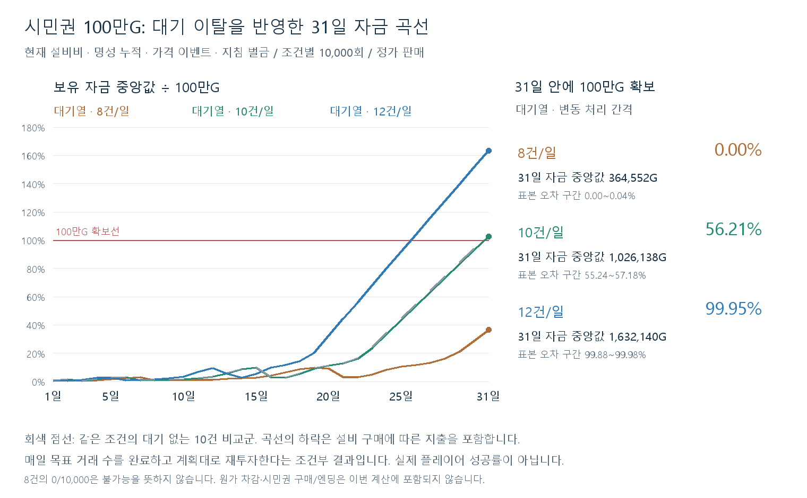

# 시민권100만G — 대기열·명성 누적 재계산

2026-09-13. 현행 설비 비용과 기존 투자 전략을 유지하고, 실제 대기열의 성향 선별과 변동 처리 간격을31일 경제 모형에 연결했다. **하루10건이면 목표 도달이 가능하지만 보장되지는 않는다. 8건은 이번 조건에서 부족하고,12건은 높은 확보율을 유지한다.** 상품·명성·인내·설비 가격 등 런타임 데이터는 변경하지 않았다.

## 이전 결과와의 비교

| 정가 거래/일 | 이전 모형 확보율 | 조건 보정·대기 없음 | 대기열·변동 간격 | 큐 적용 변화 |
|---|---:|---:|---:|---:|
| 8건 | 0.01% | 0.02% | 0.00% | -0.02%p |
| 10건 | 58.51% | 59.17% | 56.21% | -2.96%p |
| 12건 | 99.95% | 99.99% | 99.95% | -0.04%p |

이전 모형은 제출 시점을 거래 중간으로 두고 성별을 응대 거래마다 교대했다. 이번 비교군은 제출을 각 처리 구간 끝0.05초 전으로 옮기고 첫 성별을 매일 추첨한다. 큐 모형에서는 응대 여부와 무관하게 입장한 모든 손님의 성별이 교대한다. 난수 흐름도 새로 분리했으므로 이전58.51%와 새 확보율의 차이 전부를 대기 이탈 효과로 해석하지 않는다. 대기 유무의 비교는 같은 시점·추첨 규칙을 갖춘 가운데 열과 오른쪽 열로 한다.

## 대기열 포함 조건의 자금과 불확실성

| 거래/일 | 평균 보유 자금 | 중앙값 | P10~P90 | 31일 내 확보 횟수 | 확보율 Wilson95% 구간 |
|---|---:|---:|---:|---:|---:|
| 8건 | 370,771G | 364,552G | 178,018~570,747G | 0/10,000 | 0.00~0.04% |
| 10건 | 1,030,392G | 1,026,138G | 812,951~1,253,792G | 5,621/10,000 | 55.24~57.18% |
| 12건 | 1,634,571G | 1,632,140G | 1,374,562~1,898,034G | 9,995/10,000 | 99.88~99.98% |

보유 자금은 원가를 차감하지 않고 매출에서 유지비·지침 벌금·설비 지출을 차감한 금액이다. 시민권 구매로100만G를 빼지는 않는다. 확보 판정은 미납 없이 하루 정산을 마친 직후의 자금이100만G 이상인 첫날이며, 이후 선택 설비 구매를 멈춘다. P10/P90은 해당 모형의 실행 간 자금 분포이고, Wilson 구간은 확보율 추정의 표본 오차이며 사람의 실력 불확실성을 포함하지 않는다.

0/10,000은 수학적 불가능이 아니다. 8건 조건의 미관찰 성공 확률에 대한 단측95% 상한은 약0.03%다. 12건 또한 실제 플레이에서12건을 수행한다는 전제가 충족돼야 한다.

## 명성은 크게 달라졌는데 자금 영향이 작은 이유

| 거래/일 | 31일 명성 평균: 대기 없음 → 큐 | 누적 매출 평균: 대기 없음 → 큐 | 누적 설비 지출 평균: 큐 |
|---|---:|---:|---:|
| 8건 | 91.08 → 55.76 | 982,158 → 968,284G | 520,267G |
| 10건 | 96.42 → 62.35 | 1,647,272 → 1,634,974G | 521,000G |
| 12건 | 56.23 → 25.71 | 2,263,443 → 2,245,579G | 521,000G |

실제 데이터에서 명성이 낮으면 성급한 손님 생성 비중이 높아지고, 명성이 높으면 낮아진다. 이탈로 정가 보너스 손님이 줄어도 다음날 구성 변화가 일부 보완한다. 또한 인내가 긴 부유한 손님이 상대적으로 응대되기 쉬우며, 정가 매출은 성향 이름 자체보다 당일 상품·선호·수량의 영향을 받는다. 이 두 방향의 효과가 존재하므로 하루 명성 감소율을31일 자금이나 시민권 확보율에 그대로 곱할 수 없다. 각각의 기여를 따로 고정하는 추가 실험은 수행하지 않았으므로 수익 차이에 대한 정확한 기여율은 제시하지 않는다.

## 유지한 전략과 새로 연결한 조건

- 시작금1,000G, 영업180초,31일, 정가로 주문 전체 판매. 시간 내 매일8/10/12건을 완료하도록 처리 시각을 정한다. 실수·고의 폭리·선택적 거절·손님 골라 받기는 이번 정가 비교에 넣지 않았다.
- 투자 순서12001→12002→12008→12003→12004→12010→12005→12006. 실제 가게1~3단계 구매 조건을 검사하고, 상품설비는 구매 다음날부터 후보에 포함한다. 다음날 유지비를 남기며 미납 중에는 투자를 보류한다. 이 순서가 최적이라고 가정하지 않는다.
- 현재 비용은1단계 식량18,000/약품39,000G, 가게2단계23,000G, 공구23,000/전력42,000G, 가게3단계143,000G, 핵보호35,000/정밀198,000G다. 편의설비는 기존 모형처럼 구매하지 않는다.
- 매일4/6/8종의 판매 상품을 실제 해금 단계 가중치로 추첨하고, 날짜별 선호 행과 시작 명성별 성향 가중치를 반영한다. 매일 종료 후 명성을 정산해 다음날에 사용한다.
- 첫 손님은0초, 이후5초 간격 입장, 동시대기 정원10, 인내9/12/15/18초. 만료를 입장·계산대 인계보다 먼저 처리하며 FIFO로 응대한다. 현재 계산대 손님은 만료시키지 않는다. 이탈의 직접 금전/명성 벌칙은0이다.
- 처리 간격은 거래별0.8~1.2의 균등 난수 가중치를 추첨하고 합180초로 정규화한다. 실제 사람의 측정 분포나 정확한±20% 제한은 아니다. 마지막 구간 끝은180초로 고정했다. UI 연출은 시간 구간에 포함한다는 가정이며 실행하지 않는다. 상품 수에 따른 속도 변화 및 마감 후 마지막 거래의 추가 시간은 미포함이다.
- 신문·라디오 사건과 방송0~60초를 추첨하고, 제출 시점의 현재가로 주문 합계를 다시 계산한다. 가격 변경으로 이미 대기 중인 손님의 주문을 다시 추첨하지 않는다.
- 일일지침0/1/2개, 속성 대상과 상품의 무작위 선택, 같은 날 상품 중복 방지, 위반 규칙당500G를 유지한다. 주문 그대로 판매하므로 해당 위반 벌금을 낸다. 지침을 지켜 일부 상품을 빼는 플레이 전략과는 다른 조건이다.
- 매출−유지비−벌금−설비 투자와 잔고의 보존을 각 일차마다 확인한다. 미납은 기존3일 유예와 전액 납부 모형을 재사용한다.

## 처리 간격 민감도

12건을 정확히15초 간격으로 고정하면 확보율99.96%,31일 명성 평균10.43다. 변동 간격은99.95%, 명성 평균25.71였다. 명성은 간격 정렬에 민감하지만, 이번 모형의12건 자금 확보는 두 조건 모두 높았다. 확보율의 아주 작은 차이를 실질적 우열로 해석하지 않는다.

## 검증과 재현 한계

검증 상태 `PARTIAL`. 7조건×10,000회=70,000개의31일 경로를 오프라인 Node 모형으로 실행했다. 31일 전체를 Unity PlayMode로70,000번 실행했다는 뜻은 아니다. 거래/가격 판정·명성 정산·뉴스·지침·납부 유예는 앞서 검증한 모형 함수를 재사용하고, 큐 입장/이탈과 현재가 제출 시각을 연결했다.

실제 Unity API에서 고정/변동 간격·8/10/12건·명성0/50 조건으로 만든60개의 방문 기록을 사용했다. 동일한 생성 순서와 처리 시각을 입력했을 때 오프라인 큐의 응대 손님 ID 순서·이탈/생성 수·일일 명성 점수/변화가60/60 일치했다. 검증 시 가상 시계를 경계 직전 epsilon에서 멈추면 다른 손님이 살아남을 수 있어, 끝 시각에 정확히 도달하도록 호출을 수정했다. 이 수정은 분석 검증 도구에만 적용했으며 게임 큐 코드는 바꾸지 않았다.

기존 모형과25개 seed의 자금/명성 회귀 검사,30개31일 경로의 명성 전달·설비 다음날 활성 검사, 지침 속성·가격 중복 적용·미납 기한 검사를 수행했다. 전체 실행에서 공급 누락·정가 거절·자금 보존 위반이 있으면 즉시 실패하도록 했다. 기존 시민권 calculate.js는 함수 export와 직접 실행 guard만 추가했으며 과거 inputs/results는 덮어쓰지 않았다. 게임 코드·CSV·Scene·설정은 수정하지 않았다.

오프라인 난수원은 Unity와 같은 seed 재생을 보장하지 않는다. 명성/상품/선호 선택의 확률 분포를 따르되 외형·대사 난수 소비는 생략하고 성별/연령 난수를 분리한다. 실제 세션의 리소스 로딩·도덕성·UI 조작·31일 PlayMode 통합 경로와 사람의 실수는 검증 범위 밖이다. 기획 역할에는 읽기 검토를 배정했으나 완료 상태 외 회신 본문을 확보하지 못해 리뷰 승인으로 집계하지 않았다.

재현: `node calculate.js` → 기존 Unity CLI exec로 `verify.cs.txt`를 실행해 data JSON을 unity-fixtures.json에 저장 → `node verify.js` → `python render.py`. 현재 입력이 기록과 다르면 재계산 전 변경 내역을 검토한다.

자료: [결과](results.json), [현재 입력과 SHA256](inputs.json), [모형](calculate.js), [Unity 확인 기록](unity-fixtures.json), [검사](verify.js). 원래 시민권 확률 기록은 과거 모형 결과로 보존하며, 이후 같은 전략의 검토에는 이번 대기열 포함 결과를 사용한다.
