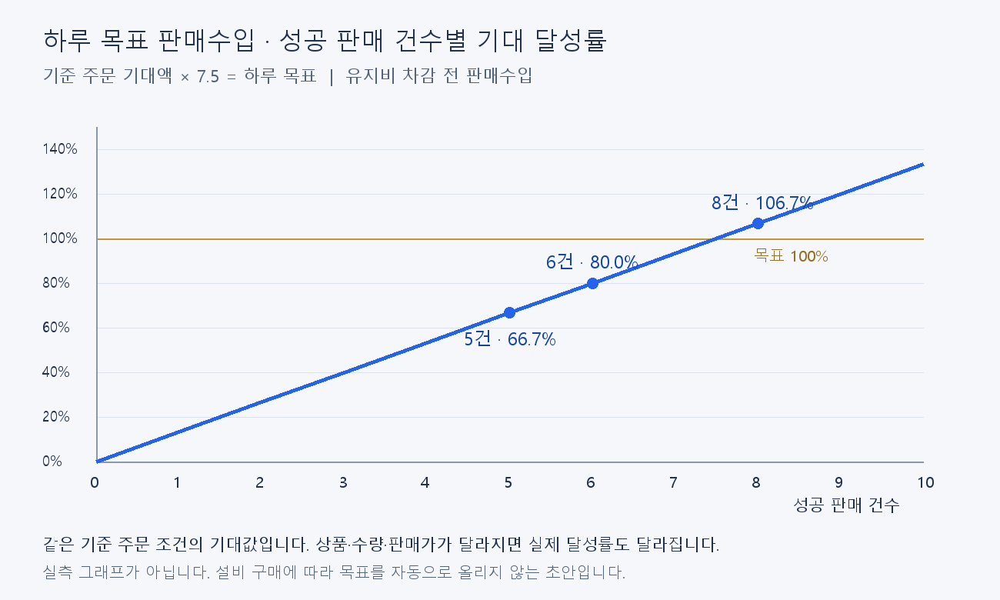

# 하루 거래량·목표 판매수입 초안

2026-09-12 / codex/balancing-preparation. 기획·기술 담당의 읽기 검토를 조정자가 통합했다. 이번 산출물은 밸런싱 기준이며 런타임 기능이나 CSV 반영 결과가 아니다.

## 계산 결과 추가 (2026-09-12)

사용자 진행 승인 후 [전체 계산 결과·목표액 표·계단 그래프](results.md)를 작성했다. 설비64조합×날짜3구간×수요2조건을 계산하고 대표 구매 경로7계단 및 유사 수입 묶음의 목표를 산출했다. 아래 “산출 전·미확정” 표현은 계산 시작 전의 설계 기록이다. 구간별 금액 초안은 결과 문서와 분석용 CSV에 있으며 런타임 반영은 하지 않았다.

전체 보유가 최고 기대 수입이 되는 것은 아니었다. 후반 수요 초안에서 핵보호+정밀장비만 보유한 경우보다 전체 보유의 평균 거래액이27.7% 낮다. 따라서 모든 경로의 목표 단조 상승과 모든 조합에서6건 약80%를 동시에 만족하는 공통표는 현재 상품 선택 분포로 확정할 수 없다. 이 제약을 숨기지 않고 기준 경로 표와 전체 조합 진단을 분리했다.

## 사용자 기준과 계산

사용자가 확인한 목표량은 **하루 목표 수입**이다. “5회를 넘어가면 약 80%”는 성공 판매 6건으로, 수입은 유지비 차감 전 판매수입으로 해석했다. 두 해석은 조정자가 명시한 초안 가정이다. 거절은 성공 판매 0건·판매수입 0으로 계산하되 처리시간에는 포함한다.

설비 진행 구간 s의 기준 주문 1건 기대 정가 판매액을 B_s라고 하면 해당 구간 하루 목표 T_s = 6 × B_s ÷ 0.8 = 7.5 × B_s다. 해당 구간 기준과 같은 상품·주문·가격·수락 조건에서 성공 판매 n건의 기대 달성률은 n ÷ 7.5다. 실제 달성률은 SaleIncome ÷ T_s로 계산한다. 100%를 넘는 수입을 제한하지 않는다.

| 성공 판매 건수 | 기준 주문과 같은 조건의 기대 달성률 |
|---:|---:|
| 0 | 0.0% |
| 4 | 53.3% |
| 5 | 66.7% |
| 6 | 80.0% |
| 7 | 93.3% |
| 8 | 106.7% |
| 10 | 133.3% |

상품 가격·수량·고가 주문 거절에 따라 거래액이 달라지므로 **6건의 실제 수입이 언제나 80%라는 보장은 아니다**. 기존 8건/일 초안은 목표를 조금 넘기는 기준 시나리오로 유지한다. 이 표는 확률 시뮬레이션이나 플레이 실측 결과가 아니라 기대값 산식이다.

## 설비 진행도에 따른 계단식 목표 — 사용자 후속 수정

사용자가 설비 업그레이드 0부터 최대까지 각 구간에서 목표 수입을 계단식으로 상향할 필요를 명시했다. 이에 따라 앞서 제안한 기본 상품군 고정 목표를 대체한다. **각 구간에서 성공 판매 6건의 기대 수입이 그 구간 목표의 약 80%**가 되도록 계산한다. 위 달성률 그래프는 각 구간 목표를 100%로 정규화한 그래프이며, 모든 구간의 목표 금액이 같다는 뜻이 아니다.

구간은 구매한 설비의 단순 개수보다 **보유 설비로 해금되는 상품군의 기대 거래액**을 기준으로 묶는 방향을 제안한다. 저가 설비 1개와 핵보호 설비 1개를 같은 진행도로 취급하지 않는다. 처음부터 고가 설비를 구매하는 경로는 해당 구간으로 건너뛸 수 있으며, 목표 구간을 순차 구매 의무나 테크트리로 사용하지 않는다.

산출 순서는 다음과 같다.

1. 상품 해금 설비 미구매부터 6종 전부 보유까지 조합별 기대 주문액을 비교한다. 저가부터 구매·고가 직행·혼합 경로를 포함한다.
2. 기대 거래액이 비슷한 조합을 구간으로 묶고 대표값 B_s를 정한다. 구간 수·경계·원화 목표는 계산 결과를 보고 정하며, 아직 임의의 숫자로 확정하지 않는다.
3. 구간별 목표 T_s = 7.5 × B_s, 6건 예상 수입 6 × B_s, 8건 예상 수입 8 × B_s를 같은 표와 계단 그래프에 표시한다. 같은 구간 안의 조합별 편차도 확인한다.

상품군의 기대 거래액에는 날짜별 수요·진열과 손님 구성의 영향을 구분한다. 고급품을 해금했다고 초반부터 선호 손님이 확정 등장하는 것으로 계산하지 않는다. 편의설비의 처리 속도 효과는 실측 전까지 매출 증가율로 임의 환산하지 않는다. 6종은 현재 상품 해금 설비의 수이며 가게 확장·편의설비까지 모두 포함한 설비 총수라는 뜻은 아니다.

목표는 사전에 계산한 구간표로 정하고 당일 실제 매출·할인·거절 결과로 다시 계산하지 않는다. 게임에 적용할 때의 제안은 다음 영업 시작 시 보유 설비에 맞는 구간을 선택하고 영업 중에는 고정하는 방식이다. 이는 아직 구현한 규칙이 아니다.

목표 금액이 높아져도 실제 판매수입과 설비 투자 이익이 줄어드는 것은 아니다. 이전 초안의 “목표 상승으로 투자 보상이 사라진다”는 표현은 과도했으며, 목표 달성률의 체감과 실제 벌어들이는 금액을 구분한다. 이번 목표는 밸런싱 비교 기준이고 동일 금액의 납부 의무·유지비·벌금을 추가하는 지시로 해석하지 않는다. 기존 설비 손익분기·상품 가격·시민권 경제 목표는 유지한다.

기획 담당도 기대 매출 능력에 따른 오프라인 구간표를 권장했다. 추가 제안한 “매출 증가분의 50%만 목표에 반영”은 채택하지 않았다. 그 방식은 후반 6건 달성률을 의도적으로 80%보다 높이므로 현재 구간별 기준과 다르며, 50%에 대한 검증 근거도 아직 없다. 구간 수를 5개로 고정하는 제안 역시 조합별 수치를 비교한 뒤 판단한다.

## 현재 구현에서 알 수 있는 범위

- `Assets/Scripts/Progress/DayProgress.cs`: 기본 영업시간은 30초다. `GameUIController` → `GameProgress`의 기본 경로도 별도 시간 인자를 전달하지 않는다. 승인된 밸런싱 가정 180초는 아직 이 경로에 연결되지 않았다.
- 같은 클래스의 `Tick`은 영업·분류·결과 상태에서 시계를 차감한다. 사람의 분류, 가격 입력, 결과 확인 시간 자료가 없으므로 코드만으로 구간별 평균 처리량을 확정할 수 없다.
- 시간 종료 시 이미 입장한 손님은 마감 거래를 완료할 수 있다. 따라서 영업시간/거래시간을 정확한 건수 상한으로 쓰지 않는다.
- 일별 진열 종류 4/6/8종과 주문 1~3종·종류별 1~3개는 복잡도 조건이다. 편의설비가 실제로 절약하는 사람 입력시간은 측정이 필요하다.
- `DayProgress.SuccessfulSales`, `RefusedCustomers`와 `DailyAggregationResult.SaleIncome`, `Transactions`가 있어 **플레이 결과를 기록하면 구간별 평균을 계산할 수 있다**. 현재 확인된 값은 일별 상태·집계이며 누적 분석이나 거래 단계별 시간 계측이 완료됐다는 뜻은 아니다.

180초에서 성공 6건은 단순 시간 예산으로 건당 30초, 8건은 22.5초다. 거절·연출·마지막 손님 초과시간을 포함한 실제 처리 가능성 검증값은 아니다. 현재 30초 설정의 플레이 결과와 180초 가정의 경제 모델을 혼합하지 않는다.

기술 검토에서 일시정지 중 연출/가격 제출 경로가 모두 차단되는지 추가 확인이 필요하다는 점도 발견했다. 기본 경로의 `SetPauseQuery` 연결은 대기열 사용 조건에 달려 있고 `CanSubmitOffer`는 일시정지 여부를 직접 검사하지 않는다. 이번에는 화면에서 재현하거나 수정하지 않았으며 처리량 측정 전에 확인할 항목이다.

## 추후 실측 집계

1~9일 / 10~19일 / 20일 이후를 구분하고, 같은 구간 안에서도 소유 설비·손님 구성·영업시간을 함께 기록한다. 기록할 최소 항목은 날짜, 설정 영업시간, 성공 판매 수, 거절 수, SaleIncome, 소유 설비, 시간 종료 후 마지막 거래 여부다. 입력 난도 분석 때만 주문 종류·총수량과 단계별 처리시간을 추가한다.

구간별 하루 평균 성공 판매 수 = 해당 구간 성공 판매 수 합계 ÷ 기록한 영업일 수. 0건으로 끝난 날도 분모에 포함한다. 거절 포함 처리 건수와 성공 판매 수는 따로 집계한다. 판매수입 평균도 SaleIncome 합계 ÷ 영업일 수로 계산한다. 반복 플레이 비교에는 숙련도와 일시정지 조건을 같게 둔다.

## 반영·검증 범위

기대 달성률 산식과 표·그래프만 작성했다. 게임 코드·런타임 CSV·목표 UI·영업시간·계측 기능은 수정하지 않았다. 일일지침 벌금 500도 유지했다. 산술 결과와 그래프 표시를 검토했으며 Unity 테스트와 실제 플레이 측정은 이번 작업에 해당하지 않는다. 실측 기반 평균과 목표 금액은 미확정이다.
