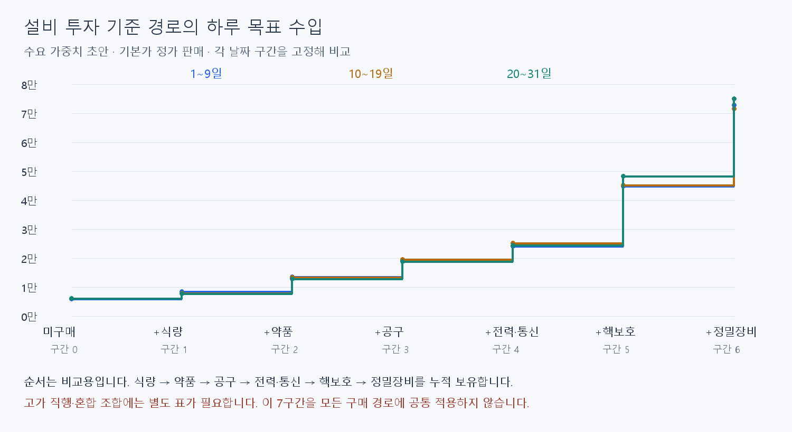
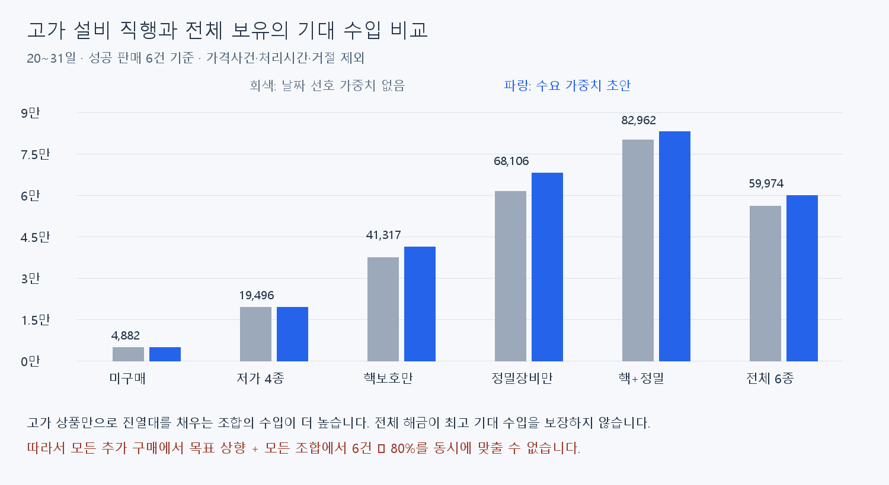

# 설비 조합별 하루 목표 수입 계산 결과

2026-09-12. 단위는 게임 화폐. 목표는 유지비 차감 전 판매수입이며 검토용 수치다. 코드·런타임 CSV에는 반영하지 않았다.

## 결과와 제약

**식량부터 시작하는 기준 구매 경로는 7개 계단으로 제시할 수 있다. 다만 모든 구매 경로에 공통 적용하는 단조 상승 목표표는 현재 분포와 충돌한다.** 고가 설비만 보유하면 제한된 진열 공간에 고가 상품이 집중되어 전체 보유보다 기대 수입이 높다. 이를 가격·확률 변경이나 목표액 보정으로 숨기지 않았다.

## 기준 경로의 목표액

각 칸은 해당 날짜 구간을 고정한 기대 거래액 ×7.5를 100 단위로 반올림했다. 행은 필수 구매 순서나 실제 구매일이 아니다. 기존 경제 초안과 비교하기 위한 순서이며 엄밀한 가격 오름차순도 아니다(전력42,000, 공구46,000). 날짜 선호 가중치를 적용한 **기획 초안**이며 현재 게임 측정값이 아니다.

| 비교 구간 | 누적 추가 설비 | 1~9일 목표 | 10~19일 목표 | 20~31일 목표 |
|---:|---|---:|---:|---:|
| 0 | 미구매 | 6,000 | 6,100 | 6,100 |
| 1 | +식량 | 8,500 | 8,000 | 7,800 |
| 2 | +약품 | 13,600 | 13,400 | 12,900 |
| 3 | +공구 | 19,000 | 19,500 | 18,800 |
| 4 | +전력·통신 | 24,100 | 25,100 | 24,400 |
| 5 | +핵보호 | 44,900 | 45,100 | 48,300 |
| 6 | +정밀장비 | 72,800 | 71,600 | 75,000 |

같은 설비라도 날짜별 진열 수와 수요가 바뀌면 평균 거래액이 내려갈 수 있다. 목표를 날짜가 지날 때도 무조건 올리는 규칙은 이번 표에 넣지 않았다.

### 20~31일의 6건·8건 기대 수입

| 비교 구간 | 평균 거래액 | 6건 수입 | 하루 목표 | 8건 수입 | 6건 달성률 |
|---:|---:|---:|---:|---:|---:|
| 0 | 814 | 4,882 | 6,100 | 6,509 | 80.0% |
| 1 | 1,042 | 6,254 | 7,800 | 8,339 | 80.2% |
| 2 | 1,713 | 10,280 | 12,900 | 13,707 | 79.7% |
| 3 | 2,507 | 15,044 | 18,800 | 20,059 | 80.0% |
| 4 | 3,249 | 19,496 | 24,400 | 25,994 | 79.9% |
| 5 | 6,434 | 38,602 | 48,300 | 51,470 | 79.9% |
| 6 | 9,996 | 59,974 | 75,000 | 79,965 | 80.0% |

## 고가 직행과 전체 보유

| 조합 | 평균 거래액 | 6건 기대 수입 | 조합별 목표 원계산 |
|---|---:|---:|---:|
| 핵보호 | 6,886 | 41,317 | 51,646 |
| 정밀장비 | 11,351 | 68,106 | 85,133 |
| 핵보호+정밀장비 | 13,827 | 82,962 | 103,703 |
| 식량+약품+공구+전력·통신+핵보호+정밀장비 | 9,996 | 59,974 | 74,967 |

핵보호+정밀장비에서 전체 보유로 바꾸면 이 모델의 평균 거래액은 **27.7% 감소**한다. 핵+정밀의 목표를 그대로 유지하면 전체 보유의 6건 기대 달성률은 **57.8%**다. 목표를 더 높이면 달성률은 이보다 낮아진다. 따라서 75~85% 허용 범위로 넓혀도 이 역전은 해소되지 않는다.

## 전체 조합의 유사 수입 구간

64개 조합을 날짜·수요 조건별로 평균 거래액 순서로 정렬했다. 6건의 **기대 달성률 75~85%**를 유지할 수 있는 조합을 같은 구간으로 묶었다. 이 ±5%p는 “약80%”를 수치화한 검토용 제안이며 확정 기획이 아니다. 대표 B는 선택 목표÷7.5다.

묶음은 낮은 평균부터 확장하되 100 단위 목표 중 6×최대평균÷0.85 이상, 6×최소평균÷0.75 이하인 값이 남아 있을 때만 유지한다. 목표는 양 끝 평균의 중간값×7.5를 반올림하고 허용 범위 안으로 제한한다. 조합 빈도나 실제 구매 경로 확률을 임의로 가정하지 않는다.

| 수요 조건 | 1~9일 구간 수 | 10~19일 구간 수 | 20~31일 구간 수 |
|---|---:|---:|---:|
| 수요 가중치 초안 | 14 | 14 | 13 |
| 날짜 선호 가중치 없음 | 13 | 14 | 13 |

이 구간 번호는 **각 날짜·수요 조건 안에서의 기대 매출 순위**다. 구매 횟수나 영구 해금 레벨이 아니며, 추가 구매 후 낮아지는 경우도 별도 비교표에 기록했다. 기준 경로의 0~6 번호와 혼용하지 않는다. 아래는 후반 수요 초안의 전체 구간이다.

| 수입 구간 | 조합 수 | 거래액 범위 | 목표액 | 6건 기대 달성률 범위 |
|---:|---:|---:|---:|---:|
| 0 | 1 | 814~814 | 6,100 | 80.0%~80.0% |
| 1 | 1 | 1,042~1,042 | 7,800 | 80.2%~80.2% |
| 2 | 2 | 1,556~1,713 | 12,300 | 75.9%~83.6% |
| 3 | 2 | 2,077~2,212 | 16,100 | 77.4%~82.4% |
| 4 | 4 | 2,507~2,592 | 19,100 | 78.8%~81.4% |
| 5 | 3 | 2,883~3,249 | 23,000 | 75.2%~84.8% |
| 6 | 3 | 3,262~3,460 | 25,200 | 77.7%~82.4% |
| 7 | 11 | 6,363~7,136 | 50,600 | 75.5%~84.6% |
| 8 | 5 | 7,332~7,748 | 56,600 | 77.7%~82.1% |
| 9 | 8 | 9,206~10,291 | 73,100 | 75.6%~84.5% |
| 10 | 18 | 10,509~11,871 | 83,900 | 75.2%~84.9% |
| 11 | 5 | 12,132~13,247 | 95,200 | 76.5%~83.5% |
| 12 | 1 | 13,827~13,827 | 103,700 | 80.0%~80.0% |

## 입력·가정·검증

- 기존 `draft-20260912/model.js`의 표본 추출을 재사용했다. 실제 21상품의 ID(기존 임시 키2개는1024/1025에 대응)·가격·타입·설비FK·판매일과 15성향의 구매 필드, 명성 분포가 모델 입력과 같은지 실행 시 검사했다. 상품 해금 설비6종의 종류와 요구 가게 단계1/1/2/2/3/3도 검사한다. 원본 경로와 SHA-256은 estimates.json에 남겼다.
- 중립 명성의 성향 비중은 보통60%·급함15%·가격민감5%·부유10%·가난10%. 주문 1~3종, 종류별1~3개, 선호 상품 선택90%, 중복 상품 없음. 모든 상품을 기본가에 판매하고 정가 주문은 모두 수락하는 조건이다.
- 날짜별 진열 후보4/6/8종, 설비 상품 가중치는 기본100, 식량·약품220, 공구·전력280, 핵보호·정밀350이다. 기본 상품만 있으면 가능한5종까지 사용한다.
- 수요 초안은 저가/중가/고가 선호 가중치가 구간별 (1.6,1,0.45), (1,1.6,1), (1,1.2,1.8)이다. 다른 비교값은 같은 성향군 내부 행을 균등 추출한다. 날짜 선호 가중치는 현재 런타임에 미연결이다.
- 6종 상품 해금 설비의 모든64조합 × 날짜3구간 × 수요2조건 =384조건. 각12,000일의 가상 일일 진열·8건 주문을 추출했다. 합계36,864,000건이며 영업시간이나 사람의 처리 속도를 시뮬레이션한 것은 아니다.
- 일별8건 평균을 독립 표본 단위로 표준오차를 계산했다. 최대 상대 표준오차 0.53%, 정규 근사 95% 오차한계는 최대 약 ±1.04%다. 이는 평균 추정의 Monte Carlo 오차이며 하루 매출 변동폭이나 모델 정확도 보장이 아니다. 모든 조건에 대한 동시95% 보장도 아니다.
- 가격사건·할인·거절·이탈·명성 변화·편의설비 시간 단축·구매비 회수는 이 계산에서 제외했다. 원가는 판매수입에서 차감하지 않았다. 180초·평균8건은 실측되지 않았고 현재 기본 영업시간30초와 차이가 남아 있다.
- 구매 자금과 가게 단계 해금 비용을 시뮬레이션하지 않았다. 현재 구현의 요구 가게 단계1/2/3 조건을 충족하고 해당 설비가 활성화됐을 때의 조건부 수입이다. 따라서 초반 고가 직행 행은 실제 그날 구매 가능성을 증명하지 않는다.
- 표본 조건384개 누락·중복 없음, 구매 추가 비교1,152개, 양수 평균·표준오차, 모든 묶음의75~85% 산술 범위, 기준 경로의 목표 증가를 자동 검사했다. Unity 테스트·플레이 실측은 수행하지 않았다.

## 데이터 파일과 다음 판단

- [기준 경로 목표액](reference-targets.csv): 21행. phase0/1/2는1~9/10~19/20~31일, stage는 비교 경로 번호다.
- [전체 조합별 입력용 계산표](combination-targets.csv): 384행. demand=draft는 수요 초안, flat은 날짜 선호 가중치 없음. mask는12001부터12006까지 순서대로1/2/4/8/16/32를 합한 분석용 키다.
- [수입 구간별 목표액](target-bands.csv): 조합 묶음과 목표. 구간 번호는 demand와phase 안에서만 유효하다.
- [추가 설비의 수입 변화](upgrade-comparisons.csv): 모든 단일 추가 구매1,152개. change_rate<0이면 기대 수입 감소다.
- 위 CSV들은 doc 아래의 분석 자료다. 런타임 테이블 등록·새 ID 발급·목표 UI 연결은 하지 않았다.
- 재현: 이 폴더의 `calculate.js`를 Node로 실행하고, 이어서 `present.py`를 Pillow가 설치된 Python으로 실행한다. 첫 단계가 원시 추정값, 둘째가 CSV·표·그림을 갱신한다. 기존 원본 모델과 입력 snapshot이 필요하다.

**권고:** 현재는 7계단 기준 경로와 전체 조합별 수입표를 검토 자료로 사용한다. 모든 경로에서 올라가는 목표표를 게임에 넣기 전에, 해금 상품이 늘 때 고가 상품의 진열·선택 확률이 희석되는 문제를 어떻게 다룰지 정해야 한다. 진열 상품 선택 기능 또는 상품 선택 규칙 변경은 별도 설계 대상이며 이번에 구현하지 않았다.
