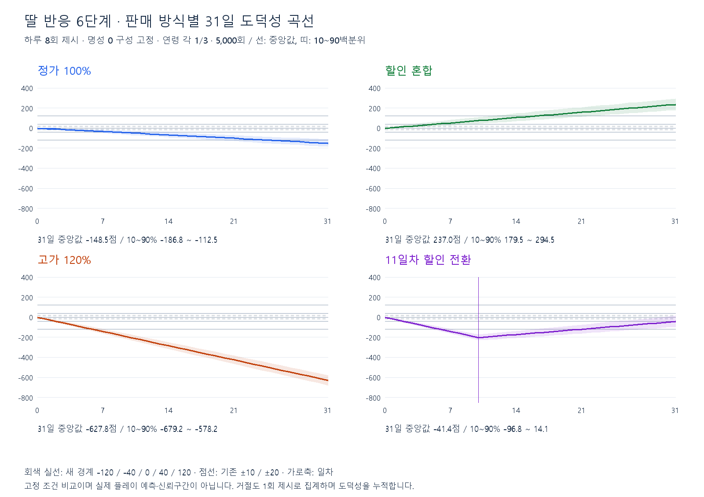

# 딸 대화 6단계 초안

2026-09-12. 기존 6단계를 유지하는 사용자 승인 범위에서 `DaughterDialogueData`의 경계를 ±10·20 → **±40·120**으로 넓히고, 기존 Text8183~8200 중15문구를 보완했다. 6행·18대사·기존 ID·이미지 연결은 유지한다. 이번 값은 플레이 검증용 초안이다.

## 기획 근거와 적용 범위

- [딸 대화 원문](https://docs.google.com/document/d/1lCzaQRmFRWrxfIhWr2UZy64-7A8v1N9fAvlOorMF77E/edit?tab=t.qsw5ep3wnjrl)은 음·양 각3단계와 단계별 약3대사를 제시한다. 수치 경계와 대사 원문은 없다.
- [거래·도덕성 명세](https://docs.google.com/document/d/1lCzaQRmFRWrxfIhWr2UZy64-7A8v1N9fAvlOorMF77E/edit?tab=t.jxxow3f6hpes)는 각5단계 방향도 포함한다. 이번 사용자는 우선 기존6단계로 검토하도록 승인했으므로10단계로 확장하거나 원문을 수정하지 않았다. 두 탭은 작업 당일 native API로 다시 읽었다.
- **0점은 긍정1단계**라는 기존 구현·승인 계약을 유지한다. 이를 원문의 최종 확정값으로 소급하지 않는다. 누적 도덕성은 계속 무제한 decimal이며, 경계는 대사 선택에만 사용한다. 플레이어에게 점수나 게이지를 새로 표시하지 않는다.

## 적용 구간과 대사

하한 포함·상한 제외다. 정확히−120은 부정2, −40은 부정1, 0은 긍정1, 40은 긍정2, 120은 긍정3이다.

| 단계 / 행 ID | 누적 점수 M | 대사 후보 3개 / 기존 Text ID 순서 |
|---|---|---|
| 부정3 / 16001 | M < −120 | 8183 아빠랑 있으면 자꾸 겁이 나. / 8184 오늘은 아빠와 이야기하고 싶지 않아. / 8185 예전의 아빠가 그리워. |
| 부정2 / 16002 | −120 ≤ M < −40 | 8186 요즘 아빠가 조금 낯설어. / 8187 아빠 표정이 자꾸 걱정돼. / 8188 나한테는 솔직하게 말해줘. |
| 부정1 / 16003 | −40 ≤ M < 0 | 8189 오늘 많이 힘들었어? / 8190 무슨 일 있었어? / 8191 잠깐 내 옆에 있어줄래? |
| 긍정1 / 16004 | 0 ≤ M < 40 | 8192 아빠, 오늘도 다녀왔네. / 8193 오늘 하루는 어땠어? / 8194 잠깐 같이 이야기할래? |
| 긍정2 / 16005 | 40 ≤ M < 120 | 8195 아빠랑 이야기하면 마음이 놓여. / 8196 아빠가 웃으니까 나도 좋아. / 8197 오늘은 조금 안심이 돼. |
| 긍정3 / 16006 | 120 ≤ M | 8198 나는 아빠를 믿어. / 8199 아빠가 있어서 든든해. / 8200 내일도 아빠랑 함께 있고 싶어. |

8188·8189·8192는 기존 문구를 보존했다. 낮은 단계는 일상적인 걱정·인사, 중간 단계는 거리감·안도, 강한 단계는 두려움·신뢰로 구분했다. 딸이 실제 거래를 목격했다거나 치료·병세가 좋아졌다고 단정하지 않는다. 날짜별 이미지3행은 같은 임시 이미지4201을 사용하므로 이번 대사 변경이 시각적 병세 변화를 만드는 것은 아니다.

## 판매 방식별 곡선

**통제 조건:** 시작 도덕성0, 31일, 하루8회 가격 제시, 5,000회, seed20260912. 중립 명성의 성향 구성(평범60%·절박15%·가격 민감5%·부자10%·가난10%)을31일간 고정한다. 실제 `CustomerCompositionSelector`의 성인·아이·노인 각1/3을 사용한다. 같은 난수 손님·연령으로 정책을 비교하고, 점수는 실제36행 CSV에서 가져온다.

| 정책 | 가격 제시 방식 | 하루 기대 변화 | 31일 중앙값 | 31일 10~90백분위 | 수락 비율 |
|---|---|---:|---:|---:|---:|
| 정가 | 모두 현재 기준가100% | −4.80 | −148.50 | −186.75 ~ −112.50 | 100.00% |
| 할인 혼합 | 매번80% 또는100%를 각각50%로 선택 | +7.67 | +237.00 | +179.50 ~ +294.50 | 97.50% |
| 고가 | 모두120% | −20.27 | −627.83 | −679.25 ~ −578.20 | 84.98% |
| 11일차 할인 전환 | 1~10일120%, 11~31일 할인 혼합 | 날짜별 다름 | −41.35 | −96.76 ~ +14.10 | 93.49% |

손님 성향을 알아맞히거나 선호를 학습했다고 가정하지 않는 일괄 가격 정책이다. 가격 민감은80%와120%에서 거절하고, 가난은120%에서 거절한다. 거절에도 도덕성을 적용하며 하루8회에는 거절을 포함한다. 할인 혼합은 확정된8회 중 정확히4회 할인을 강제하지 않는다.

현재가 합계1,000의 통제 거래로80/100/120%를 정확히 표현했다. 실제 상품 조합·가격 이벤트·원가·수입·부도·설비 구매·동적인 명성 변화·처리 속도는 시뮬레이션하지 않았다. 따라서 경제적 생존 가능성이나 엔딩을 검증한 결과가 아니다. 180초도 이 모델의 입력이 아니며 실제 영업시간을 바꾸지 않는다. 띠는 경로 분포의10~90백분위이지 신뢰구간이 아니다.

## 경계를 넓힌 이유

| 정책 / 가장 강한 반응 | 기존 경계 최초 도달일 중앙값 | 새 경계 최초 도달일 중앙값 | 새 경계 31일 이내 도달 비율 |
|---|---:|---:|---:|
| 정가 / 부정3 | 5일 | 25일 | 83.94% |
| 할인 혼합 / 긍정3 | 3일 | 16일 | 99.64% |
| 고가 / 부정3 | 2일 | 6일 | 100.00% |

도달일은 **실제로 도달한 경로만의 중앙값**이다. 도달하지 못한 경로를31일로 바꾸지 않는다. 일시 도달 후 다시 내려가는 경우도 포함하므로 마지막 날의 단계 비율과는 다르다.

기존 경계는 큰 점수 거래 몇 건으로 가장 강한 반응에 도달해 중간 단계를 볼 시간이 짧았다. 새40점 경계에서는 중간 반응 진입 중앙값이 정가 부정2 약9일, 할인 긍정2 약6일, 고가 부정2 약3일이다.120점 경계는 지속적인 선택을 더 오래 반영하면서 고가 정책의 빠른 악화도 남긴다. ±40·120은 이 비교를 보고 조정한 초안이며3·10·20일 같은 경제 성장 목표를 강제하는 값이 아니다.

정가 판매만 해도 점수가 내려가는 이유는 가난 성향의 확정 점수표다. 경계를 넓혀도 이를 중립 정책으로 바꾸지는 않는다. 고가 판매10일 후 할인으로 바꾸는 경로는31일 중앙값이−41.35이며, 전환 후0 이상을 한 번이라도 회복한 비율은17.06%에 그쳤다.31일 마감에 실제0 이상인 비율은16.62%다. 경계 변경만으로 회복 난이도나 엔딩 조건이 완화됐다고 해석하면 안 된다.

## 민감도와 검토할 부분

| 하루 제시 횟수 / 중립 명성 고정 | 정가 부정3 도달 | 할인 혼합 긍정3 도달 | 고가 부정3 도달 |
|---|---|---|---|
| 4회 | 30일 / 1.94% | 26일 / 49.12% | 12일 / 100% |
| 8회 | 25일 / 83.94% | 16일 / 99.64% | 6일 / 100% |
| 12회 | 17일 / 99.98% | 11일 / 100% | 4일 / 100% |

각 셀은 도달 경로의 중앙 일차 / 전체 도달 비율이다. 명성 구간5개를 각각 고정한 별도 비교에서 할인 혼합의 하루 기대 변화는+4.63~+12.49, 고가는−26.84~−15.70이다. 정가는 가난 비율이 모든 구간10%로 같아−4.80으로 동일하다. 실제 명성 피드백은 여기에 포함되지 않는다.

플레이에서는 하루 처리량, 강한 대사를 너무 빨리 듣는지, 초기0점 대사의 자연스러움, 할인 전환 후 감정 회복 속도를 우선 확인한다. 특히 하루4회와12회의 차이가 크므로 처리량을 확인한 뒤 경계를 다시 조정해야 한다. 반복 대사 방지·별도 중립 단계·대사 변경 지연·추가 이미지는 이번 범위에 없다.

## 재현과 검증

`inputs.json`은 반영 전 도덕성36행·명성5행·딸6행·해당 Text18행 및 통제 가정을 보존한다. `model.py`는 이 입력을 읽어 `results.json`과 `curves.png`를 재생성한다. 점수는100배 정수로 합산해 소수 손실을 피하고 각 정책의 시뮬레이션 평균을 별도의 가중 기대값 계산과 대조했다. 실행 명령은 `python model.py`다.

실제 데이터의6구간·18개 FK·새 경계·일별 선택 유지와 폰트 검증 결과는 [작업 기록](../../balancing-preparation.md)을 따른다. 그래프는 육안 검토했으며 실제 게임 화면 가독성과 사용감은 별도 확인 대상이다.
