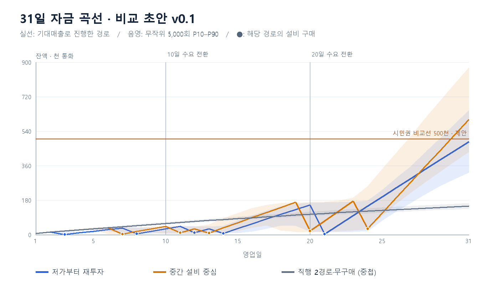
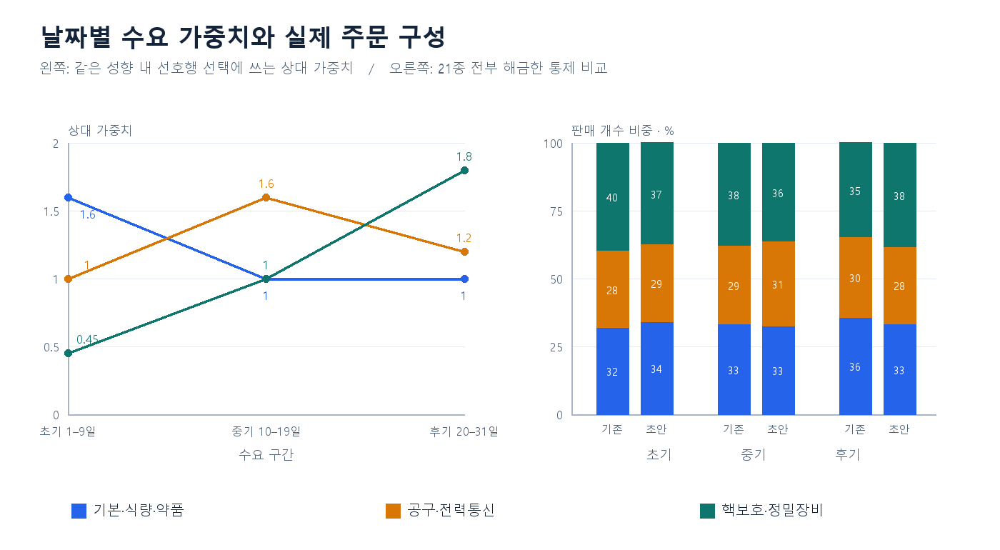
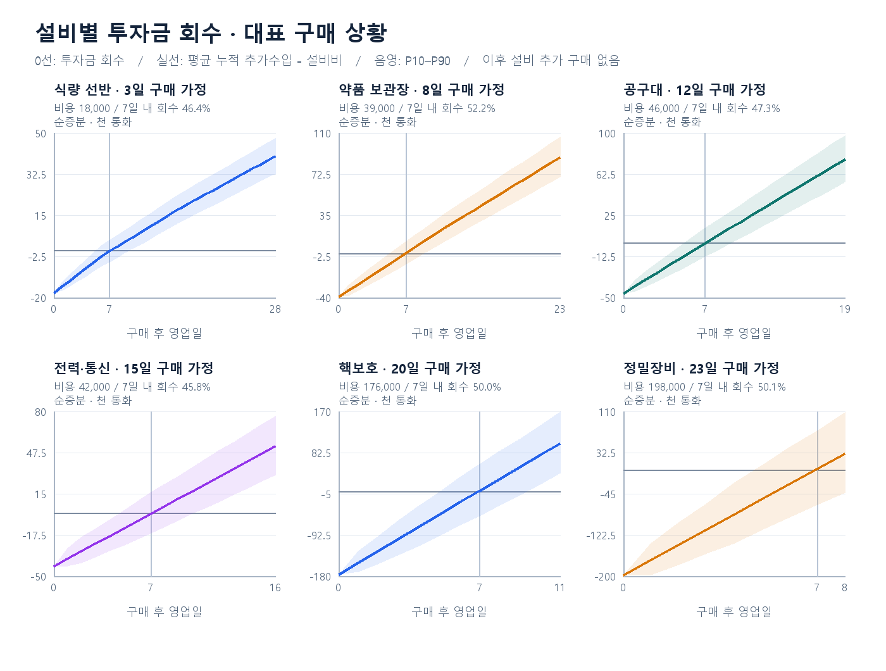

# Cashier 밸런싱 초안 v0.1 — 2026-09-12

검토용 수치와 곡선이다. 자유 구매·날짜별 선호는 가상 설계이며 현재 게임에 적용하지 않았다. 이전 고정 선호 분석은 참고 기준선이고 이번 결과가 날짜별 선호를 적용한 첫 초안이다.

**후속 반영·가정 변경:** 상품21종·정가·설비비·시작금·31일 유지비는 실제CSV에, 영업180초·날짜별 선호는 런타임에 연결했다. 이후 사용자가 기존 가게 단계별 설비 구매 조건을 유지하도록 결정해 자유 구매 변경은 취소했다. 아래 계산·그래프는 가게 단계 제한과 확장비를 제외한 당시 가상안을 보존한다. 현재 게임의 구매 시점·31일 잔액·투자 회수 결과로 확정하지 않으며, 단계 조건과 확장비를 포함한 재계산이 필요하다. 수치 자체는 이번에 바꾸지 않았다. 시민권 비교선은 여전히 미연결이며 상세 상태는 [준비 문서](../../balancing-preparation.md)를 따른다.

## 먼저 볼 결과

첫 설비 접근, 7영업일 회수, 여러 구매 경로의 경쟁력을 함께 진단했다. 이번에 정의한 경로 중 중간 설비 중심 경로의31일 잔액 중앙값이 가장 높았다. 두 고가 설비 직행 경로는24일 구매 마감 전까지 초안 설비비를 모으지 못해 무구매와 같은 결과가 됐다. 설비 효과가 없다는 뜻은 아니다. 최적 전략을 탐색한 결과나 자유 구매가 불가능하다는 일반 결론으로 확대하지 않는다. 최종 밸런스로 승인할 수 있는 단계는 아니다.

날짜 가중치를 도입해도 실제 주문 구성의 변화는 작았다. 단일 선호행 성향은 재가중되지 않고, 당일 상품 추첨과 선호품 부재 시 대체 주문이 효과를 약화한다. 아래 수요 그래프에서 입력 가중치와 판매 구성의 차이를 함께 확인할 수 있다.

기대매출 경로에서 저가 재투자는 첫 설비3일 목표를 충족했지만 중가 진입12일·고가 진입21일로10/20일 목표보다 늦었다. 중간 중심 경로는 중가 진입11일로 늦고 고가 진입20일은 맞췄다. 첫 설비3일 목표는 저가 재투자 경로의 기준으로 보았으며 모든 정책에서 동시에 충족한다고 주장하지 않는다.

| 경로 | 기대매출 경로의 구매일 | 31일 잔액 중앙값 | P10–P90 | 50만 도달률 |
|---|---|---|---|---|
| 저가부터 재투자 | 3일 식량 선반 → 8일 약품 보관장 → 12일 공구대 → 14일 전력·통신 → 21일 핵보호 | 462,325 | 323,745–648,500 | 38.6% |
| 중간 설비 중심 | 7일 약품 보관장 → 11일 공구대 → 13일 전력·통신 → 20일 핵보호 → 24일 정밀장비 | 604,750 | 431,140–870,715 | 75.0% |
| 핵보호 직행 | 24일까지 구매 없음 | 149,200 | 133,900–164,505 | 0.0% |
| 정밀장비 직행 | 24일까지 구매 없음 | 149,200 | 133,900–164,505 | 0.0% |
| 무구매 기준 | 24일까지 구매 없음 | 149,200 | 133,900–164,505 | 0.0% |

실선과 구매일은 매일 기대매출을 받는 한 경로다. 표의 잔액 중앙값·P10–P90·도달률은 별도의 무작위 5,000회 결과다. 서로 다른 통계이므로 31일 실선 끝과 중앙값은 일치하지 않을 수 있다. 음영은 계산 오차나 최솟값–최댓값이 아니라 이 모델 플레이의 가운데80% 범위다. 직행 두 경로와 무구매가 대부분 겹친다.

## 입력 기준과 제안값

| 항목 | 초안 | 상태·의미 |
|---|---|---|
| 상품·영업·기간 | 21종,180초,평균8건,31일 | 채택된 검증 기준. 모델은8건 모두 완료, 실제180초 처리 가능성 미검증 |
| 설비 구매 | 자금 조건만, 익일 상품 활성 | 사용자 의도를 적용한 가상안. 현행 가게 단계 제한은 분석에서 제외 |
| 원가 | 미차감 | 현행은 기록만 수행. 원가0 거래 거부 검증은 보존 |
| 시작금 | 1,000 | 제안. 현행100,000에서 낮춰 첫 설비3일 목표를 비교. 첫 실행0에서는 기대 경로4일 구매여서1,000으로 조정 |
| 유지비 | 1~30일 기존200~3,100;31일3,200 | 31일 행은 현재 없음. 선형 연장 제안 |
| 시민권 비교선 | 500,000 | 검토용 제안. 그래프는 결제 전 잔액이며 자동 차감·승리 처리 없음 |
| 명성·판정 | 중립 성향 비율 고정, 정가 판매 | 명성 변화·가격 이벤트·할인·거절·이탈·벌금·치료비 등 제외 |
| 가게 단계 목표 | 기존10/20일은 중·고가 진입의 관측 목표 | 잠금 조건으로 적용하지 않음. 시민권31일의 도달률과 함께 검토 |

시작금 변경은 첫 설비 접근을 보기 위한 비교 변수다. 현행100,000을 유지한 경우와의 민감도는 이번 초안 범위 밖이다. 식량 가격350/450 외 기존 상품가는 유지했다. 상품가 압축으로 직행 전략이 성립하는지는 후속 비교 대상으로 남긴다.

## 날짜별 선호

| 날짜 | 기본·식량·약품 | 공구·전력통신 | 핵보호·정밀 |
|---|---:|---:|---:|
| 1~9일 | 1.6 | 1.0 | 0.45 |
| 10~19일 | 1.0 | 1.6 | 1.0 |
| 20~31일 | 1.0 | 1.2 | 1.8 |

모두 **상대 가중치 제안**이다. 명성의 손님 성향 비율은 그대로 두고, 같은 성향에 속한 선호 설정행만 재가중한다. 복수 상품 타입의 행은 해당 가중치 산술평균, 한 행뿐인 성향은 변화 없음. 개별 상품 PK 선호는 현재 모두 빈 셀이다. 현재 데이터가 바뀌면 모델도 재검토해야 한다.

오른쪽은 모든21종을 해금한 동일 보유 상태에서의 통제 비교다. '기존'은 균등 행 선택, '초안'은 날짜 가중 행 선택이며 각 구간의4/6/8종 추첨은 양쪽 모두 적용했다. 실제 구매 경로의 날짜별 판매 비중을 뜻하지 않는다. 가중치를0으로 만들지 않았지만 상품 등장과 판매 수익을 보장하지 않는다.

핵보호·정밀의 판매 개수 비중은 초기 약39.6%→37.3%, 후기 약34.6%→38.3%였다. 초기0.45·후기1.8 가중치에 비해 실제 주문 변화는 작다. 선호 행을 재가중하는 것만으로 강한 시기별 수요 차이가 만들어졌다고 판단하지 않는다.

상품 목록 추첨100/220/280/350, 당일4/6/8종, 선호 선택90%, 주문1~3종·종류당1~3개는 유지했다. 선호 상품이 없으면 비선호 상품에서 주문한다. 따라서 선호를 바꿔도 고가품 매출 억제가 약할 수 있다. 학습·예고 시스템은 가정하지 않았다.

## 상품 가격표

| 상품 | 현재 정가 | 초안 정가 | 원가 보관값 | 해금 설비 |
|---|---|---|---|---|
| 물 | 100 | 100 | 50 | 기본 |
| 통조림 | 250 | 250 | 125 | 기본 |
| 분말 수프 | 150 | 350 | 75 | 식량 선반 |
| 영양바 | 200 | 450 | 100 | 식량 선반 |
| 붕대 | 300 | 300 | 150 | 기본 |
| 건전지 | 200 | 200 | 100 | 기본 |
| 연고 | 500 | 500 | 250 | 약품 보관장 |
| 응급 주사 | 900 | 900 | 450 | 약품 보관장 |
| 손전등 | 800 | 800 | 400 | 공구대 |
| 접이식 삽 | 1,000 | 1,000 | 500 | 공구대 |
| 무전기 | 2,000 | 2,000 | 1,000 | 전력·통신 |
| 배터리 | 1,200 | 1,200 | 600 | 전력·통신 |
| 방독면 | 2,500 | 2,500 | 1,250 | 핵보호 |
| 방호복 | 4,000 | 4,000 | 2,000 | 핵보호 |
| 방사능 측정기 | 5,000 | 5,000 | 2,500 | 핵보호 |
| 열화상 카메라 | 6,000 | 6,000 | 3,000 | 정밀장비 |
| 성냥 | 신규 | 150 | 75 | 기본 |
| 해열제 | 신규 | 700 | 350 | 약품 보관장 |
| 쇠지렛대 | 신규 | 1,200 | 600 | 공구대 |
| 야간 투시경 | 신규 | 6,500 | 3,250 | 정밀장비 |
| 휴대용 탐지기 | 신규 | 7,000 | 3,500 | 정밀장비 |

추가5종의 신규 문자열 키는 분석용이며 런타임 ID를 발급한 것이 아니다. 방사능 측정기는 핵보호로 이동한21종안을 사용했다. 원가 보관값은 현행 또는 기존 신규50% 초안을 유지했고, 식량 정가 변경에 맞춰 원가를 재계산하지 않았다. 계산에서는 모든 원가를 차감하지 않는다.

## 설비 가격과 손익분기

대표 구매 상황에서 구매 다음 날부터7영업일의 추가매출을 합하고1,000단위 반올림했다. 보유 조합과 날짜는 **견적 산정용 가정이며 구매 선행조건이 아니다.** 모든 경로는 같은 설비비를 지불한다. 기존 가게 확장비·편의설비비는 넣지 않았다.

| 설비 | 초안 비용 | 산정 기준 구매일 | 기존 보유 설비 | 7영업일 예상 추가매출 |
|---|---|---|---|---|
| 식량 선반 | 18,000 | 3일 | 없음 | 17,691 |
| 약품 보관장 | 39,000 | 8일 | 식량 선반 | 39,382 |
| 공구대 | 46,000 | 12일 | 식량 선반·약품 보관장 | 45,728 |
| 전력·통신 | 42,000 | 15일 | 식량 선반·약품 보관장·공구대 | 41,565 |
| 핵보호 | 176,000 | 20일 | 식량 선반·약품 보관장·공구대·전력·통신 | 176,106 |
| 정밀장비 | 198,000 | 23일 | 식량 선반·약품 보관장·공구대·전력·통신·핵보호 | 198,025 |

| 설비 | 7일 내 최초 회수 | 31일까지 최초 회수 | 회수한 표본의 기간 중앙값 |
|---|---|---|---|
| 식량 선반 | 46.4% | 100.0% | 8영업일 |
| 약품 보관장 | 52.2% | 100.0% | 7영업일 |
| 공구대 | 47.3% | 100.0% | 8영업일 |
| 전력·통신 | 45.8% | 100.0% | 8영업일 |
| 핵보호 | 50.0% | 98.6% | 7영업일 |
| 정밀장비 | 50.1% | 69.5% | 7영업일 |

이 그래프는 지정된 보유 상태에서 해당 설비 하나를 추가한 경로와 추가하지 않은 경로를 동일 난수로 비교한다. 이후 설비는 더 사지 않는다. 실제 경로 전체의 회수일이 아니다. 순증분이 처음0 이상인 날을 최초 회수로 셌으며, 이후에도 계속 양수임을 보장하지 않는다. 회수 기간 중앙값은31일까지 회수한 표본에 한정하므로 미회수율과 함께 읽는다. 대표 가격이7일 기대 추가매출과 비슷하므로7일 내 회수 확률은100%가 아니라 대략 절반이다.

해금 상품 총매출과 투자 효과의 차이는 다음과 같다. 각 견적 상황의 첫 영업일 기준으로, 기존 상품의 대체 손실을 함께 차감해야 한다.

| 설비 | 해금 상품 매출 | 기존 상품 매출 변화 | 하루 추가매출 |
|---|---|---|---|
| 식량 선반 | 5,196 | -2,587 | 2,609 |
| 약품 보관장 | 8,726 | -3,340 | 5,386 |
| 공구대 | 11,261 | -4,729 | 6,533 |
| 전력·통신 | 9,720 | -3,736 | 5,984 |
| 핵보호 | 31,742 | -6,583 | 25,158 |
| 정밀장비 | 39,532 | -11,243 | 28,289 |

## 경로 정책과 일별 잔액

저가 재투자는 선반→약품→공구→전력→핵보호→정밀, 중간 중심은 약품부터 같은 순서다. 핵보호 직행은 핵보호→정밀, 정밀 직행은 정밀→핵보호다. 이는 비교할 행동 정책이며 최적 전략을 계산한 것이 아니다. 앞선 목표를 살 자금이 모일 때까지 저축하고, 다른 설비를 즉흥적으로 대체하지 않는다.

정산마다 유지비를 먼저 차감하고 다음 영업일 유지비를 남길 수 있으면 설비1개를 구매한다. 신규 상품은 다음 날부터 반영한다. 모든 경로는24일까지만 새 설비를 사도록 했다. 이는 남은7영업일을 고려한 모델 정책이며 게임 구매 제한이 아니다. 현재 유지비 외 지출을 제외해도 직행이 막히는지를 우선 본다.

아래 잔액은 기대매출 경로의 설비 구매·유지비 차감 후 값이다. 시민권 결제 전이다.

| 일 | 유지비 | 저가부터 재투자 | 중간 설비 중심 | 핵보호 직행 | 정밀장비 직행 | 무구매 기준 |
|---|---|---|---|---|---|---|
| 1 | 200 | 7,240 | 7,240 | 7,240 | 7,240 | 7,240 |
| 2 | 300 | 13,380 | 13,380 | 13,380 | 13,380 | 13,380 |
| 3 | 400 | 1,420 | 19,420 | 19,420 | 19,420 | 19,420 |
| 4 | 500 | 9,969 | 25,360 | 25,360 | 25,360 | 25,360 |
| 5 | 600 | 18,418 | 31,199 | 31,199 | 31,199 | 31,199 |
| 6 | 700 | 26,767 | 36,939 | 36,939 | 36,939 | 36,939 |
| 7 | 800 | 35,016 | 3,579 | 42,579 | 42,579 | 42,579 |
| 8 | 900 | 4,165 | 17,246 | 48,119 | 48,119 | 48,119 |
| 9 | 1,000 | 17,600 | 30,812 | 53,559 | 53,559 | 53,559 |
| 10 | 1,100 | 30,644 | 43,351 | 58,901 | 58,901 | 58,901 |
| 11 | 1,200 | 43,588 | 9,790 | 64,144 | 64,144 | 64,144 |
| 12 | 1,300 | 10,432 | 30,333 | 69,286 | 69,286 | 69,286 |
| 13 | 1,400 | 29,708 | 8,775 | 74,328 | 74,328 | 74,328 |
| 14 | 1,500 | 6,885 | 35,782 | 79,271 | 79,271 | 79,271 |
| 15 | 1,600 | 31,946 | 62,689 | 84,113 | 84,113 | 84,113 |
| 16 | 1,700 | 56,907 | 89,496 | 88,856 | 88,856 | 88,856 |
| 17 | 1,800 | 81,768 | 116,203 | 93,498 | 93,498 | 93,498 |
| 18 | 1,900 | 106,529 | 142,810 | 98,040 | 98,040 | 98,040 |
| 19 | 2,000 | 131,190 | 169,317 | 102,483 | 102,483 | 102,483 |
| 20 | 2,100 | 154,986 | 18,843 | 106,871 | 106,871 | 106,871 |
| 21 | 2,200 | 2,682 | 71,282 | 111,158 | 111,158 | 111,158 |
| 22 | 2,300 | 51,437 | 123,621 | 115,346 | 115,346 | 115,346 |
| 23 | 2,400 | 100,091 | 175,861 | 119,434 | 119,434 | 119,434 |
| 24 | 2,500 | 148,645 | 30,000 | 123,422 | 123,422 | 123,422 |
| 25 | 2,600 | 197,099 | 111,771 | 127,310 | 127,310 | 127,310 |
| 26 | 2,700 | 245,454 | 193,442 | 131,098 | 131,098 | 131,098 |
| 27 | 2,800 | 293,708 | 275,013 | 134,786 | 134,786 | 134,786 |
| 28 | 2,900 | 341,862 | 356,484 | 138,373 | 138,373 | 138,373 |
| 29 | 3,000 | 389,916 | 437,855 | 141,861 | 141,861 | 141,861 |
| 30 | 3,100 | 437,870 | 519,126 | 145,249 | 145,249 | 145,249 |
| 31 | 3,200 | 485,725 | 600,297 | 148,537 | 148,537 | 148,537 |

## 검증·한계·다음 검토

- 계산: 고정 시드 20260912, 보유 상태·기간별 4,000일 기대매출 표본, 경로별 5,000회 및 설비별 5,000회 회수 비교. 1~3개 수량도 실제 추첨했다. 실재 플레이 테스트가 아니다.
- 일일 가중 비복원 추첨은 동등 분포의 exponential-race 방식이며 원본 C# 난수열을 재현하지 않는다. 같은 거래 난수를 공유해 구매 전후를 대응시켰다. 이 대응 방식도 반사실 비교를 위한 분석 가정이다.
- 자동 확인: 21 unique products, 1000 disposition weight sum, cash conservation, no duplicate expected purchases, quantile ordering, mean units about 32/day. 시뮬레이터의 내부 일관성 확인이며 Unity 통합 검증으로 확대하지 않는다.
- 기술 담당은 읽기 전용으로 확률·익일 효과·현금 보존·회수 계산을 검토했다. 진열되지 않은 상품까지 선호 대기에 집계하던 보조 지표1건을 당일 진열·설비·선호의 교집합으로 수정하고 재계산했다. 매출·잔액·회수 결과는 동일했다. 그래프의 숫자 눈금·글자·범례도 이미지로 확인했다.
- 기획 담당의 결과 리뷰에 따라 경로 간 우위를 비교 정책 안으로 한정하고, 직행의 구매 마감 및 수요 변화 폭과 성장 목표 미충족을 본문에 명시했다.
- 자유 구매, 날짜 선호, 새5종, 가격 변경은 게임에 미적용. 사용자 설정·패키지·기존 작업 파일 보존. 이번에 Unity 실행·Git stage·commit·push·merge 없음.
- 첫 설비3일, 중가10일, 고가20일, 시민권31일은 대표 경로 관측 목표다. 현재 초안에서 실제 구매일·도달률이 벗어난 항목은 미충족으로 보고 조정한다.
- 다음 수치 비교는 기존 가격 보존안과 고가 상품 가격 간격 축소안을 나란히 두고, 설비비를 함께 재산정하는 것이다. 고가 설비비만 낮추면 회수가 지나치게 빨라질 수 있으므로 가격·비용을 함께 바꿔야 한다. 7일 회수는 대표 상황의 목표로 유지한다.
- 사용자는 성장 속도, 늦은 투자 회수의 부담, 중간 투자와 직행 선택의 매력을 검토하면 된다. 현재 초안은 직행 경로 미성립과 시민권 성공률 차이를 보여주는 진단 결과다.

재현: 이 폴더의 [model.js](model.js)를 Node로 실행하고, Pillow가 설치된 Python으로 [render.py](render.py)를 실행한다. 숫자 원본은 [results.json](results.json), 원문 근거는 [물품 기준안](../sources/t.mxsfe4eewdaq.md), 이전 논의는 [준비 문서](../../balancing-preparation.md)에 있다. 실제CSV 반영 후에도 검토 당시 계산을 재현하도록 inputs/에 적용 전 상품·유지비와 당시 성향·명성CSV 4개를 보존했다. 분석 모델만 읽는 스냅샷이며 runtime 테이블이 아니다. 새 밸런스 비교에서는 이 입력을 명시적으로 갱신하거나 새 초안으로 분리한다.
