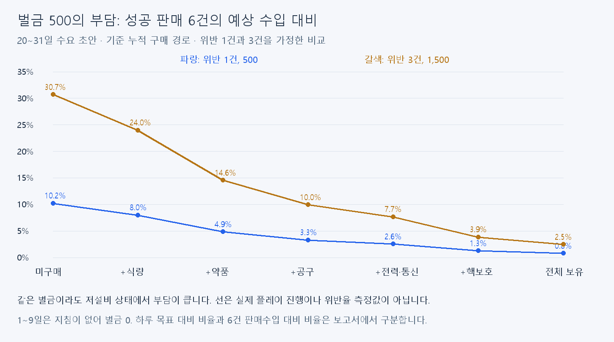

# 일일지침·벌금500 검토

2026-09-12. **두 규칙의 벌금500·허용 수량0/1을 유지한다.** 기획 명시값과 실제CSV가 일치하며, 실측 위반율 없이 일괄 인상할 근거가 부족하다. 설비 수입 역전은 사용자가 플레이테스트에서 검토하기로 했으므로 이번에 수정하지 않았다.

## 기획·현재 데이터

[기획서 일일지침 탭](https://docs.google.com/document/d/1lCzaQRmFRWrxfIhWr2UZy64-7A8v1N9fAvlOorMF77E/edit?tab=t.eiyoesglx0mz)을2026-09-12 native API로 재조회했다. revision `ANLCKQk8V-OYnqhGzUR49hPrwBM9i4-KPdGptYaBvjtUFzuHXlSwF0eZQUZFrxPAKf1ijMFKwAPqCnXamEwEmhl1aoCy3WNfkSsNcRxVUXc`. 기존 로컬 스냅샷만으로 최신 기획을 추정하지 않았다.

| ID | 규칙 | 대상 손님에게 한 거래에서 판매한 수량 | 벌금 |
|---|---|---|---:|
|13001|판매 금지|대상 상품1개 이상|지침 위반1건당500|
|13002|수량 제한|대상 상품2개 이상,허용1개|지침 위반1건당500|

초과 수량이2개여도 같은 지침 벌금은500이다. 한 거래에서 서로 다른 두 지침을 위반하면1,000이다. 현재 생성기는 두 지침의 대상 상품을 서로 다르게 고른다. 판매가 거절되면 벌금0이며 수락된 거래의 최종 판매 목록으로 판정한다.

| 날짜 | 지침 수 | 6건 성공 거래에서의 벌금 범위 |
|---|---:|---:|
|1~9일|0|0|
|10~19일|1|0~3,000|
|20일 이후|2|0~6,000|

상한은 모든 거래가 모든 활성 지침을 위반하는 조건부 산술 상한이다. 평균 위반량·실제 도달 빈도가 아니다. 후보 부족 등 예외 상황에서의 동작은 아래 차이에 기록한다.

## 집계·실제 납부 경로

1. 거래 성립 시 판매수입은 잔액에 반영하고 지침 위반·예정 벌금은 집계한다. 벌금 때문에 거래를 취소하지 않는다.
2. 마감 시 기존 미납+오늘 유지비+오늘 지침 벌금을 합산한다. 전액을 감당하면 한 번에 차감한다.
3. 부족하면 일부를 차감하지 않고 총액을 미납으로 기록한다. 최초 미납일+3일을 상환 기한으로 두며 추가 미납으로 연장하지 않는다.
4. 마지막 유예일에도 전액 납부할 수 없으면 게임오버 조건을 반환한다. 실제 진행 종료·Scene 전환까지 구현됐다는 뜻은 아니다.

예:20일차 정산 직전 잔액2,000, 유지비2,100, 위반1건500, 기존 미납0이면 필요액2,600이다. 실제 차감0, 미납2,600, 최초 유예 종료23일이 된다. 이 예시는 코드 규칙의 산술 설명이며 이번 실제 플레이 결과가 아니다.

지침 위반 자체에 추가 명성·도덕성 감점은 연결돼 있지 않다. 상품 제외와 가격 선택이 달라져 생기는 간접 효과는 별개다.

## 진행별 부담

기존 수요 초안의 기본가 판매수입을 분모로 사용했다. 날짜 선호 가중치는 아직 런타임에 연결되지 않았고 실제 처리시간·위반률·준수에 따른 상품 제외는 시뮬레이션하지 않았다. 아래는20~31일을 고정한 기준 누적 구매 경로다.

| 누적 경로 | 하루 목표 | 6건 판매수입 | 위반1건/목표 | 위반1건/6건 수입 | 위반3건/6건 수입 |
|---|---:|---:|---:|---:|---:|
| 미구매 | 6,100 | 4,882 | 8.2% | 10.2% | 30.7% |
| +식량 | 7,800 | 6,254 | 6.4% | 8.0% | 24.0% |
| +약품 | 12,900 | 10,280 | 3.9% | 4.9% | 14.6% |
| +공구 | 18,800 | 15,044 | 2.7% | 3.3% | 10.0% |
| +전력·통신 | 24,400 | 19,496 | 2.0% | 2.6% | 7.7% |
| +핵보호 | 48,300 | 38,602 | 1.0% | 1.3% | 3.9% |
| 전체 보유 | 75,000 | 59,974 | 0.7% | 0.8% | 2.5% |

분모 구분: 위 표의 하루 목표는 기존 기준표의 100단위 반올림값이다. burden.csv의 exact_target은 반올림 전 기대 거래액×7.5이며 penalty_per_exact_target도 그 값을 분모로 사용한다.

10일차 이후에도 설비가 적으면 벌금 부담은 크고, 고가 상품군을 갖추면 작아진다. 1~9일에 위 표의 부담이 발생하는 것으로 읽지 않는다. 전체64조합·현재 선호 균등/수요초안 비교는burden.csv에 있으며0/1/2/3건 및6거래의 최대 위반 수를 조건별로 계산했다. 위반 건수를 확률이나 강제 발생량으로 설정하지 않았다.

## 고가 상품의 위반 유인

같은 손님과 나머지 판매가 그대로 성립하고 다른 효과가 같다면, 위반으로 늘어난 금전 수입은 `준수했으면 제외할 수량 × 기본가 − 500`이다. 원가 차감은 현재 경제 모델에서 사용하지 않는다. 한 거래의 같은 지침은 고정500이므로 비싼 상품일수록 위반이 금전적으로 유리할 수 있다.

| 예시 | 준수 대비 추가 판매수입 | 벌금 후 추가수입 |
|---|---:|---:|
|물100을 판매 금지인데1개 판매|100|−400|
|연고500을 판매 금지인데1개 판매|500|0|
|휴대용 탐지기7,000을 판매 금지인데1개 판매|7,000|+6,500|
|휴대용 탐지기7,000 최대1개인데3개 판매|14,000|+13,500|

이는 곧바로 모든 상황의 최적 행동을 뜻하지 않는다. 실제 분류·제외 과정, 거래 성립 여부, 가격사건과 다른 손해는 별도로 확인해야 한다. 의도적인 위반 선택을 허용할지, 고가품도 반드시 준수하게 만들지는 아직 확정하지 않았다. 이번에 벌금 인상이나 수입 비례 벌금을 추가하지 않는다.

## 기획과 구현의 차이

- 기획은 유효한 손님 조건의 균등 선택과 성별+연령 조합을 설명한다. 현재 생성은 모든 손님70%, 남/여/아동/성인/노인 각각6%이고 복합 조건을 생성하지 않는다. 판정 구조는 복합 조건을 지원한다.
- 기획은 일부 비충돌 조건에서 같은 상품을 두 지침 대상으로 허용하지만 현재 생성기는 같은 상품을 중복 대상으로 쓰지 않는다.
- 기획은 후보 부족 시 지침 수를 줄이고 로그를 남기지만, 현재 생성기는 필요한 서로 다른 상품/유효 후보 부족 시 예외를 던진다. 정상21종 데이터의 일반 흐름과 예외 동작은 구분한다.
- 이런 차이는 벌금 노출 빈도에 영향을 줄 수 있다. 이번 데이터 검토에서 생성 정책을 임의로 바꾸지 않았다.

## 플레이테스트에서 볼 항목

- 10일·20일 지침 증가 시점과 저설비/고설비 각각에서 성공 거래 수, 지침별 위반 수, 하루 판매수입, 예정 벌금, 실제 납부·미납을 기록한다.
- 실수 위반과 벌금보다 비싼 상품을 의도적으로 판매한 위반을 구분한다.
- 지침 준수를 위해 제외한 수량이 정상 제외로 인정되는지, 두 지침 위반이1,000으로 누적되는지 확인한다.
- 거래 거절의 벌금0, 마감 차감1회, 잔액 부족 시 전액 미납, 유예 종료일 고정을 실제 연결 경로에서 확인한다.
- 유지비·미납과 벌금을 구분해 보고, 고정500이 초반에는 과도하고 후반에는 무의미한지 판단한다. 날짜/설비 연동 벌금은 기존CSV에 없는 기능이므로 이번에 가상 컬럼으로 채우지 않았다.

## 산출물·검증 경계

[전체 부담 계산](burden.csv), [21상품별 위반 금전 유인](violation-incentive.csv). 분석용 CSV는 게임 데이터로 등록하지 않았다. 입력 해시·규칙2종·1~9일벌금0·가정별 위반 상한·계산 행 수를 검사했다. 실제 거래별 벌금 집계·정산 전체 연결은 코드 읽기로 확인했으며 실행 결과는 별도 validation.md에 기록한다.

원본: Assets/Datas/DailyGuidelineData.csv, Customer/ProductData.csv, 기존 daily-income-20260912/estimates.json 및reference-targets.csv. 코드 근거: Commons/SaleRestriction.cs, Customer/CustomerVisit.cs, Finance/DailyAggregationService.cs, Manager/GameSessionManager.cs. 재현은 이 폴더의review.py를 Pillow가 설치된 Python으로 실행한다.
