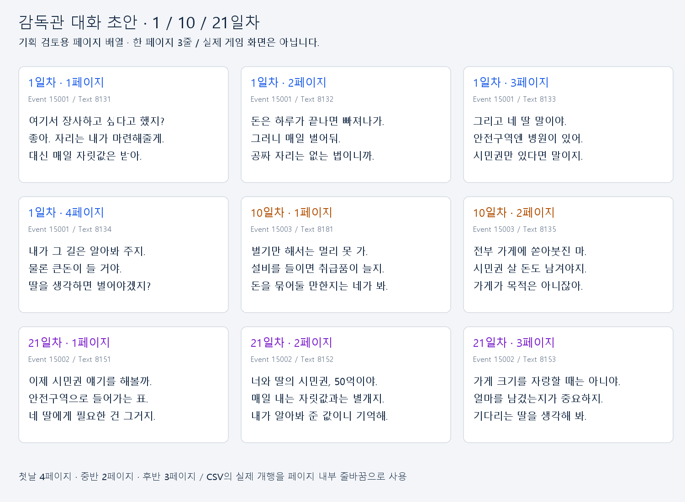

# 감독관 등장과 3줄 대화 초안

2026-09-12. 기획서의 인물 역할과 현재 구현을 바탕으로 감독관 이벤트3개를 **1·10·21일차 영업 전**으로 배치했다. 사용자의 스토리·당위성·목표 의식 의견은 참고하고, 감독관이 등장할 때마다 새로운 역할을 갖도록 초안을 작성했다. 현재 데이터에 반영한 검증용 콘텐츠이며 최종 스토리 확정은 아니다.

[페이지별 실제 문구](pages.md)는 TextData를 읽어 생성한다. 위 그림은 검토용 배열이며 게임 화면 캡처가 아니다.

## 등장 시점과 역할

| 시점 | 이벤트 | 목적 | 분량 |
|---|---:|---|---:|
| 1일차 영업 전 | 15001 | 장사 자리와 매일 지출의 관계, 안전구역 시민권의 존재, 감독관에게 의존하는 관계 소개 | 4페이지·12줄 |
| 10일차 영업 전 | 15003 | 설비 투자와 시민권을 위한 저축 사이의 선택 환기 | 2페이지·6줄 |
| 21일차 영업 전 | 15002 | 터무니없는 시민권 가격50억 제시, 상납금과 시민권 대금 구분 | 3페이지·9줄 |

첫 방문은 첫 영업 전에 기본 맥락을 준다. 다음 방문은 초기 운영을 경험한 뒤 투자·저축을 다시 생각할 시점, 마지막 방문은31일 운영의 후반에 목표액을 보고 남은 자금을 모을 시점으로 잡았다.10일차 방문은 새 콘텐츠 제안이며 도달 보장이나 확정 성장 시점이 아니다.

기존 2일차 확인용 임시 이벤트를10일차 실제 대화로 바꿨다. 기존3단계 도달 후 목표 공개는21일차 고정 공개로 조정했다. 특정 설비나 가게 확장을 사야만 핵심 이야기를 들을 수 있는 조건을 피하고, 늦어도21일에는 목표를 알려주는 기획 추천안을 이번 초안에 채택했다. 조기3단계 도달 시 더 일찍 공개하는 OR 조건은 만들지 않았다. 따라서3단계를 일찍 구매해도21일 전에는 이 대화가 나오지 않는다.

모든 이벤트는 날짜가 정확히 일치할 때만 세션당1회 등장한다. 시설 조건·가게 단계 조건은 비워두며 당일 여러 감독관 이벤트를 연속 배치하지 않았다. 날짜를 건너뛰는 디버그 진입에서는 지난 대화를 이월하지 않는다. 대화 중에는 영업시간이 흐르지 않고, 마지막 페이지를 확인하고 퇴장이 끝나면 기존 가격표·일일지침 확인 단계로 진행한다.

## 내용과 말투

감독관은 호의를 베푸는 척하며 플레이어가 돈을 벌어야 하는 이유를 반복한다. 첫날은 자리를 내준 대가를 자연스러운 의무처럼 설명하고, 중반에는 판단을 플레이어 몫으로 돌리고, 후반에는 딸을 언급해 목표를 다시 압박한다. 거래를 직접 지시하거나 특정 손님 착취를 튜토리얼 정답처럼 가르치지 않는다.

현재 구현과 다른 주간 징수·확장 직후 상납 인상·미납 즉시 박탈·딸의 병세 악화 같은 내용은 활성 대사에 넣지 않았다. 감독관이 실제 징수나 거래를 수행하는 기능은 여전히 없다. 대사 선택·넘김으로 잔고·도덕성·명성은 변하지 않는다.

**50억은 사용자의 후속 요청에 따라 임의로 정한 터무니없는 연출용 가격**이다. 기존 대사의50만을50억으로 바꿨으며 경제 분석의 목표액50만과는 의도적으로 구분한다. 시민권 구매·목표 잔액 표시·엔딩과 연결되는 데이터 소비자는 아직 없고, 이번 변경은 그 기능이나 경제 수치를 바꾸지 않는다. 앞으로 실제 시민권 구매를 연결할 때 연출 가격과 실제 목표액의 관계를 별도로 정해야 한다. 원문3억·6억·5억도 예시이며 이번50억은 새 대사 초안이다.

## 데이터 압축과 UX

문장마다 다음 버튼을 누르는 대신, 의미가 이어지는3줄을 TextData 한 레코드로 묶었다. 첫날20→4페이지, 후반29→3페이지로 줄였고 중반은 임시1→2페이지로 바꿨다. 총50→9페이지이며 페이지 완료를 위한 다음 입력도50→9회로82% 줄었다. 입퇴장 연출과 읽는 시간까지82% 줄었다는 뜻은 아니다.

각 페이지는 실제 줄바꿈2개를 포함한 짧은3줄이다. CSV에서는 문자열 전체를 큰따옴표로 감싼다. 물리적 파일 줄 수가 늘어도 Text 데이터는230레코드 그대로다. 애플리케이션에서 문자 `\n`을 치환하거나 세 레코드를 동적으로 합치는 처리를 추가하지 않았다. 기존 CsvHelper 파싱과 TMP 문자열 표시를 그대로 쓴다.

| 이벤트 | 현재 페이지 Text ID |
|---|---|
| 15001 | 8131 → 8132 → 8133 → 8134 |
| 15003 | 8181 → 8135 |
| 15002 | 8151 → 8152 → 8153 |

이름8129·8130·8180과 페이지9개, 총12개 Text만 수정했다. 다른218개 레코드와 기존FK·ID·스키마를 보존했다. 더 이상 선택되지 않는 과거 감독관41개 Text는 삭제하지 않았다. 이 문구에 예전 금액·상납 표현이 남아 있어도 현재 이벤트 배열에서는 재생하지 않는다. 다른 시스템이 해당 Text를 참조하지 않는지 현재 CSV를 대조했다.

## 근거·예약·검증

- [감독관 원문](https://docs.google.com/document/d/1lCzaQRmFRWrxfIhWr2UZy64-7A8v1N9fAvlOorMF77E/edit?tab=t.exfv0lp8nt0): 인물 성격·의존 관계·시민권과 딸을 통한 압박. 주간 징수와 예시 금액은 그대로 구현값으로 옮기지 않았다.
- [31일 운영 기획](https://docs.google.com/document/d/1lCzaQRmFRWrxfIhWr2UZy64-7A8v1N9fAvlOorMF77E/edit?tab=t.yfziq7qrws5t): 매일 지출 방향과 늦어도21일 목표 공개 추천. 두 문서를 작업 당일 native API로 다시 읽었다.
- [구현 명세](../../../INSPECTOR_SYSTEM_DRAFT.md): 날짜 조건·영업 전 위치·한 페이지당1회 진행·퇴장 완료·경제 상태 불변.
- 기존15003이 실제 CSV에는 있지만 예약표에는 빠져 있던 불일치를 정리했다. [CSV 종류 ID](https://docs.google.com/document/d/1lCzaQRmFRWrxfIhWr2UZy64-7A8v1N9fAvlOorMF77E/edit?tab=t.ccpln6m1g4kv)의 예약15001~15002를15001~15003으로 고쳤고 새ID는 만들지 않았다. 같은 탭의 다른17문단과 전체67개 탭 구조·제목·순서가 그대로임을 재조회했다. 감독관 스토리 원문은 수정하지 않았다.

정적 검사에서3이벤트·9페이지·페이지당3줄·Text230개의 고유성·다른218개 레코드 보존을 확인했다. `before.json`에 변경 전 데이터를 보존했고 `preview.py`로 검토표·그림을 재생성할 수 있다. 실제 Unity 파싱·글꼴·페이지 크기·진행 API 결과는 [작업 기록](../../balancing-preparation.md)에 구분해 남긴다. 실제 화면의 읽기 속도와 연출 호흡은 사용자 플레이 검토 대상이다.
