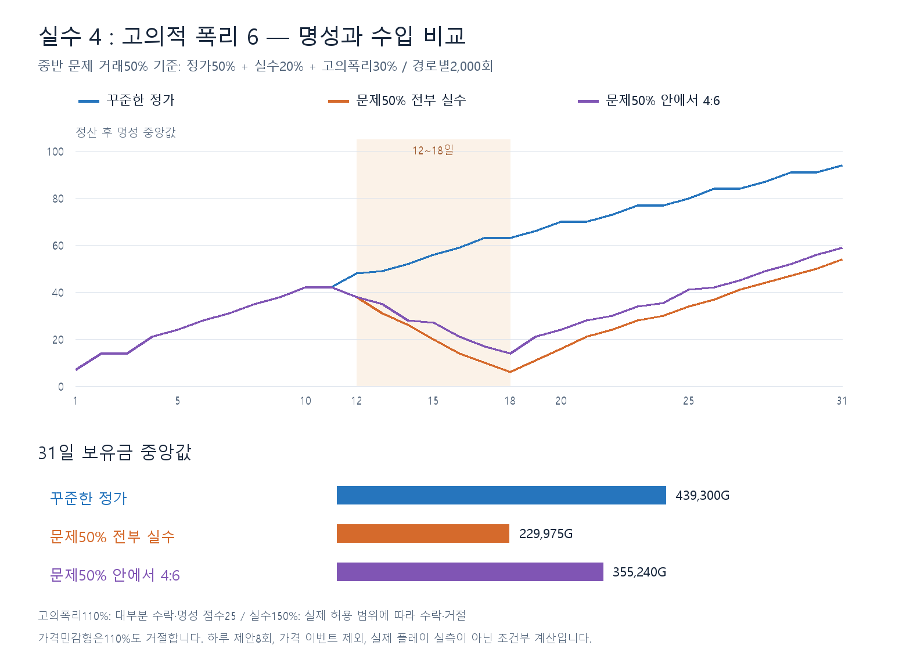

# 중반 실수와 고의적 폭리 4:6 비교

2026-09-12. 사용자의 조건부 요청 중 **폭리가 명성에 영향을 주는 경우의 추가 계산**을 수행했다. 실제 데이터 입력은 폭리가 명성에 영향을 주지 않는 경우의 대안이므로 이번 작업에서는 런타임 CSV를 변경하지 않았다.

## 구현 확인과 해석

현재 게임은 거래 의도를 판별하지 않고 제안 금액과 손님 허용 범위로 판정한다. 수락된 폭리는 행동 점수25, 과다 청구로 거절되면0이다. 일반 정가는50이고 성급형 정가는100점·가중치3이다. 하루 전체의 가중 점수를 정산하므로 **폭리 한 번이 곧 명성 감소 한 번은 아니다.** 정가·성급형 거래가 함께 있으면 당일 명성이 유지되거나 오를 수도 있다.

이번에는 기존12~18일·하루 제안8회·문제 거래25%/50%를 유지하고 **문제 거래 안에서 실수40%, 고의폭리60%**로 나눴다. 별도로 중반 모든 거래를4:6으로 구성하는 해석도 계산했다.

| 중반 문제 발생률 | 전체 중 정가 | 전체 중 실수 | 전체 중 고의폭리 |
| --- | --- | --- | --- |
| 25% | 75% | 10% | 15% |
| 50% | 50% | 20% | 30% |
| 100% 참고안 | 0% | 40% | 60% |

실수 가격은 이전과 같은 현재가150%, 고의폭리는 **현재가110%**로 가정한다. 구체적인 폭리 배율은 사용자가 정한 값이 아닌 이번 계산 가정이다.110%는 일반/성급/부자/가난의 허용 범위 안이지만 가격민감형은 거절한다. 성향별 최고 수락가를 정확히 알아내는 완전정보 전략으로 계산하지 않았다.150% 오입력도 성급형·부자형이 수락할 수 있으며, 실수라는 이유만으로 무조건 거절시키지 않는다. 실수/고의는 분석용 분류이며 게임에 새 필드나 시스템을 만들지 않았다.

기간 밖에는 정가로 복귀한다. 거래를 거절당하면 수입0이고8번 제안 기회 중 한 번을 소모한다. 비율은 각 거래의 독립 확률이므로 매일 정확히 같은 건수로 나누지는 않는다.

## 계산 결과

이전 [명성 초안](../reputation-20260912/report.md)의 비용 제안과 실제 단계 제한·유지비·명성 정산을 사용했다. 아래 명성·구매일·보유금은 각2,000회 중앙값, 하루 성공 건수는12~18일 전체 표본의 평균이다. 보유금은 지출을 모두 차감한31일 정산 잔액이며 누적 매출과 다르다.

| 경로 | 18일 명성 | 31일 명성 | 중반 하루 성공 건수 | 3단계 구매일 | 핵보호 구매일 | 31일 보유금 G |
| --- | --- | --- | --- | --- | --- | --- |
| 꾸준한 정가 | 63 | 94 | 8.00 | 20 | 22 | 439,300 |
| 문제25% 전부 실수 | 31 | 70 | 6.49 | 21 | 23 | 335,400 |
| 문제25% 안에서 4:6 | 38 | 76 | 7.34 | 21 | 22 | 401,915 |
| 문제50% 전부 실수 | 6 | 54 | 4.99 | 23 | 24 | 229,975 |
| 문제50% 안에서 4:6 | 14 | 59 | 6.67 | 21 | 23 | 355,240 |
| 중반 전체 거래 4:6 | -39 | 33 | 5.39 | 22 | 24 | 269,288 |

문제50% 안에서4:6으로 섞으면 전부 실수인 경우에 비해 18일 명성 중앙값6→14,31일 명성54→59,3단계 구매23→21일,핵보호24→23일이다.31일 보유금 중앙값도229,975→355,240G로 높아진다. 같은seed 표본끼리 비교한 평균 보유금 차이는 120,335G다. 두 중앙값의 차이와 표본별 차이의 평균은 다른 통계다.

고의폭리 거래가 수락되면110% 수입을 남기고 행동 점수25를 받는다. 따라서 거절이 많이 발생하는 실수 경로보다 당장의 현금과 명성 손실이 작다. 그래도 꾸준한 정가 경로의31일 명성94·보유금439,300G에는 못 미쳤다. 이는 **혼합 경로 전체**의 결과이며, 고의폭리만으로 운영하는 전략보다 정가가 항상 최적이라는 증거는 아니다. 폭리 배율·기간·손님 구성이 달라지면 결과도 바뀐다.

문제25% 혼합은 중반 명성 중앙값이11일42→18일38로 소폭 하락하고, 약53%의 표본만11일보다 낮아졌다.4:6이라는 비율만으로 큰 명성 하락을 보장할 수 없으며 총 발생률이 중요하다. 중반 전체를4:6으로 채우면18일 명성이-39까지 내려가는 더 강한 경로가 된다.

## 이후 회복

| 혼합 경로 | 11→18일 하락 비율 | 회복한 표본의 회복일 중앙값 | 하락 표본 중31일 내 회복 |
| --- | --- | --- | --- |
| 문제25% 안에서 4:6 | 53.0% | 21일 | 99.0% |
| 문제50% 안에서 4:6 | 99.0% | 25일 | 88.5% |
| 중반 전체 거래 4:6 | 100.0% | 30일 | 21.2% |

회복은19일 이후 자신의11일 정산 명성을 처음 다시 달성하는 것으로 정의했다. 회복일 중앙값은 회복에 성공한 표본만의 값이다. 특히 중반 전체4:6 참고안의 회복 비율은21.25%이므로 회복일30을 전체 플레이어의 예상 회복일로 읽으면 안 된다.

## 초안 판단

정가 운영은 비용 도달 목표의 기준으로 유지한다. 혼합25%는 가벼운 실수·이익 추구 경로, 혼합50%는 뚜렷한 명성 하락과 회복을 검토할 경로로 쓰는 것을 권한다. 중반 전부4:6은 별도의 강한 스트레스 검토에 해당한다. 현행 구현만으로도 현금과 명성 사이의 선택 결과가 나타나므로 이번 계산을 근거로 보상·벌점·시설 가격을 즉시 바꾸지는 않는다.

이전 비용 제안의 식량3·2단계10·공구12일 구매 중앙값은 이번 모든 경로에서도 유지됐다. 후반 도달일과 잔액 차이는 위 표에 반영했다. 상품 설비는 구매 다음날 활성화되고, 확장은 즉시 적용된다. 가격 제안의110%는 최고 수익 전략을 탐색해 정한 값이 아니다. 실제 성향 식별과 가격 입력 체감은 플레이테스트에서 확인해야 한다.

## 검증과 한계

기존 계산기에 혼합 행동 분기와 다른 분석에서 재사용할 진입점만 추가했다. 이전 정가/실수25%/실수50%의 최종 명성·현금·5개 구매일 통계가 **기존 결과와 정확히 일치**하는지 확인했다.110%의 수락·점수를 실제15개 성향 행과 대조했고, 실수/고의 분기 및12·18일 포함/11·19일 제외 경계6개를 검사했다. 혼합25/50/100%의 실수 표본 비중은 각각39.65/39.88/40.07%로4:6 설정을 확인했다. 가격민감형의 고의폭리 거절도 집계했다.

6경로×2,000회=12,000개31일 시뮬레이션을 완료했다. 명성 합산·회복 배율·다음날 적용·단계 제한·익일 활성·예비 유지비·잔액 보존은 앞 분석기를 재사용한다. 모든 표본이 유지비를 납부할 수 있었으며 미납을 임의로 면제하지 않았다. 분석 입력·현재 구현 소스의SHA256 일치도 확인했다.

가격 이벤트·대기열 이탈·실제180초 처리량·지침 벌금·도덕성/가족 선택은 제외했다. 고의폭리도 도덕성 등에 별도 영향을 줄 수 있으므로 여기의 명성/현금 결과만으로 게임 전체의 최적 행동을 판단하지 않는다. 검증 상태는 **PARTIAL**: 오프라인 검사와 그래프 확인 완료, Unity 실행 검증 미실행. 런타임 데이터·코드·Git commit/push는 변경하지 않았다. 기획 역할에 읽기 리뷰를 요청했으나 도구에서 회신 본문이 없어 위 판단은 조정자 판단이다.

재현: 이 폴더의 `calculate.js`를Node로 실행하고 `render.py`를Pillow가 있는Python으로 실행한다. 입력은 이전 `reputation-20260912/inputs.json`을 재사용하며 새 결과·참조 해시는 이 폴더의 `results.json`에 보관했다. 이전 보고서·결과는 덮어쓰지 않았다.
