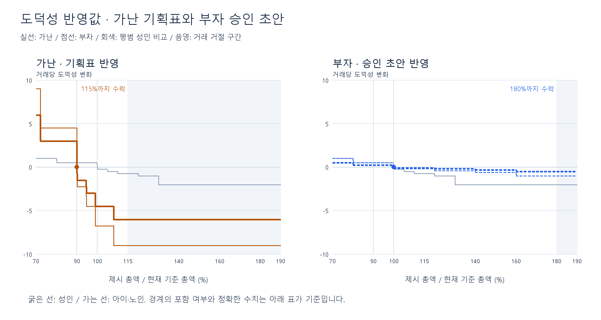

# 가난·부자 도덕성 데이터 반영

2026-09-12. 사용자가 데이터 추가와 예약 범위 확장을 승인했다. **가난14021~14028, 부자14029~14036의16행을 런타임 MoralityData에 추가했다.** 기존20행은 보존했다. 실행 검증 결과는 [작업 기록](../balancing-preparation.md)을 따른다.

## 가난: 기획 확정표 8행

근거는 기획서의 [거래·도덕성 확정표](https://docs.google.com/document/d/1lCzaQRmFRWrxfIhWr2UZy64-7A8v1N9fAvlOorMF77E/edit?tab=t.jxxow3f6hpes)다. 새 기획 제안이 아니며 경계·점수·연령 배율을 그대로 옮긴다. 제시 총액과 현재 기준 총액은 양수다.

| 제시가 비율 | 거래 | 성인 | 아이·노인 |
|---|---|---:|---:|
| 72% 이하 | 수락 | +6 | +9 |
| 72% 초과~90% 미만 | 수락 | +3 | +4.5 |
| 정확히 90% | 수락 | +0 | +0 |
| 90% 초과~94.5% 이하 | 수락 | -1.5 | -2.25 |
| 94.5% 초과~99% 이하 | 수락 | -3 | -4.5 |
| 99% 초과~108% 이하 | 수락 | -4.5 | -6.75 |
| 108% 초과~115% 이하 | 수락 | -6 | -9 |
| 115% 초과 | 거절 | -6 | -9 |

도덕성 중립점은90%지만 기준가 판매 판정은100%다. 따라서 가난 성인에게100%로 팔면 거래는 기준가 판매 성공, 도덕성은−4.5다. 이전 미평가(null) 상태에서 이번에 실제 점수를 평가하도록 데이터를 연결했다.

예를 들어 전원 성인·하루8건·가난 비중10%·전부100% 판매라는 통제 가정이면 도덕성 기대 변화는 하루−3.6,31일−111.6이다. 실제 플레이 예측이나 새 일일 제한이 아니다. 고정 가격 정책이 Good 엔딩의0 이상 조건을 자동 보장하지 않는다는 의미다. 기존 무이벤트 현금흐름 그래프는 도덕성을 계산하지 않았으므로 해당 그래프로 엔딩까지 검증됐다고 해석하면 안 된다.

## 부자: 사용자 승인 초안 8행

원문에는180% 구매 상한이 있지만 도덕성 점수표가 없다. 아래는 사용자 승인을 받아 반영한 검증 초안이며 기획 원문의 확정값으로 소급하지 않는다. 할인 보상은 일반의 절반,100%는0,100% 초과에는 작은 음수, 아이·노인은 성인의2배다.

| 제시가 비율 | 거래 | 성인 | 아이·노인 |
|---|---|---:|---:|
| 80% 이하 | 수락 | +0.5 | +1 |
| 80% 초과~100% 미만 | 수락 | +0.25 | +0.5 |
| 정확히 100% | 수락 | +0 | +0 |
| 100% 초과~120% 이하 | 수락 | -0.1 | -0.2 |
| 120% 초과~140% 이하 | 수락 | -0.2 | -0.4 |
| 140% 초과~160% 이하 | 수락 | -0.3 | -0.6 |
| 160% 초과~180% 이하 | 수락 | -0.5 | -1 |
| 180% 초과 | 거절 | -0.5 | -1 |

할인 보상을 낮춰 부자에게만 할인해서 점수를 쉽게 얻는 유인을 줄이고, 비싸게 팔 수 있다는 이유로 도덕성 비용을0으로 만들지는 않는다. 180% 초과 거절도 직전 구간과 같은 음수여서 고의 거절로 벌점을 없애지 못한다. 소액 거래 반복·손님 선별에 의한 점수 획득 가능성은 현 거래당 고정 점수 계약에 남아 있으며 이번 수치만으로 방지했다고 주장하지 않는다. 금액 비례 계산이나 일일 제한은 추가하지 않는다.

## ID 예약과 데이터 반영

Google Docs의 [CSV 종류 ID](https://docs.google.com/document/d/1lCzaQRmFRWrxfIhWr2UZy64-7A8v1N9fAvlOorMF77E/edit?tab=t.ccpln6m1g4kv)에서 Morality 예약을14001~14036으로 수정했다. 해당 탭의 다른17문단과67개 탭의 제목·순서·부모 관계 보존을 읽기 확인했다. 사용 가능한 Git 이력과 현재CSV에서 신규PK 중복이 없음을 확인했다. 새 테이블·컬럼·제품코드는 추가하지 않았다.

## 검증 범위

기존 스키마의 min/max·include_min/max·is_accepted와 소수 점수를 사용한다. 경계점과 모든 인접 구간 중간점을 검사해 두 성향 모두 양수 제시비율이 정확히 한 행에 해당하고, 수락 범위가115%·180%와 일치함을 확인했다. 가난90%/100%·부자100%/180%/180%초과 사례와 실제CSV16행의 값도 대조했다. 이 스크립트의 검사는 오프라인 정적 검사이며 Unity 실행 증거는 작업 기록에 구분해 적는다.

morality-review-20260912.json에는 반영한 ID와 점수의 근거 구분을 저장한다. 이 파일은 분석자료이며 게임 로더에 등록하지 않는다.
