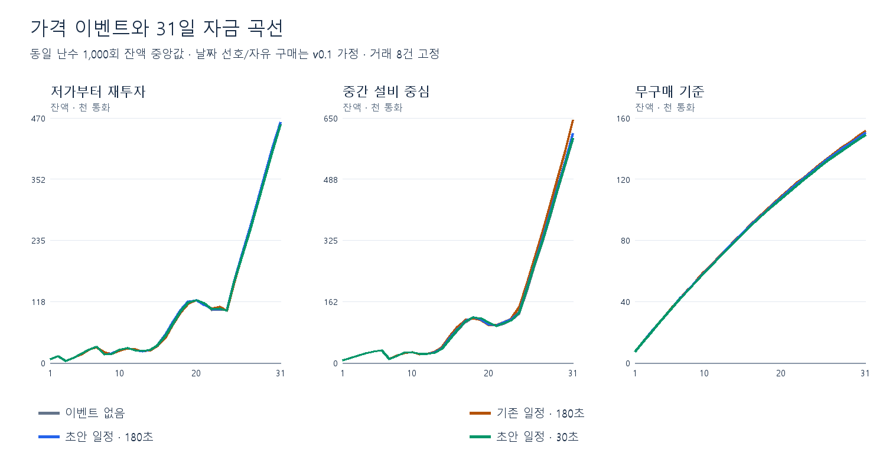
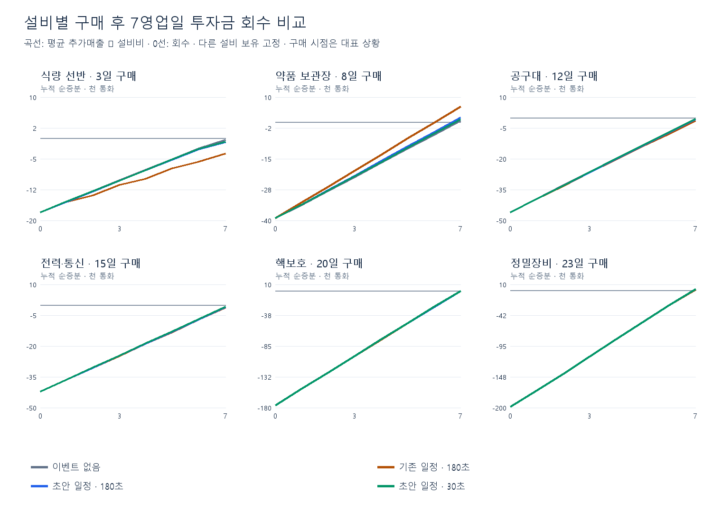

# 가격 이벤트 데이터 초안 v0.1

2026-09-12. 사용자가 승인한 순차 데이터 작업의 첫 항목이다. 기존 사건4개·일정5개·문구8개의 ID와 스키마를 유지한다. 아래 빈도는 기획 원문의 확정값이 아니라 이번 검증용 제안이다.

## 적용안

| 사건 | 효과 | 표시 영업일 / 후보 가중치 |
|---|---|---|
| 식료품 공급 확대9001 | 식료품2 기본가 −10% | 신문3·10·17·24·31일 |
| 지역 소식9003 | 가격 영향 없음 | 신문6·13·20·27일 |
| 생수 운송 지연9002 | 물1001 기본가 +15 | 라디오1~31일, 가중치1 |
| 의약품 수요 증가9004 | 의약품3 기본가 +15% | 라디오1~31일, 가중치1 |
| 지역 소식9003 | 가격 영향 없음 | 라디오1~31일, 가중치4 |

신문은9일 보도되고22일은 없다. 라디오는1~31일 매일 예약되며 가격 영향 있는 뉴스가 선택될 확률은1/3이다. 나머지2/3도 무영향 뉴스가 예약되는 것이며 방송 부재가 아니다. 실제 방송 여부는 영업시간에 달려 있다. 일자32일부터는 이 초안의 후보가 없다.

CSV 날짜는 경과일0부터 시작한다. end_day는 포함이다. 신문 repeat_days=7은7일간 지속이 아니라7일마다 당일 적용이다. 매일 BasePrice에서 초기화되므로 효과가 영구 누적되지 않는다. 라디오 효과는 방송 후 제출한 거래부터 적용된다. 방송 전 거래와 완료된 거래는 소급 변경되지 않는다.

현재 구현은 라디오를0~60초에 방송한다. 180초 영업에서는 예약 방송이 모두 도달하고, 30초 영업에서는 절반가량이 종료 전에 도달하지 않는다. 후자의 무방송을 무영향 뉴스 확률과 혼동하지 않는다. 방송 전/후 거래량에 따른 영향 차이는 아래30초 민감도와 함께 본다.

## 상품 현재가 예시

| 상품 | 기본가 | 해당 사건 적용 후 |
|---|---:|---:|
| 물 | 100 | 115 |
| 통조림 | 250 | 225 |
| 분말 수프 | 350 | 315 |
| 영양바 | 450 | 405 |
| 붕대 | 300 | 345 |
| 연고 | 500 | 575 |
| 해열제 | 700 | 805 |
| 응급 주사 | 900 | 1,035 |

대상 범위를 추가하지 않았으므로 공구·전력통신·핵보호·정밀장비 상품에는 직접 가격 효과가 없다. 그러나 저가 상품을 대체하는 정도와 구매 시점 변화 때문에 해당 설비의 순증분에도 간접 영향은 생긴다. 원가 차감은 계산에 넣지 않는다.

## 선택 근거

빈도만 줄인 첫 비교에서는 식량 설비의7일 내 회수가45.3%→35.5%, 약품은53.3%→62.5%였다. 효과를 절반으로 낮춘 적용안은40.4%·57.3%로 설비 간 편향이 줄었다. 같은 모델/seed의 frequency-only-results.json에 첫 비교 결과를 남겼다. 기존 사건을 폐기하거나 설비비를 다시 맞추기보다 작은 변동을 먼저 플레이 검증한다.

## 비교 결과

| 경로 | 조건 | 31일 잔액 중앙값 | P10–P90 | 무이벤트 대비 짝지은 차이 평균 |
|---|---|---|---|---|
| 저가부터 재투자 | 이벤트 없음 | 459,200 | 327,040–644,850 | +0 |
| 저가부터 재투자 | 기존 일정 · 180초 | 458,495 | 321,703–635,492 | -3,270 |
| 저가부터 재투자 | 초안 일정 · 180초 | 462,125 | 329,928–654,576 | +5,228 |
| 저가부터 재투자 | 초안 일정 · 30초 | 458,202 | 326,654–643,591 | -1,871 |
| 중간 설비 중심 | 이벤트 없음 | 596,150 | 439,575–870,765 | +0 |
| 중간 설비 중심 | 기존 일정 · 180초 | 644,845 | 461,329–909,378 | +41,457 |
| 중간 설비 중심 | 초안 일정 · 180초 | 609,460 | 448,708–881,880 | +13,485 |
| 중간 설비 중심 | 초안 일정 · 30초 | 598,162 | 440,410–872,812 | +2,030 |
| 무구매 기준 | 이벤트 없음 | 149,475 | 134,395–164,055 | +0 |
| 무구매 기준 | 기존 일정 · 180초 | 151,590 | 136,034–166,535 | +1,822 |
| 무구매 기준 | 초안 일정 · 180초 | 150,518 | 135,355–165,091 | +972 |
| 무구매 기준 | 초안 일정 · 30초 | 149,128 | 134,166–163,756 | -313 |

각 조건의 구매 시점은 자금에 따라 다시 결정한다. 동일 조건의 손님·상품 난수를 공유해 비교하지만 설비 구매 후 카탈로그는 달라질 수 있다. 중앙값끼리 뺀 값을 평균 효과로 취급하지 않는다. 직행 경로는 v0.1의 무구매 상태와 중첩되어 표에서 생략했다.

| 설비 | 비용 | 무이벤트 180초 | 기존180초 | 초안180초 | 초안30초 |
|---|---|---|---|---|---|
| 식량 선반 | 18,000 | 45.3% | 13.2% | 40.4% | 41.9% |
| 약품 보관장 | 39,000 | 53.3% | 73.7% | 57.3% | 54.6% |
| 공구대 | 46,000 | 46.7% | 42.6% | 45.9% | 46.9% |
| 전력·통신 | 42,000 | 45.7% | 44.9% | 45.6% | 45.6% |
| 핵보호 | 176,000 | 49.8% | 49.5% | 49.6% | 49.8% |
| 정밀장비 | 198,000 | 49.7% | 49.6% | 49.6% | 49.7% |

위 표는 대표 구매 후7영업일 안에 처음 투자금을 회수한 비율이다. 7일째에도 계속 회수 상태일 확률은 아니다. 설비를 산 경우와 사지 않은 경우의 추가매출 차이로 계산하며, 다른 설비 보유는 고정한다. 곡선은 그 순증분의 평균이다. 1,000회 표본의 확률 차이는 약1~2%p 표본 변동이 있어 작은 차이만으로 설비비를 다시 맞추지 않는다.

## 재현과 한계

- inputs.json은 반영 전 일정과 적용 제안 일정·사건·상품·설비비를 보존한다. compare.js는 기존 draft-20260912/model.js의 수요 샘플러를 재사용한다. node compare.js 이후 번들 Python으로 render.py를 실행한다.
- 1,000회, 고정 seed20260912. 손님·카탈로그 난수와 이벤트 난수를 분리하고 조건 간 공유한다. C#과 분포 계약을 맞춘 분석이며 같은 seed의 실제 플레이 재현은 아니다.
- 거래8건이 영업시간에 균등하게 분산되어 각 구간 중간에 제출된다고 가정한다. 방송 시점과 각 제출 시점을 비교해 현재가를 적용한다. 정확한 실제 처리 시점은 아직 측정값이 없다.
- 날짜별 선호·자유 구매·처리8건·유지비·설비가격은 기존 v0.1 비교 조건이다. 30초 비교도 처리8건을 고정하므로 현재 게임의 실제 매출 예측이 아니다.
- 할인/거절/이탈·명성 변화·벌금·치료비·편의설비·원가 차감 제외. 구매는 정산 때 하루1개, 다음날 유지비 유보,24일까지다. 실제 게임의 구매 제한을 뜻하지 않는다.
- 180초 영업·날짜별 선호·자유 구매를 이번 데이터 작업으로 구현하지 않는다. 현재 게임 UI에서 뉴스 표시 및 라디오 체감 검수는 별도다.
- 근거: doc/PRICE_EVENT_INTEGRATION.md, 실제 PriceEventScheduler/PriceEventScheduleData, 기획 스냅샷 t.wymf2xvsgena 및 t.798h5ciwg4ih. 사건 수치·일정은 제안이며 기존 사건 효과의 크기를 절반으로 낮추고 빈도를 줄였다.
