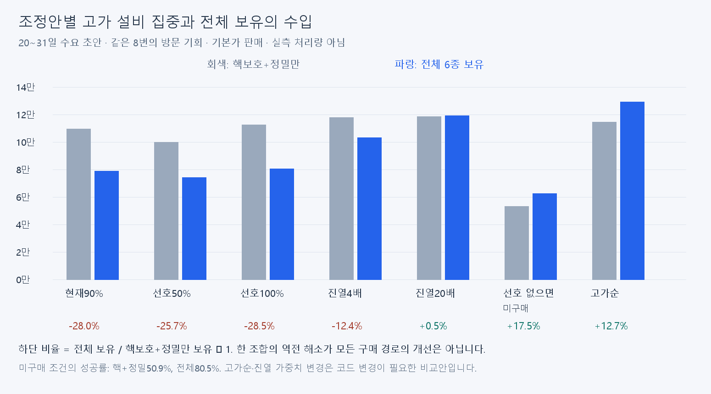
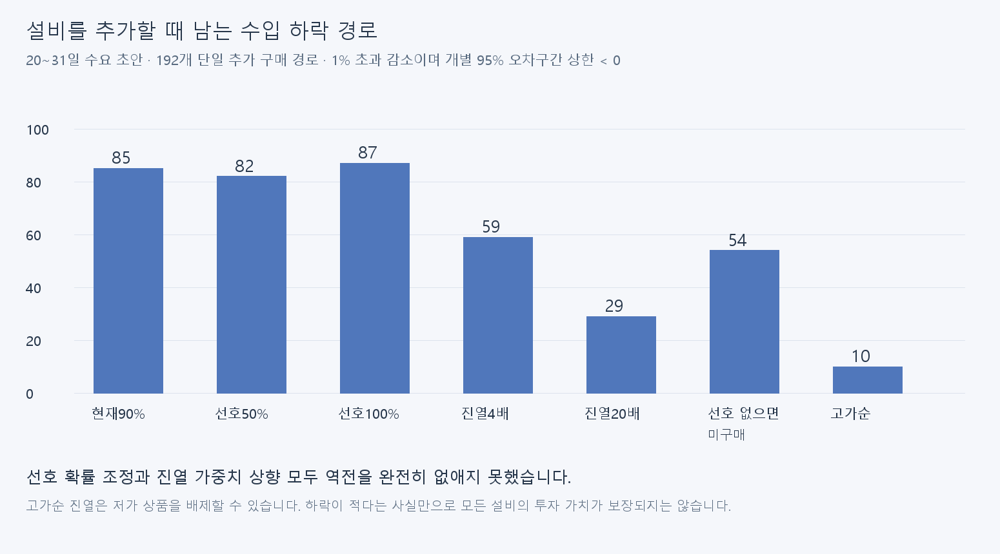

# 추가 설비 구매로 기대 수입이 감소하는 원인과 조정안

2026-09-12. 분석만 수행했다. 게임 코드·런타임 CSV·설비 가격은 수정하지 않았다.

## 결론

**기존 CSV의 선호 확률을 50% 또는100%로 조정하는 안은 수입 역전을 해결하지 못했다.** 고급 진열 가중치4배는 부분 개선에 그쳤다.20배·고가순 진열은 핵보호+정밀→전체 비교를 개선하지만 다른 구매 경로의 하락과 저가 설비 가치 문제를 남겼다. 따라서 이번 비교에서 확인된 값을 그대로 채택하지 않고 현재 CSV를 유지한다.

보유와 실제 판매 활성 상품군을 분리하면 새 설비 구매 후에도 기존 구성을 유지할 선택지가 생긴다. 이는 기대 수입이 낮아지는 구성을 강제하지 않는 후속 설계 후보다. **모든 설비의 양의 추가수입이나 모든 순서에서7일 회수까지 보장하는 해결책은 아니다.** 선택 UI·활성일·저장 방식은 아직 설계·구현하지 않았다.

## 구현에서 확인한 원인

1. **진열 경쟁:** 활성 상품 중 날짜별4/6/8종만 뽑는다. 후반 수요 초안에서 핵보호+정밀만 보유하면 고급품 진열은 평균5.5종, 전체 보유하면3.1종이다. 낮은 가격의 새 상품도 같은 자리를 차지한다.
2. **선호 없는 손님의 대체 주문:** `CustomerCompositionSelector.selectItems`는 선호 후보가 없으면 비선호 상품으로 주문을 채운다. 선호 확률을100%로 바꿔도 이 분기는 유지된다. 고가 설비에 집중하면 비선호 고객도 비싼 상품을 주문할 수 있다.
3. **주문 수 고정·후보 경쟁:** 주문은1~3종이고 각 후보군 안의 상품 선택은 균등하다. 새 상품이 기존 주문에 추가되는 구조가 아니므로 같은 선호 분류 안에서도 낮은 가격의 상품이 기존 고가 상품을 대체할 수 있다. 진열 제한만 없애도 이 효과는 남는다.

선호 확률은 이미 **선호하는 손님이 나타날 확률**과 다르다. 그 손님이 선호·비선호 후보 중 어느 쪽에서 물품을 고르는지의 확률이다. 이를 변경했다고 고급품 선호 고객의 등장 비중이 직접 바뀌는 것으로 해석하지 않는다.

### 데이터와 코드의 경계

| 조절 항목 | 현재 위치 | 이번 분석에서의 취급 |
|---|---|---|
| 선호 확률900→500/1000 | CustomerDispositionData.preferred_selection_chance | 기존CSV로 가능,15행 동일 조정 가상 실험 |
| 선호 타입·개별품목·주문 종류/수량·성향 비중 | 성향·명성CSV | 변경 가능하지만 손님 정체성·분포 전체에 영향,이번에는 유지 |
| 진열 가중치100/220/280/350 | DailyProductSelector 코드 상수 | 고급350만1400/7000으로 비교,CSV만으로 불가 |
| 날짜별 진열 수4/6/8 | DailyProductSelector 코드 분기 | 전체 진열은 원인 확인용 가정 |
| 선호 없으면 미구매·고가순 진열 | 현재 없는 규칙 | 코드 변경 필요,오프라인 비교만 수행 |
| required_store_stage | 설비CSV와 구매/UI/진열 공통 계약 | 진열 조정 목적으로 변경하지 않음 |

## 비교 결과

주표는20~31일의 **날짜 선호 가중치 초안**이다. 중립 명성, 가격사건 제외 기본가, 동일한8번의 방문 기회를 가정한다. 일반 조건은 전부 성공 판매이며 미구매 조건은 방문 일부가0수입이다. 따라서 미구매 조건을8건의 성공 거래 매출과 혼동하지 않는다.

| 조건 | 핵+정밀 8회 수입 | 전체 8회 수입 | 전체 전환 증감 | 하락 경로/192 | 성공률 핵+정밀/전체 |
|---|---:|---:|---:|---:|---:|
| 현재 선호90% | 109,467 | 78,800 | -28.0% | 85 | 100.0%/100.0% |
| 선호50% | 99,862 | 74,208 | -25.7% | 82 | 100.0%/100.0% |
| 선호100% | 112,436 | 80,445 | -28.5% | 87 | 100.0%/100.0% |
| 고급 진열4배 | 117,913 | 103,323 | -12.4% | 59 | 100.0%/100.0% |
| 고급 진열20배 | 118,611 | 119,176 | +0.5% | 29 | 100.0%/100.0% |
| 진열 제한 제거 | 85,625 | 58,916 | -31.2% | 110 | 100.0%/100.0% |
| 선호 무시 | 114,352 | 78,934 | -31.0% | 81 | 100.0%/100.0% |
| 진열 제한·선호 제거 | 92,287 | 62,176 | -32.6% | 93 | 100.0%/100.0% |
| 선호 없으면 미구매 | 53,136 | 62,411 | +17.5% | 54 | 50.9%/80.5% |
| 미구매 규칙·전체 진열 | 54,119 | 58,916 | +8.9% | 65 | 65.7%/100.0% |
| 고가순 진열 | 114,469 | 129,014 | +12.7% | 10 | 100.0%/100.0% |

### 현재 구현과 같은 날짜 선호 균등 조건

위 기획 초안의 날짜 선호 가중치는 아직 게임에 없다. 아래는 같은 상품·명성·진열 분포에서 날짜별 선호 재가중을 하지 않은 비교다. Unity 실제 실행값이나 처리량 실측은 아니다.

| 조건 | 핵+정밀 8회 수입 | 전체 8회 수입 | 전체 전환 증감 | 하락 경로/192 |
|---|---:|---:|---:|---:|
| 현재 선호90% | 105,450 | 73,561 | -30.2% | 85 |
| 선호50% | 100,575 | 72,735 | -27.7% | 82 |
| 선호100% | 107,362 | 74,458 | -30.6% | 85 |
| 고급 진열4배 | 114,690 | 99,551 | -13.2% | 55 |
| 고급 진열20배 | 115,481 | 116,571 | +0.9% | 34 |
| 진열 제한 제거 | 79,551 | 51,192 | -35.6% | 109 |
| 선호 무시 | 114,352 | 78,934 | -31.0% | 81 |
| 진열 제한·선호 제거 | 92,287 | 62,176 | -32.6% | 93 |
| 선호 없으면 미구매 | 45,943 | 55,617 | +21.1% | 49 |
| 미구매 규칙·전체 진열 | 46,297 | 51,192 | +10.6% | 65 |
| 고가순 진열 | 110,877 | 127,408 | +14.9% | 11 |

## 원인 분해와 해석

진열 제한과 선호 선택을 각각 제거한2×2 비교를 했다. 각 효과가 상호작용하므로 손실의 몇%를 특정 원인 탓으로 단순 배분하지 않는다. 선호 무시는 모든 진열 후보를 균등 선택하는 진단 조건이며 선호 확률0%와 다르다(0%도 후보 부재 시 대체 선택이 남는다).

| 진열 조건 | 선택 조건 | 전체 전환 증감(후반 초안) |
|---|---|---:|
| 4/6/8 제한 | 선호90% | -28.0% |
| 전체 진열 | 선호90% | -31.2% |
| 4/6/8 제한 | 선호 무시 | -31.0% |
| 전체 진열 | 선호 무시 | -32.6% |

핵+정밀만 보유했을 때 매출의51.5%는 **주문 생성 시작 시 선호 상품이 없었던 손님**에게서 발생했다. 전체 보유에서는20.8%다. 이는 해당 손님 매출의 관측 분류이며 원인별 기여율이나 순수 인과 효과는 아니다.

진열 제한을 제거해도 역전이 남고, 선호를 무시해도 역전이 남았다. 저가 상품을 추가할 때 고정된 주문 몫을 나눠 갖는 구조가 핵심이다. 선호 상품이 없는 손님을 미구매 처리하면 일부 역전이 해소되지만 성공률이 낮아지며 동일 분류 내부 경쟁도 남는다.

## 투자 가치와 추천

- **선호50%/100%:** 기존CSV만으로 가능한 최소 실험이지만 미해결이다. 현값90% 유지.
- **고급 진열4배:** 일부 개선용 후보일 뿐이다. 모든 경로의 투자 가치를 확보한 수치로 확정하지 않는다.
- **고급 진열20배·고가순:** 고가품 집중을 더 강화한다. 고가순에서 전체 보유의 후반8자리는 고가6종+무전기+배터리/쇠지렛대 중 하나다(마지막 두 상품은1,200 동가 추첨). 식량·약품은 진열되지 않고 공구도 쇠지렛대만 일부 진열된다. 저가 설비 가치가 사라지거나 제한되므로 전체 설비 가치 목표에 맞지 않는다.
- **선호 없으면 미구매:** 고가품의 비선호 대체 구매를 줄이는 수요 설계 후보다. 하지만 성공 거래량·실제 영업 속도·목표 수입·기존 거절/빈 주문 흐름을 함께 재검토해야 하며 간단한CSV조정으로 적용할 수 없다.
- **판매 활성 상품군 선택:** 새 설비를 사도 기존 구성을 그대로 유지할 수 있게 하는 설계 후보를 우선 검토한다. 선택지가 넓어져 최선의 가능한 기대수입은 낮아지지 않지만, 플레이어가 항상 최적 선택을 한다는 보장이나 새 설비가 즉시 수입을 늘린다는 보장은 없다. 모든 설비에 양의 수익을 요구하면 별도 수요·추가 판매기회 설계가 필요하다.
- 활성 선택안을 채택하면 낮은 설비가 후반에 선택되지 않을 가능성과 선택을 설명할 UX를 함께 검토해야 한다. 목표를 실제 판정에 사용한다면 영업 시작 전에 활성 구성과 목표를 함께 고정해야 하며, 낮은 목표를 고른 뒤 다른 구성으로 판매하는 문제를 피해야 한다. 이 규칙도 아직 구현하지 않았다.

7일 회수는 `추가 전후 방문당 기대수입 차이 ×8방문 ×7일 − 설비비`로 별도 비교파일에 넣었다. **날짜·명성·구매 자금·방문 속도를 고정한 민감도**이며 실제7일 진행이나 회수일 예측이 아니다. 유지비가 같은 두 상태의 차액이라 공통 유지비는 상쇄했고, 가게 확장·편의설비·원가는 포함하지 않았다. 기존 시설 가격을 이 수치로 다시 맞추지 않았다.

## 범위·재현·검증

- 설비64조합×날짜3구간×수요2조건×11안=4,224조건, 조건별3,000가상일·8방문이다. 각 날짜 구간을 고정했으며 실제 처리시간과31일 플레이를 시뮬레이션하지 않았다.
- 기본 모델은 기존 sampler와 같은 난수에서384조건의 매출 일치를 확인했다. 기존21상품/명성/성향/설비/모델5개 입력 파일 SHA-256도 이전 계산 때와 같은지 검사했다.
- 모든192개 단일 추가 구매를 조건별 비교해12,672개 차액을 계산했다. 같은 시드의 일별 차액으로 짝지은 표준오차를 구했다. 보고하는 하락 건수는1% 초과 감소이며 개별95% 구간 상한<0인 경로 수다. 다중비교 보정은 하지 않았으며 하락0건도 단조성의 수학적 증명이 아니다.
- 원인 비교3조건의 진열 구성이 동일함, 선호 무시의 수입이 날짜 선호 가중치와 무관함, 전체21상품진열에서는 선호부재미구매를 더해도 결과가 같음을 검사했다.
- 이전12,000일 표본을 이번 민감도 비교는3,000일로 줄였다. 기준 결과의27.7%와 이번 약28.0% 차이는 표본 수 차이이며 런타임 데이터를 바꾼 결과가 아니다.
- JSON의mean은 **방문기회당 수입**, meanPerSale은 성공 판매당 평균, saleRate는 성공률이다. 선호부재 미구매는0수입·실패 기회로 남긴다. 새로운 목표액을 만들 때 이 두 평균을 바꿔 쓰면 안 된다.
- 실제 구매 자금과 가게 단계 요건을 충족해 설비가 활성화됐다고 가정한다. 초반 고가 단독 행은 그날 구매할 수 있다는 증명이 아니다.
- Unity 테스트·실제 화면·플레이 계측은 수행하지 않았다. 보고서와 계산자료만 작성했다.

재현은 `analyze.js`를 Node로 실행한 뒤 `present.py`를 Pillow가 설치된 Python으로 실행한다. 기존 모델과 직전 계산의 estimates.json이 필요하다.

- [날짜·조건별 비교66행](comparison.csv)
- [전체 추가 구매 차액12,672행](upgrade-effects.csv)
- 원시 수입·표준오차·성공률·선호 부재 비중·진열 수는results.json에4,224조건으로 보관했다.
- 코드 근거: [진열 추출](../../../../Assets/Scripts/Customer/CustomerProductAvailability.cs), [선호와 대체 주문](../../../../Assets/Scripts/Customer/CustomerCompositionSelector.cs), [설비 구매 단계](../../../../Assets/Scripts/Facility/FacilityService.cs).
