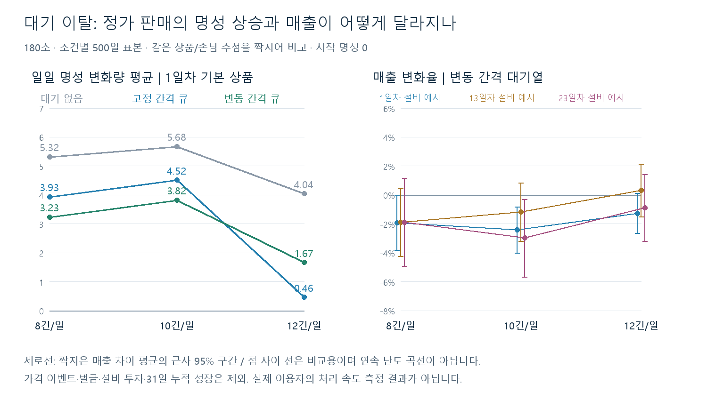

# 대기 이탈이 응대 손님·매출·명성에 미치는 영향

2026-09-13, `9d603f1`의 현재 구현·데이터 기준. **대기 이탈은 직접 벌칙이 없어도 성급한 손님의 응대 비율을 줄여, 정가 거래의 명성 성장을 늦출 수 있다.** 이번에는 이 영향을 분리해 계산했으며 상품 가격·인내 시간·명성 데이터를 수정하지 않았다.

## 핵심 수치

1일차 기본 상품, 시작 명성0, 처리 간격을 변동시킨 조건이다. 각 값은500일 표본 평균이며 서로 이어지는500일 플레이가 아니다.

| 하루 정가 거래 | 성급한 손님 비율: 대기 없음 → 큐 | 명성 증가 평균: 대기 없음 → 큐 | 일 매출 평균: 대기 없음 → 큐 |
|---|---:|---:|---:|
| 8건 | 15.25% → 7.13% | +5.32 → +3.23 | 6,467G → 6,342G (-1.93%) |
| 10건 | 15.42% → 7.58% | +5.68 → +3.82 | 8,152G → 7,954G (-2.43%) |
| 12건 | 15.23% → 7.70% | +4.04 → +1.67 | 9,735G → 9,611G (-1.27%) |

매출은 비용 차감 전이며 원가·유지비·투자비·벌금을 포함하지 않는다. **더 많이 처리하면 매출 자체는 증가한다.** 오른쪽 그래프는 같은 거래 수에서 대기 유무로 발생한 차이를 보여준다. 이번 변동 간격18조건의 매출 차이 평균은 약-3.0%~+0.4%였으며, 일부 조건은 오차 구간이0을 포함하므로 감소를 확정할 수 없다. 구간은 짝지은 일 매출 차이의 평균 ±1.96 표준오차를 비교군 매출 평균으로 나눈 값이다. 플레이어 결과 범위나 시민권 달성 확률 구간이 아니다.

## 명성이 달라지는 이유

현재 데이터의 성급한 손님 인내는9초다. 일반·가난한 손님12초, 부유한 손님15초, 가격 민감 손님18초보다 짧아 계산대에 오기 전에 더 자주 이탈한다. 정가 거래의 명성 점수는 보통50점·가중치1이지만, 성급한 손님은100점·가중치3이다. 따라서 이 손님이 빠지면 동일한 정가 거래 수라도 일일 행동 점수가 낮아진다. 이탈에 새 벌칙을 적용한 결과가 아니다.

12건에서 명성이 더 적게 오르는 현상에는 두 요소가 있다. 하나는 이탈이고, 다른 하나는 **기존 일일 평균 점수의 구간 판정**이다. 모든 거래가 정가이고 성급한 손님이 정확히1명인 경우, 10건이면 `(9×50 + 100×3) / 12`의 정수 점수62로 +7 구간에 들어가지만, 12건이면 `(11×50 + 100×3) / 14`의 정수 점수60으로 +0 구간에 남는다. 때문에 대기 없는 비교군에서도 거래 수에 비례해 명성이 오르지는 않는다. 현재 시스템을 그대로 계산한 결과이며 점수 규칙은 유지했다.

정확히15초마다12건을 처리한 고정 간격에서는 초반 큐 명성 증가 평균이+0.46이었다. 처리 간격을 변동시키면+1.67로 완화됐다.5초 입장·9초 인내와 계산대 인계 시점이 맞물리는 효과가 있어, 고정 간격 결과만으로 실제 사람의12건 플레이를 예측하면 과장할 수 있다. 변동 간격도 실측 분포가 아닌 민감도 확인용 가정이다.

## 실행 조건과 재현

- 실제 Unity6000.3.18f1의 `DailyProductSelector`, `CustomerCompositionSelector`, `CustomerGenerator`, `CustomerQueue`, `CustomerVisit`, `DailyReputationCalculator`를 기존 CLI Connector의 exec로 호출했다. 프레임·UI 대신0.05초 이하의 가상 시계를 사용했다.
- 1/13/23일차 × 시작 명성0/50 × 거래8/10/12건 × 고정/변동 간격 =36조건, 각500seed. 큐 영업일18,000개와 같은 수의 대기 없는 비교군을 계산했다.
- 1일차는 상품설비 미보유,13일차는1~2단계 상품설비4개,23일차는1~3단계 상품설비6개 활성 예시다. 날짜에 자동 해금된다는 뜻도, 해당 날짜에 전부 구매 가능하다는 예측도 아니다. 실제 가게 초기 단계는1이며 결과 JSON의 stageExample=0은 상품설비 미보유만 뜻한다. 구매·다음날 활성 전환은 이번에 시뮬레이션하지 않았다.
- 일일 상품4/6/8종은 현재 설비 상태와 실제 상품 가중치로 추첨했다. 날짜별 선호 행 선택·명성별 성향 구성·성별 교대도 실제 선택기를 사용했다. 가격은 선택 상품의 기본 정가로 고정했다. 신문·라디오·일일지침·도덕성은 연결하지 않았다.
- 각 seed의 당일 상품과 손님 생성 순서를 공유했다. 큐는 실제 입장·만료·FIFO를 거친 손님 N명을 응대하고, 비교군은 같은 생성 순서의 첫 N명을 대기 없이 응대했다. 두 집단 모두 전체 주문량을 정확한 정가로 판매했다.
- 고정 간격은180/N초다. 변동 간격은 각 거래에0.8~1.2의 균등 난수 가중치를 뽑은 뒤 합이180초가 되도록 정규화했다. 개별 간격을 정확히±20%로 제한한 모형은 아니다. 상품 수·난도에 따른 처리 시간 변화는 미포함이다.
- 상품 추첨 seed=410000+run, 손님 선택 seed=730000+run, 시간 변동 seed=910000+run, run=0..499. 같은 seed를 조건 간 재사용했으므로36조건을 독립 표본처럼 합쳐 통계 추정하지 않는다.
- [probe.cs.txt](probe.cs.txt)는 두 간격 모드를 모두 재현한다. 실행 당시에는 고정 간격18조건을 먼저 호출하고, 변동 간격18조건을 추가 호출해 병합했다. 임시로 생성한 성향 테이블의 행 검증 후 해당 객체만 reflection Commit했으며 전역 데이터·세션·Scene은 건드리지 않았다. 전체 catalog FK 검증을 새로 수행했다는 뜻은 아니다.

검증 `PARTIAL`: 실제 API 실행에서 전 조건의 거래 성립, 손님 공급, 생성 수=응대+이탈+남은 대기 수,180초 시계 보존을 확인했다. 보고서 생성 시36조건 및 성향 집계 합을 검사했고, 실행 후 커넥터 ready·compileErrors=false를 확인했다. 사람 조작·실시간 UI·31일 통합 경제 검증은 미실행이다. 제품 코드 변경이 없어 기존 EditMode/PlayMode 전체 테스트는 반복하지 않았다. 기술 역할에 읽기 검토를 배정했으나 완료 상태 외 회신 본문을 확보하지 못해 리뷰 승인으로 집계하지 않았다.

## 밸런싱 적용 판단

현재 초안 값은 유지한다. 실측에서는 정가 거래 수뿐 아니라 응대한 성급한 손님 수와 일일 명성 변화도 함께 기록해야 한다. 거래량 목표를 달성했는데 명성이 늦게 오르면 계산 실수 외에 응대 성향 구성과 점수 경계를 확인할 수 있다.

기존 시민권100만G의10건 성공률58.51%는 대기열 없는31일 모형의 조건부 값으로 유지한다. 이번 하루 분석의 매출 감소율을 그 확률에 곱하거나, 명성 감소분을31배해 새 성공률로 제시하면 안 된다. 다음 경제 재계산에서는 **현재 대기열·변동 처리 간격·명성 누적·설비 투자·가격 이벤트·지침 벌금**을 함께 연결해야 한다. 이번 결과만으로 목표가 불가능하다고 판단하지 않는다.

자료: [36조건 표](tables.md), [결과 JSON](results.json), [입력 소스 SHA256](sources.json), [그래프 재생성](render.py). 모든 산출물은 분석 자료이며 런타임 데이터 테이블이 아니다.
