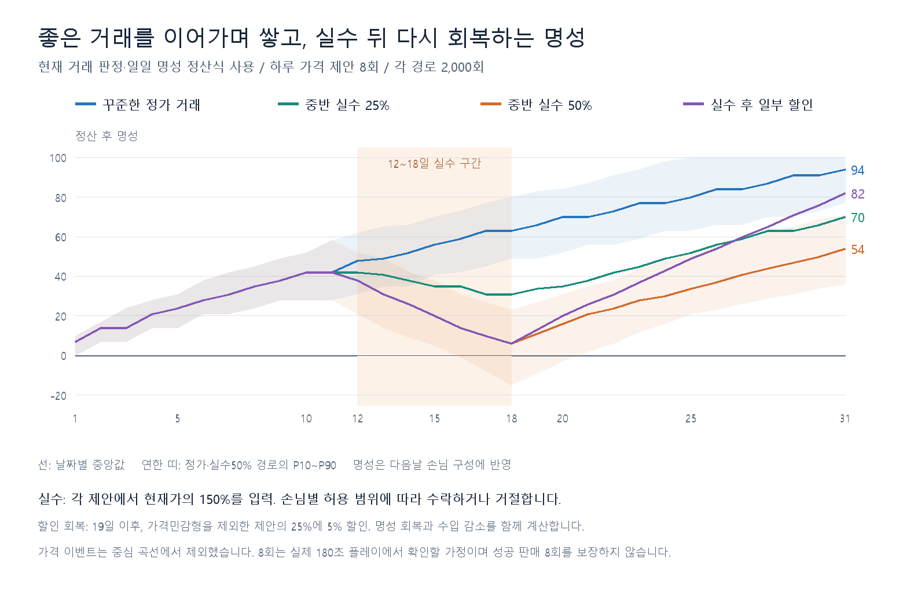
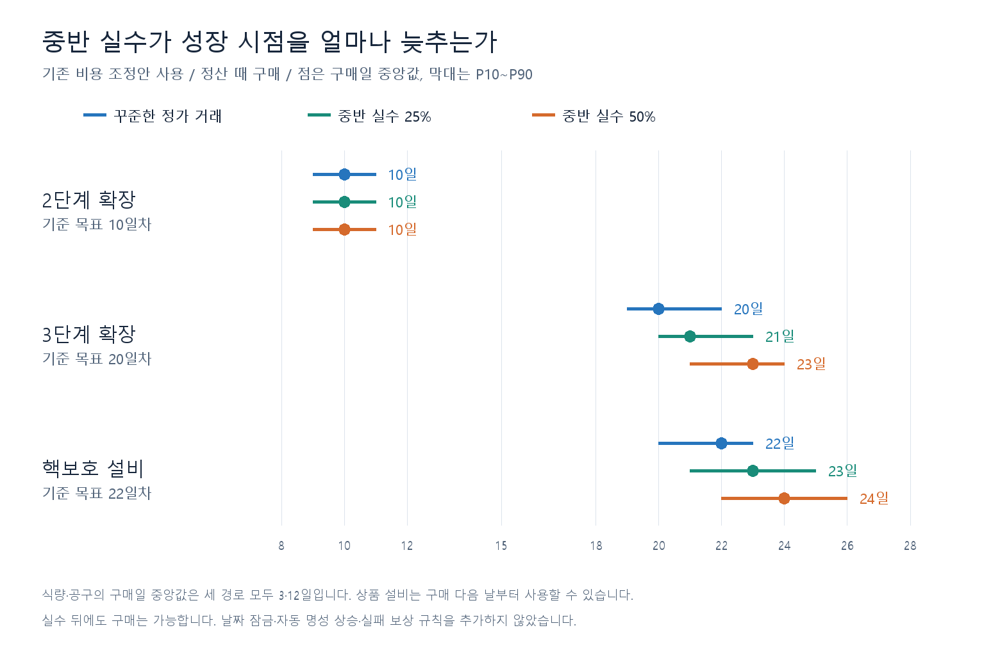
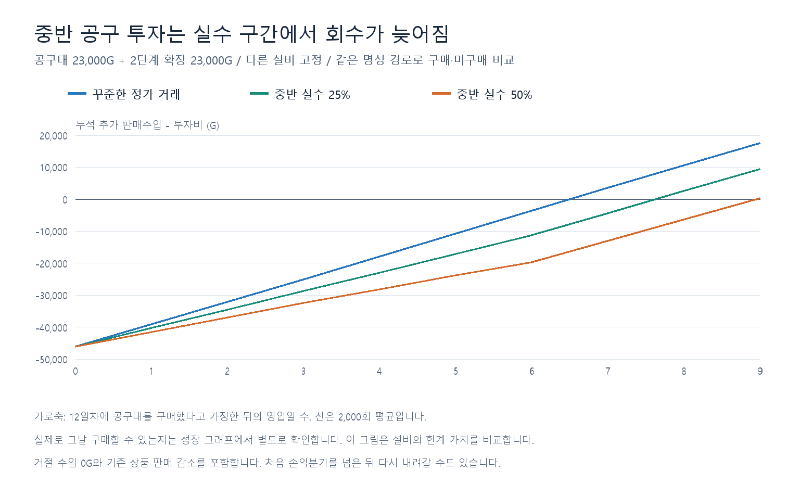

# 명성 변화에 따른 밸런싱 초안

2026-09-12. 가격 이벤트는 사용자 의견에 따라 무작위 변동 요소로 남기고, 이번 중심 계산에서는 제외했다. **현재 구현된 명성 정산과 손님 구성 변화**를 사용한다. 날짜에 맞춰 명성을 강제로 올리거나 내리는 기능을 추가하지 않는다. 런타임 CSV와 코드는 수정하지 않았다.

## 판단과 채택할 검증 경로

정확한 정가 거래를 이어가는 경로를 성장 기준으로 삼고, 중반 실수25%를 보통 실패·회복 검토,50%를 심한 실수 검토로 두는 것을 권한다. 현재 수치에서도 성실한 거래가 명성을 쌓고, 중반 실수로 낮아진 명성을 이후 거래로 되찾는 흐름이 나온다. **이번에는 명성 CSV의 보상·벌점을 강화할 근거가 없으며 기존 값을 유지하는 초안**이다.

사용자 제안은 자연스러운 상승과 중반 반복 실수라는 방향이다. 아래 기간·확률·입력 가격·할인 회복은 조정자가 구체화한 분석 가정이며 실측 플레이 행동이 아니다.

| 경로 | 1~11일 | 12~18일 | 19~31일 | 용도 |
| --- | --- | --- | --- | --- |
| 꾸준한 정가 | 정가 | 정가 | 정가 | 성장 비용의 기준 |
| 실수25% | 정가 | 각 제안마다25% 확률로150% 가격 입력 | 정가 | 일반적인 반복 실수 검토 |
| 실수50% | 정가 | 각 제안마다50% 확률로150% 가격 입력 | 정가 | 심한 실수 검토 |
| 일부 할인 회복 | 정가 | 실수50%와 동일 | 가격민감형 제외, 각 제안마다25% 확률로5% 할인 | 회복 선택의 대가 비교 |

하루 가격 제안 기회8회 중 각각 독립적으로 실수를 추첨한다. 25%는 평균2회,50%는 평균4회의 가격 과다 입력이며 고정 건수가 아니다.150%를 입력해도 성급형·부자형은 현재 허용 범위 안이라 수락할 수 있다. 거절된 거래는 수입0이며8회 중 한 기회를 소모한다. 이전의 성공 판매8건 가정을 실수 경로에 그대로 적용하지 않았다. 가격민감형은 정가만 받아들이므로 할인 회복 경로에서는 할인을 시도하지 않는다고 가정한다. 이 보조 경로는 해당 성향을 알아볼 수 있어야 하며, 실제 플레이에서 식별 가능한지는 이번에 확인하지 않았다.

## 실제 명성 규칙이 만드는 흐름

일반적인 정가 거래는 행동 점수50, 할인은100, 수락된 폭리는25, 과다 청구로 거절된 거래는0이다. **성급한 손님 정가 거래는100점에 가중치3**이어서 자연 상승에 크게 기여한다. 예를 들어 일반 정가7회와 성급형 정가1회면 일일 점수65, 중립 구간에서 명성+7이다. 성급형 없이 일반 정가8회면 점수50으로 명성이 그대로다. 자동 상승이 아니라 어떤 손님과 어떻게 거래했는지에 따른 결과다.

일일 가중 평균 점수0~19/20~39/40~60/61~80/81~100은 각각-15/-7/0/+7/+10으로 정산한다. 음수 명성 구간에서는 양수 회복량에1.5배 또는2배가 적용되고 버림·일일 상한+10을 거친다. 명성은-100~100이며 당일 점수가 다음날 손님 구성에 반영된다. 소표본5건 보정과 가격민감형의 하한 미달 거절을 중립 점수로 처리하는 규칙도 분석에 구현·검사했다.

명성 구간이 중립→상위→최상위로 오르면 부자 비중은10%→18%→25%, 성급형은15%→7%→5%가 된다. 저명성에서는 성급형이24%/33%로 늘어 정가 거래를 통한 복구 기회가 생긴다. 다만 성급형은 대기 인내시간이9초이므로 실제 플레이에서 놓치면 이번 가정보다 회복이 어려울 수 있다.

| 경로 | 11일 정산 명성 | 18일 정산 명성 | 31일 정산 명성 | 11→18일 실제 하락 비율 |
| --- | --- | --- | --- | --- |
| 꾸준한 정가 거래 | 42 | 63 | 94 | 0.0% |
| 중반 실수 25% | 42 | 31 | 70 | 79.8% |
| 중반 실수 50% | 42 | 6 | 54 | 99.8% |
| 실수 후 일부 할인 | 42 | 6 | 82 | 99.8% |

수치는 각2,000회 결과의 날짜별 중앙값이다. 각 표본의 하락량 중앙값과 위 중앙값 두 개의 차이는 같지 않을 수 있다. 선과 띠는 실제 플레이 한 판이 아니라 결과 분포다.

| 하락 뒤 경로 | 11→18일 하락한 표본 수 | 회복한 표본의 회복일 중앙값 | 하락 표본 중31일 내 회복 비율 |
| --- | --- | --- | --- |
| 중반 실수 25% | 1595 | 22일 | 97.7% |
| 중반 실수 50% | 1995 | 27일 | 75.4% |
| 실수 후 일부 할인 | 1995 | 25일 | 99.3% |

회복은19일 이후 자신의11일 정산 명성에 처음 다시 도달하는 것으로 정의했다. 하락하지 않은 표본은 분모에서 제외한다. 50% 실수 경로에서는 약25%가31일까지 그 명성을 되찾지 못하므로 회복일27을 전원 회복 보장으로 읽으면 안 된다. 일부 할인은 회복을 앞당기지만 할인액과 구매 지연 때문에31일 보유금이 더 높아지는 전략은 아니었다. 따라서 할인을 최선의 거래나 필수 회복법으로 지정하지 않는다.

## 성장 비용안은 유지 가능

기존 [가게 단계 비용 조정안](../store-stages-20260912/report.md)을 자연 명성 경로로 다시 평가해도 구매일 중앙값은3·10·12·20·22일이다. 추가 가격 보정 없이 기존4개 제안값을 유지한다.

| 항목 | 현재 런타임 G | 유지할 제안 G |
| --- | --- | --- |
| 2단계 확장 | 1,500 | 23,000 |
| 공구대 | 46,000 | 23,000 |
| 3단계 확장 | 2,500 | 143,000 |
| 핵보호 | 176,000 | 35,000 |

핵보호35,000G는3단계 확장143,000G를 먼저 지불한 뒤의 설비 가격이다. 실제1→2→3 단계 조건, 확장 즉시 적용/상품 설비 익일 활성, 초기1단계와 시작금1,000G,31일 유지비를 유지했다. 상품 가격·원가·CSV 스키마·명성 규칙 변경은 없다. **이 가격 제안은 아직 런타임 CSV에 반영하지 않았다.**

| 경로 | 식량 구매 | 2단계 확장 | 공구 구매 | 3단계 확장 | 핵보호 구매 | 31일 보유금 G |
| --- | --- | --- | --- | --- | --- | --- |
| 꾸준한 정가 거래 | 3 | 10 | 12 | 20 | 22 | 439,300 |
| 중반 실수 25% | 3 | 10 | 12 | 21 | 23 | 335,400 |
| 중반 실수 50% | 3 | 10 | 12 | 23 | 24 | 229,975 |
| 실수 후 일부 할인 | 3 | 10 | 12 | 23 | 24 | 221,598 |

단위는 구매일차이며 전부 정산 후 구매다. 기준 구매 순서는 식량→약품→2단계→공구→전력→3단계→핵보호→정밀이다. 다음날 유지비 예비금을 남기고 살 수 있으면 여러 개를 같은 정산에서 구매한다. 이 순서와 예비금은 플레이 전략 가정이며 코드의 필수 선행 설비나 날짜 잠금이 아니다. 다른 구매 순서와 거래량에서는 도달일이 달라진다.

중반25% 실수는3단계·핵보호가 각각1일 늦고,50%는3단계3일·핵보호2일 늦는다. 명성 손실뿐 아니라 거절로 인한 당일 수입 감소와 후속 투자 지연을 함께 반영한 결과다.31일 보유금 차액 전부를 명성의 직접 효과로 해석하지 않는다. 기본 가격·시작금·유지비를 낮춰 이 실수 손실을 자동 보전하는 수치는 제안하지 않는다.

## 명성 자체의 수입 효과를 분리한 비교

아래는22일차·같은 보유 설비·정가8건을 고정해 손님 구성만 바꾼각5,000회 평균이다. 중반 실수로 잃은 거래나 설비 구매 지연은 포함하지 않는다.

| 보유 조합 | 명성-80 매출 G | 명성0 매출 G | 명성80 매출 G | 0→80 변화 |
| --- | --- | --- | --- | --- |
| 기본 상품 | 6,704 | 6,516 | 6,455 | -0.9% |
| 식량+약품 | 14,597 | 13,673 | 13,377 | -2.2% |
| 식량+약품+공구+전력 | 24,789 | 26,051 | 27,089 | +4.0% |
| 앞 조합+핵보호 | 47,234 | 51,445 | 53,511 | +4.0% |
| 상품 설비 전부 | 74,066 | 80,017 | 82,773 | +3.4% |

**명성이 오르면 모든 상황에서 매출이 증가하는 구조는 아니다.** 기본·식량·약품만 갖춘 경우 성급형의 약품 수요가 줄면서 매출이 조금 감소한다. 중급·고급 상품을 갖춘 경우 부자 비중 증가의 가치가 커진다. 상품진열과 선호 대체 선택이 수입 효과를 제한하므로 명성은 판매가에 직접 보너스를 주는 배율과도 다르다. 현재 시스템을 유지한 초안에서는 이 차이를 표시하고 플레이테스트에서 상승 보상을 체감하는지 검토한다.

## 투자 회수 재검토

첫 설비를 목표3/12/22일에 보유했다고 고정하고, 각 경로에서 나온 하루 시작 명성을 구매/미구매 양쪽에 동일하게 적용했다. 필요한 확장비는 한 번 합산한다. 다른 설비는 각각 미보유/식량+약품/중급까지 보유 상태로 고정했다. 이후9영업일까지 추가 판매수입을 비교하며 중반 거절 손실도 반영한다. 날짜별 구매 가능성은 앞 성장 시뮬레이션에서 따로 평가한다.

| 경로 | 첫 설비 | 확장 포함 비용 G | 7영업일 누적 차액 평균 G | 7일 내 첫 회수 비율 |
| --- | --- | --- | --- | --- |
| 꾸준한 정가 거래 | 식량 | 18,000 | -353 | 46.9% |
| 꾸준한 정가 거래 | 공구 | 46,000 | 3,596 | 62.2% |
| 꾸준한 정가 거래 | 핵보호 | 178,000 | 5,829 | 53.8% |
| 중반 실수 25% | 식량 | 18,000 | -353 | 46.9% |
| 중반 실수 25% | 공구 | 46,000 | -4,272 | 34.5% |
| 중반 실수 25% | 핵보호 | 178,000 | 6,193 | 54.2% |
| 중반 실수 50% | 식량 | 18,000 | -353 | 46.9% |
| 중반 실수 50% | 공구 | 46,000 | -12,980 | 9.0% |
| 중반 실수 50% | 핵보호 | 178,000 | 5,424 | 53.8% |

자연 명성 경로는 약1주 회수 기준을 유지한다. 중반 공구 투자는 실수25%에서 약8영업일,50%에서 약9영업일까지 평균 회수가 늦어진다. 최초 확장비 지출부터 세면 추가2일이 있으며, 확률 표의 첫 회수 이후 다시 음수로 내려갈 수도 있다. 단계의 상품 설비2개 전체를 사는 묶음 회수로 확대 해석하지 않는다.

## 검토 기준과 범위

초기 플레이테스트의 기준은 다음과 같이 제안한다. 목표를 달성하지 못했다고 코드로 강제 교정하지 않고 거래 수·성향·가격 입력·거절·구매일을 확인한다.

- 정가 운영: 명성이 서서히 오르고, 비용안의3·10·12·20·22일 구매 목표 주변에 도달하는지 확인한다.
- 중반25% 실수: 실패가 수입과 명성에 보이되 정가 운영 복귀 후대부분31일 내 이전 명성을 회복하는지 확인한다.
- 중반50% 실수: 더 큰 성장 지연과 회복 부담을 허용하는 스트레스 경로로 둔다. 이를 정상 성장 속도의 가격 기준으로 삼지 않는다.
- 기본 상품만 있을 때의 작은 역효과, 성급형9초 대기, 높은 명성을 유지했을 때 부자 상품 수요의 체감을 확인한다. 새로운 UI/명성 보너스 시스템을 이번 초안에 추가하지 않는다.

분석 완료: 현행/제안2가지 비용×5개 행동 경로×2,000회=20,000개31일 시나리오. 명성별 보유 조합 비교25개×5,000일. 투자회수9개 조건×2,000회. 구현의 가격 판정 경계·성급형 가중치·명성 하한/상한·소표본 보정·회복 배율, 다음날 명성/상품 활성, 잔액 보존과유지비 납부를 검사했다. 중립 수요4개 대표 조건은 기존 추정과 통계 오차 범위 내 일치를 확인했다.

한계: 실제180초 처리량·대기열 이탈·편의설비 처리량, 가격 이벤트, 지침 벌금·도덕성/가족 선택의 후속 효과는 제외했다. 모든 계산 표본은 매일 유지비를 납부할 수 있었다. 미납을 임의로 면제하지 않았으며 미납 경로가 나오면 계산이 중단되도록 했다. 실제 게임 테스트나C#와동일seed 재생은 아니다. RNG는 날짜/표본seed를 혼합해 인접 날짜 간 단순한 난수 이동을 피했고 비교 경로끼리 같은seed를 사용한다.

검증 상태 **PARTIAL**: 오프라인 수치 검사·그래프 확인 완료, Unity 실행검증 미실행. 기획 역할에 읽기 검토를 요청했으나 회신 본문을 조회하지 못해 위 권고는 조정자 판단으로 기록한다. 런타임 수정·commit/push는 수행하지 않았다.

재현은 `calculate.js`를 Node로 실행한 뒤 `render.py`를 Pillow가 있는 Python으로 실행한다. `inputs.json`에 실제 CSV 입력·이전 비용 제안·소스 SHA256을 보관했고 이후 실행은 이 고정 입력을 사용한다. 결과는 `results.json`에 있다. 현재 시스템이 바뀌면 원본과 해시를 대조한 새 버전의 분석을 작성한다.
