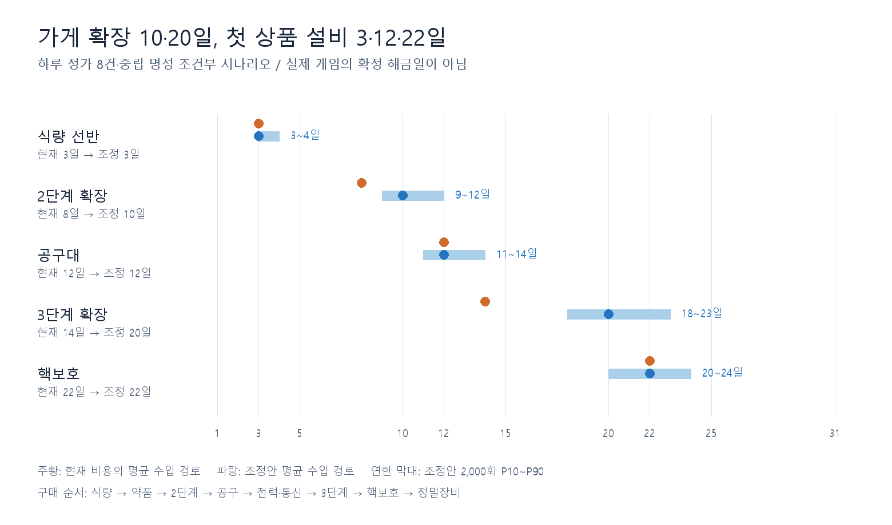
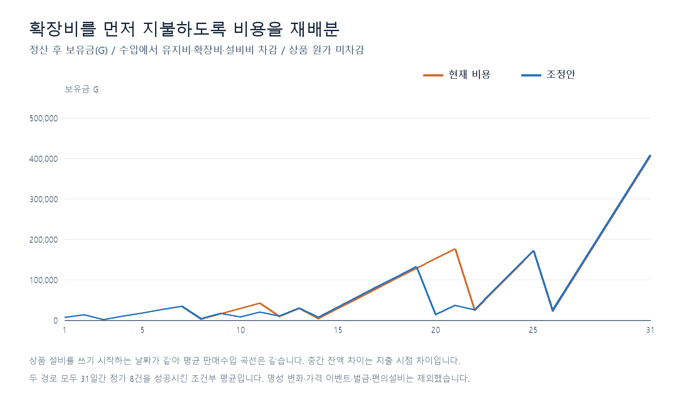
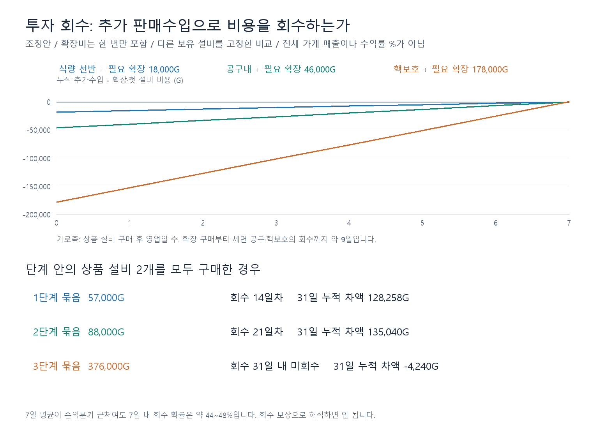

# 가게 단계에 맞춘 성장 비용 조정안

> 후속 적용: 2026-09-13에 아래 조정 가격4개를 실제 FacilityData.csv에 반영했다. [적용 기록](../../balancing-preparation.md)을 참조한다. 이 보고서의 현재/조정 비교와 입력·결과 파일은 분석 당시 스냅샷으로 보존하며, 아래 미반영 표기는 작성 당시 상태다.

작성 기준: 2026-09-12, `codex/balancing-preparation`. **검토용 수치 초안이며 런타임 CSV에는 아직 적용하지 않았다.** 기존 시스템의 1→2→3 단계 조건을 사용한다. 목표 날짜를 강제하는 코드는 추가하지 않는다.

## 결과

기준 경로에서는 현재 비용으로도 첫 상품 설비가 3·12·22일에 구매된다. 문제는 가게 확장이 8·14일에 먼저 끝난다는 점이다. 확장비에 비용을 옮기면 상품 활성일 4·13·23일을 유지하면서 확장을 10·20일로 조정할 수 있다. 상품 가격·시작금·유지비는 그대로 두는 안이다.

| 변경 항목 | 현재 G | 조정안 G | 차이 G |
| --- | --- | --- | --- |
| 공구대 | 46,000 | 23,000 | -23,000 |
| 핵보호 | 176,000 | 35,000 | -141,000 |
| 2단계 확장 | 1,500 | 23,000 | 21,500 |
| 3단계 확장 | 2,500 | 143,000 | 140,500 |

식량18,000·약품39,000·전력/통신42,000·정밀장비198,000G와 편의설비 가격은 유지한다. 2단계 진입+공구 총비용은47,500→46,000G, 3단계 진입+핵보호는178,500→178,000G다. 이미 낸 2단계 확장비를 3단계에서 다시 합산하지 않는다. 1단계부터 고급으로 직행하면 두 확장비가 모두 필요하다.

**핵보호 설비 단독 가격35,000G는 고급 진입 총가격이 아니다.** 3단계 확장143,000G를 먼저 내야 한다. 이 비용은 핵보호·정밀장비·해당 단계 편의설비의 공통 구매 자격을 연다. 정밀장비부터 사면 확장비도 그 경로의 진입비로 계산해야 한다.

## 목표와 도달 범위

| 항목 | 목표 구매일 | 현재 경로 | 조정 경로 | 조정 활성일 | 조정 P10~P90 |
| --- | --- | --- | --- | --- | --- |
| 식량 선반 | 3 | 3 | 3 | 4 | 3~4 |
| 2단계 확장 | 10 | 8 | 10 | 10 | 9~12 |
| 공구대 | 12 | 12 | 12 | 13 | 11~14 |
| 3단계 확장 | 20 | 14 | 20 | 20 | 18~23 |
| 핵보호 | 22 | 22 | 22 | 23 | 20~24 |

평균 수입 경로는 하루 수입을 조건부 평균으로 고정해 계산한 경로다. P10~P90은 동일한 구매 전략에서 손님·진열·주문을 매일 추첨한2,000회 결과 중 중앙80% 범위이며 평균 추정치의 신뢰구간이 아니다. 조정안 도달일 중앙값도3·10·12·20·22일이다. 1단계는1일차 초기 상태이며 비용 없이 시작한다.

참조 구매 전략은 식량→약품→2단계 확장→공구→전력·통신→3단계 확장→핵보호→정밀장비다. 약품8일·전력14일·정밀26일은 이번 계산 결과이며 사용자가 추가로 확정한 목표가 아니다. 각 정산 후 다음날 유지비를 남기고 다음 항목이 살 수 있을 때 즉시 산다. 하루 여러 항목 구매를 허용하고24일 구매 중단 같은 임의 제한은 없다. 이 구매 순서와 유지비 예비금은 분석 전략이며 게임의 필수 규칙이 아니다.

## 투자 회수와 단계 전체 가치

추가수입은 `설비를 산 경우의 판매수입 − 같은 날짜에 사지 않은 경우의 판매수입`이다. 새 상품 때문에 기존 상품 판매가 밀리는 효과도 포함한다. 비교 양쪽의 기본 유지비가 같아 차액에서 상쇄되고, 현재 재정에서 상품 원가를 차감하지 않으므로 원가도 빼지 않는다. 전체 매출을 투자 회수액으로 잘못 사용하지 않는다.

아래는 그 단계의 **첫 상품 설비와 필요한 확장**을 묶은 한계 가치다. 다른 설비는 비교 시작 전 상태로 고정한다.

| 첫 상품 설비 | 확장 포함 G | 활성 후 7영업일 추가수입 G | 7일 ROI | 평균 회수 영업일 | 첫 투자부터 경과일 | 7일 내 1회 이상 회수 |
| --- | --- | --- | --- | --- | --- | --- |
| 식량 선반 | 18,000 | 17,760 | -1.3% | 8 | 8 | 44.4% |
| 공구대 | 46,000 | 46,008 | 0.0% | 7 | 9 | 46.5% |
| 핵보호 | 178,000 | 178,331 | 0.2% | 7 | 9 | 48.2% |

천G 단위 반올림과 추정 오차 때문에7일 ROI는 사실상 손익분기 부근이다. 식량은 평균8영업일에 회수한다. 공구·핵보호도 정확히7일을 보장할 정도의 차이가 아니므로 **약7~8영업일**로 검토한다. 확장을 상품 설비보다2일 먼저 사므로 첫 지출부터는 약9~10일이다. 첫 지출일부터7일을 원한다면 회수에 사용할 영업일이5일로 줄어 별도 재조정이 필요하다. 회수율은7일 중 한 번이라도 누적 차액이0을 넘은 비율이며 이후 다시 내려갈 수도 있다.

| 단계 상품 설비 전체 | 공유 확장 포함 총비용 G | 지출 발생일 | 전체 묶음 회수일 | 31일 누적 차액 G |
| --- | --- | --- | --- | --- |
| 1 | 57,000 | 3~8일 | 14 | 128,258 |
| 2 | 88,000 | 10~14일 | 21 | 135,040 |
| 3 | 376,000 | 20~26일 | 31일 내 미회수 | -4,240 |

전체 묶음은 각 단계의 상품 설비2개와 그 단계 확장을 실제 구매일에 한 번씩 차감한다. 직전 단계 상품만 유지한 반사실과 비교하고, 신규 설비는 각각 익일부터 수입에 반영한다. 구매가 여러 날에 나뉘므로 첫 설비 한 개의7일 회수와 단계 전체의 회수일은 다르다. 편의설비 비용·처리량 가치는 이 표에 포함하지 않았다. 모든 묶음 구매를 끝낸 뒤 처음 손익분기를 넘는 날만 표기했으며31일 이후는 외삽하지 않았다.

## 거래량·구매 선택에 따른 차이

| 하루 성공 거래수 | 식량 | 2단계 | 공구 | 3단계 | 핵보호 |
| --- | --- | --- | --- | --- | --- |
| 6 | 4 | 14 | 16 | 28 | 30 |
| 8 | 3 | 10 | 12 | 20 | 22 |
| 10 | 3 | 8 | 10 | 16 | 17 |

6·10건 표는 거래당 조건부 평균 수입을 선형 적용한 처리량 민감도다. 실제180초 동안 가능한 방문·판매 건수를 측정한 결과가 아니다. 하루6건이면 고급 도달이30일로 늦어진다. 따라서8건 실측 전에는10·20일을 실제 플레이 예측으로 확정할 수 없다.

| 다른 구매 전략 | 2단계 | 3단계 | 핵보호 | 31일 보유금 G |
| --- | --- | --- | --- | --- |
| 단계별 대표 설비만 | 6 | 17 | 19 | 634,060 |
| 핵보호 우선 저축 | 4 | 31일 내 미구매 | 31일 내 미구매 | 126,217 |
| 정밀장비 우선 저축 | 4 | 31일 내 미구매 | 31일 내 미구매 | 126,217 |
| 설비 미구매 | 31일 내 미구매 | 31일 내 미구매 | 31일 내 미구매 | 149,217 |

대표 설비만 고르면 약품·전력 지출을 생략해 단계2는6일, 단계3은17일로 빨라진다. 고급만 바라보고 기본 상품으로 저축하면 이 초안에서는31일까지3단계 비용을 모으지 못한다. 낮은 설비 구매가 코드상 필수인 것은 아니며, 수입을 재투자하지 않은 경제 결과다. 모든 구매 선택에서 같은 도달일이 되도록 맞춘 안은 아니다. 고가 위주의 진열에 저가 상품을 추가했을 때 평균 거래액이 낮아지는 기존 문제는 시스템을 바꾸지 않고 플레이테스트 검토 사항으로 유지한다.

## 계산 범위와 검증

- 구현 반영: 초기 가게1단계, 확장1→2→3 순서, `required_store_stage`, 즉시 확장/상품설비 익일 활성,21상품의 해금 관계, 날짜별 진열4/6/8종·가중치100/220/280/350, 날짜별 선호, 주문 종류·수량·선호 대체 선택, 시작금1,000G,31일 유지비200~3,200G.
- 조건부 가정: 매일 정가 성공8건, 명성0 고정, 가격 이벤트 없음, 지침 위반·벌금 없음, 편의설비 미구매. 실제 정가 거래에서도 급한 손님 점수가 명성에 영향을 줄 수 있으므로 **명성0 고정은 실제31일 플레이를 재현하는 조건이 아니다.** 기존 비교와 비용 변경 효과를 분리하기 위한 기준이다.
- 실제 적용된 가격 이벤트, 명성 변화, 대기열 이탈, 처리 속도, 도덕성/딸 선택 등은 이번 조건부 모델에 연결하지 않았다. 이 항목을 빠뜨린 채 전체 게임 시뮬레이션이라고 주장하지 않는다. 시민권 구매/엔딩도 계산하지 않는다.
- 검증: 기존 수요 추정 입력의SHA256 일치, 상품 설비6개와 확장2개의 단계 조건,31일 유지비 대조, 잔액 보존, 중복 구매 없음, 목표일 무잠금 재현, 현행/조정 각2,000회 실행 완료. 모든 표본의 일일 유지비 납부가 가능했으며 미납 시스템을 임의로 단순화해 흑자로 처리하지 않았다.
- 한계: Unity 코드·CSV 변경과 Unity 테스트는 수행하지 않았다. 오프라인 계산 검사는 통과했으며 실행 게임 검증은 미실행이다. 역할 작업에 읽기 리뷰를 요청했으나 회신 본문을 조회할 수 없어 외부 리뷰 승인으로 기록하지 않았다.

재현: 이 폴더의 `calculate.js`를Node로 실행한 뒤 `render.py`를Pillow가 설치된Python으로 실행한다. 수요는 기존 `daily-income-20260912/estimates.json`의 조건별12,000회 추정과 `draft-20260912/model.js`의 검토된 추첨 함수를 재사용한다. 난수 분포 기반 비교이며C#의 동일seed 재생 결과가 아니다. 입력 경로·해시는 `results.json`에 남겼으며 입력이 바뀌면 기존 수요 추정부터 갱신해야 한다.

## 다음 반영 범위

수치 변경은 `FacilityData.csv`의 기존4개행 `purchase_price`만으로 가능하다. 날짜 잠금·가게 시작 단계·상품 선호·가격·유지비·CSV스키마 변경은 필요 없다. 이 문서는 도달 목표를 반영한 **비용 배분 초안**이며, 런타임 반영과 명성/이벤트를 포함한 검증을 완료한 것으로 해석하지 않는다.
