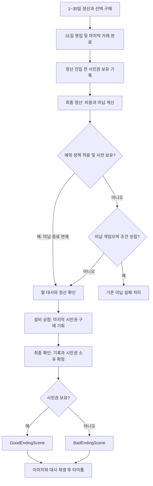

# 시민권·엔딩 작업 상태와 설계 기록

2026-09-13, `codex/citizenship-ending`, 기준 `total_merge 480af457efc440839ed101fb753c624c943fce14`. 사용자 승인에 따라 시민권·엔딩 구현을 먼저 진행했다.

현재 기능 계약·데이터·검증·플레이 테스트 항목은 [CITIZENSHIP_ENDING.md](../CITIZENSHIP_ENDING.md)를 따른다. 이 파일의 아래 1~8절은 구현 전 설계와 결정 근거를 보존한 기록이다. 당시의 미구현·제안 표현을 현재 구현 상태로 해석하지 않는다.

수정·Unity 조작은 조정 담당이 통합했고 기존 기술 담당의 핵심 세션 구현을 포함한다. 사용자 소유 패키지·프로젝트 설정 변경은 보존했다. 커밋·푸시·병합은 수행하지 않았다. 손님 외형45종의 이름 정리는 후속 요청으로 완료했다. 성별·연령은 이름 정리 참고이며, 사용자 지시에 따라 외형 컬럼·검증·생성 조건으로 고정하지 않는다. 역할 리뷰는 완료 상태 외 회신 본문을 조회하지 못해 별도 승인으로 집계하지 않는다.

## 설계 기록 (구현 전 검토 근거)

## 1. 확정된 방향과 원문

- 한 판은31일, 최종 목표는 안전구역 시민권 구매다.
- 시민권은 기존 설비 업그레이드 상점에서 구매한다.
- 실제 가격은 **1,000,000G 초안**으로 사용한다. 이번 사용자 응답으로 선택했으며 최종 밸런스 확정은 아니다.
- 구매는 **31일차 정산까지** 가능하다.31일 정산 후 마지막 구매 기회를 거쳐 ‘최종 확인’ 시 보유 여부를 판정한다. 중간에 선택했던30일 구매 마감안은 사용자가 다시 변경했으므로 폐기한다.
- 시민권 보유는 굿 엔딩, 미보유는 배드 엔딩의 기준이다. 정상적으로 최종일까지 도달했을 때의 두 분기에 도덕성·명성 조건을 추가하지 않는다.
- 굿·배드 각각 씬을 준비하고 여러 이미지와 대사로 연출한다. 이미지 임시 참조는 프로젝트 안의 기존 이미지로 한다.
- 세계관·감독관·딸·도덕성·명성 시스템을 대사 작성의 근거로 사용한다.
- 1~30일에는 시민권 구매 후라도 기존 미납 게임오버 조건을 적용한다. **31일 최종 정산 진입 전에 시민권을 보유했다면 그날의 미납 게임오버는 면제**한다. 조기 엔딩이나 미납금 면제는 아니다. 이 마지막 날 예외는 플레이 테스트용 정책이며, 테스트 후 마지막 날에도 미납을 우선하는 기존 제안으로 변경할 수 있도록 설계한다.

원문 확인: [31일 운영·최종 목표 1항](https://docs.google.com/document/d/1lCzaQRmFRWrxfIhWr2UZy64-7A8v1N9fAvlOorMF77E/edit?tab=t.yfziq7qrws5t#heading=h.kq0pfkme8a5z), [엔딩](https://docs.google.com/document/d/1lCzaQRmFRWrxfIhWr2UZy64-7A8v1N9fAvlOorMF77E/edit?tab=t.puepp4z0tpqk). Google Drive에서 두 탭을 직접 읽었다. 첫 탭의 목표액은 미정이고 기존5억은 예시, 마지막 확장 때 늦어도21일째 공개는 추천안이며 최종 구매 순서는 별도 확정 항목이다. 이번 사용자 선택이 가격과 구매 마감일의 기준이다. 코드의21일 감독관 대사는50억으로 별도 존재하므로 원문의5억 예시와 혼동하지 않는다.

## 2. 기획 보완 제안 — 아직 승인된 구현 사양이 아님

| 항목 | 제안 | 이유/검토점 |
|---|---|---|
| 시민권 적용 대상 | 한 번 구매로 주인공과 딸의 안전구역 입국 자격 확보 | 현재 감독관 대사가 두 사람을 함께 언급한다. 개별2회 결제로 바꾸면100만G 분석의 의미가 달라진다. |
| 상점 노출 | 첫 정산부터 전용 목표 행으로 실제 가격·부족액·31일 정산 마감 표시 | 장기 투자와 저축을 판단할 근거를 일찍 제공한다. 원문의21일 공개 추천보다 일찍 공개하는 제안임을 구분한다. |
| 구매 조건 | 가게 단계와 무관하게 구매할 수 있게 요구 단계1, 단 정산 중·마감 전·미보유·잔액 충분 | 시민권 구매에 기존 모든 설비 구매를 강제하지 않는다. 원문이 필수 단계 조건을 확정하지 않았으므로 검토 대상이다. |
| 소유/효력 | 결제 즉시 소유 확정, 익일 활성 대기 없음 | 상품설비의 다음날 해금과 다르다.31일 정산 구매도 그 자리에서 최종 보유로 판정한다. |
| 구입 후 진행 | 일찍 사도 정상31일까지 운영, 소유 표시 유지 | 1~30일 미납 실패는 유지하며,31일 정산 진입 전 보유자만 최종일 미납 게임오버 면제. 구매가 운영비 면제가 되지 않는다. |
| 구매 마감 UX | 31일 정산의 다음날 버튼을 ‘최종 확인’으로 바꾸고, 미구매 상태에서 한 번 확인 | ‘결과를 확인하면 시민권을 더 이상 살 수 없습니다’ 안내와 상점으로 돌아가기. 자동 구매하지 않는다. |
| 31일 정산 | 매출·유지비·벌금·명성·딸 대사 처리 후 상점 및 최종 확인 제공 | 시민권 구매 가능. 다음날 효과만 있는 일반 설비는 설명 후 구매 비활성화하는 UX를 제안한다. 시민권까지 함께 막지 않는다. |
| 중복 방지 | 한 번만 결제·소유·종료 확정; 씬 로딩 재시도는 결과를 재계산하지 않음 | 더블클릭과 로딩 실패로 재결제·정산 중복이 생기지 않게 한다. |

실제100만G 안내를 넣으면 TextData8152의50억 대사는 정리해야 한다. 권장안은 실제 거래 안내 시점에 CSV의 시민권 가격을 표시하고, 과장된 협박성 대사는 금액을 확정하지 않는 표현으로 바꾸는 것이다. 원문/CSV 가격/상점 부족액/대사가 서로 다른 정가를 안내하지 않게 한다. 이번에는 문구·코드를 변경하지 않았다.

## 3. 미납 실패 정책 — 최종 정산 전 시민권 보유 예외

최신 사용자 지시에 따라31일 정산 진입 전에 시민권을 보유한 경우에는 그날 미납 게임오버를 면제한다. 시민권으로 세계관의 목표를 이미 달성했다는 해석을 검증하기 위한 초안이다. 1~30일은 기존 규칙을 유지하므로25일 구매 후29일에 미납 유예가 끝나면 게임오버다. 시민권 구매 즉시 조기 굿 엔딩으로 전환하지 않는다.

- ‘사전 보유’의 경계는 **31일 정산 처리 시작 시점, 해당 정산의 구매 기회가 열리기 전**으로 정의한다. 이때 기존 FacilityService에서 보유 여부를 한 번 읽어 정산 기록에 고정한다.31일 정산 중 구매는 사전 보유로 소급하지 않는다.
- 유지비·벌금·미납금·유예기간 계산과 정산 표시는 그대로 수행한다. 면제하는 것은 그날의 미납에 의한 종료뿐이며, 비용 차감이나 미납 기록을 삭제하지 않는다.
- 사전 미보유이고 미납 게임오버 조건이 성립했다면 실패 처리하며 이후 구매로 구제하지 않는다. 조건이 성립하지 않았다면31일 정산에서 구매할 수 있고, 최종 보유 여부로 굿·배드를 판정한다.
- 유예가 남은 미납은 원래 게임오버 조건이 아니다. 명성·도덕성 조건도 새로 추가하지 않는다.

원문은 미납 게임오버 규칙을 서술하지만 현재 구현은 `IsGameOverConditionMet` 계산과 정산 문구 표시까지만 연결돼 있다. `GameProgressState.Failed`와 실패 패널은 있으나 현재 GameProgress에서 해당 상태로 전환하는 소비 경로는 확인되지 않았다. ‘기존 게임오버가 이미 실제로 작동한다’고 가정하지 않는다.

### 플레이 테스트 후 정책 변경 지점

기존 진행/세션의 종료 판정 한곳에서 정책 값 하나 `exemptFinalDayPreownedCitizenship`을 사용하도록 제안한다. 현재 기본값은 `true`, 테스트 후 `false`로 바꾸면 모든 날짜에서 미납을 우선하는 원래 제안으로 돌아간다. 범용 규칙 엔진이나 별도 매니저는 만들지 않는다. 정책은 세션 시작에 고정하고 진행 중에는 바꾸지 않는다.

판정식: `미납 종료 = 기존 미납 조건 && !(예외 정책 && 최종일 && 정산 진입 전 시민권 보유)`.

정산 계산 결과인 `IsGameOverConditionMet` 자체를 거짓으로 덮어쓰지 않는다. 계산된 조건과 정책 적용 후 실제 종료 여부를 구분하고, 실패 전환·상점 구매 허용·정산 UI가 동일한 최종 판정을 사용하게 한다. 면제 상태에서 ‘게임오버’만 표시하지 않고 ‘시민권 사전 보유로 최종일 미납 게임오버 면제’를 함께 안내한다. 정산 재호출이나 화면 재진입 때 사전 보유 시점을 다시 잡지 않는다.

| 상황 | 현재 정책(true) | 원래 제안(false) |
|---|---|---|
| 1~30일, 시민권 보유, 미납 게임오버 조건 성립 | 게임오버 | 게임오버 |
| 31일, 사전 보유, 미납 게임오버 조건 성립 | 정산 후 최종 확인 → 굿 엔딩 | 게임오버 |
| 31일, 사전 미보유, 미납 게임오버 조건 성립 | 게임오버, 구매 불가 | 게임오버, 구매 불가 |
| 31일, 사전 보유, 미납 게임오버 조건 불성립 | 최종 확인 → 굿 엔딩 | 최종 확인 → 굿 엔딩 |
| 31일, 사전 미보유, 조건 불성립, 정산 중 구매 | 최종 확인 → 굿 엔딩 | 최종 확인 → 굿 엔딩 |
| 31일, 사전 미보유, 조건 불성립, 끝까지 미구매 | 최종 확인 → 배드 엔딩 | 최종 확인 → 배드 엔딩 |

## 4. 정상 진행 흐름

1~30일에는 사전 보유 예외 없이 미납 게임오버 조건을 적용한다.31일에 미납 종료 대상이 아니라면 그날 매출을 포함한 정산 후 잔액으로100만G를 지불해 굿 엔딩을 선택할 수 있다.100만G가 있어도 실제로 구매하지 않고 최종 확인하면 배드 엔딩이다. 결제 후 잔액이100만G 미만이어도 시민권 보유 자체는 유지된다. 최종 잔액을 소유 여부로 대신 판정하지 않는다.

## 5. 현재 구현과 최소 설계 경계

| 경계 | 현재 상태 | 제안하는 변경 |
|---|---|---|
| FacilityData/FacilityUpgradeKind | 상품·편의·가게단계3종,11개 행 | 시민권 전용 종류와 행1개 추가. 이름은 TextData FK, 가격은 purchase_price의 long 사용. 기존 enum 값은 유지. |
| FacilityService | 일회 결제·보유/활성일·단계·재진입 보호 | 결제 원자성 재사용, 시민권은 당일 보유. 기존 상품/편의 익일 활성 규칙 유지. |
| 세션 구매 API | 외부는 설비PK만 전달, 가격·날짜는 내부 조회 | 시민권에만31일 최종확인 전·허용 정산 상태를 도메인에서 검사. UI 버튼만 비활성화하는 우회 가능한 제한으로 만들지 않는다. |
| 보유 권위 | 세션의 FacilityService가 보유 기록 소유 | 해당 종류의 유일한 행을 검증하고 그 소유에서 HasCitizenship을 계산. UI나 PlayerPrefs에 별도 bool을 중복 저장하지 않는다. |
| 미납 종료 정책 | 미납 조건 계산·문구만 연결됨 | 정산 진입 전 보유를기록하고 단일 종료 판정에서 최종일 예외 정책 적용. 현재 소유와 과거 정산 진입 시점 기록을 구분. 정책 전환으로 원래 미납 우선안 복원. |
| 정산 완료 | CompleteDay로 경과일 증가 후 무조건 새 DayProgress 생성 |31일에는 최종 기록을 확정하고32일의 상품·가격·유지비·손님 생성을 시작하지 않는다. 마지막 명성 적용도 한 번 수행. |
| 날짜 표시 | CurrentDay가 ElapsedDays+1을 반환 | 종료 시 completed day=31을 명시한 결과 snapshot 사용. 완료 후32일처럼 표시되지 않도록 날짜 권위와 결과 표시를 분리 검토. |
| 종료 상태 | Failed/Completed enum은 있으나 정상 목표 종료 연결 없음 | 정상31일 실행 종료와 Good/Bad 결과를 분리. Completed를 굿 엔딩 전용 bool처럼 쓰지 않고 종료 결과를 읽는다. 기존 주석·소비자 함께 정리. |
| 씬 전환 | GameSceneManager가 Init/Hub/Main과 로딩 재진입 보호 소유 | GoodEndingScene/BadEndingScene 목적지 추가, 기존 로딩 경로 재사용. 두 씬이 같은 EndingPresenter와 연출 프리팹을 공유. |
| UI | 설비 행 자동 생성, 익일 효과 공통 안내 | 시민권은 즉시 소유/구매 마감 문구, 보유·부족액 표시. 기존 설비는 그대로 표현. |

시민권 일회 결제는 기존 잔액 차감·보유 예약·차감 후 알림 예외 계약을 유지한다. 알림 실패가 구매 실패라고 보유를 지우거나 다시 차감하지 않는다. 이미 보유·자금 부족·마감·종료 후 구매 요청은 각 사유를 명시하고 무변경으로 끝낸다.

종료 snapshot에는 결과 종류, 종료일, 시민권 소유, 최종 잔액, 최종 명성·도덕성을 담는 안이다. 기존 GameSessionManager가 소유하고 새 전역 singleton을 추가하지 않는다. 씬은 결과를 읽어 보여주며 구매·경제·엔딩 판정을 소유하지 않는다. 종료 확정 후에는 구매/다음날/거래 요청을 받지 않는다. 씬 로딩에 실패하면 같은 결과로 전환만 재시도한다.

현재 UI/CashierSession.cs에 시민권 가격300,000의 구형 프로토타입은 있으나 현행 GameProgress의 권위로 사용하지 않는다. 프로토타입 시민권 상태와 현행 세션 상태를 병행해 연결하지 않는다. 기존 세션은 저장파일 복원이 없으므로 첫 구현은 한 실행의 세션 상태 유지까지다. 타이틀 복귀/새 게임에서 세션·보유·종료결과의 초기화 경로를 검증하고 영구저장은 별도 범위로 둔다.

## 6. 엔딩 데이터와 화면 연출

우선 각 엔딩4페이지, 각 페이지 한 장의 배경과 약3줄 대사로 시작하는 제안이다. 텍스트는 한 페이지를 하나의 TextData 행에 개행 포함으로 넣어 기존 감독관 대사의 압축 방식을 따른다. 짧은 교차 페이드와 다음 버튼/Enter로 진행하고, 읽기 전에 자동으로 넘기지 않는다. 페이지마다 입력 한 번만 처리해 더블클릭이나 이전 화면의 키 입력이 여러 장을 넘기지 않게 한다. 마지막 페이지에 타이틀 버튼을 표시하는 안이다. 타이핑 연출·갈래별 도덕성 엔딩·별도 컷신 프레임워크는 첫 범위에 넣지 않는다.

내용을 코드와 분리하기 위한 EndingPageData 제안 컬럼: `idx`, `ending_kind`, `page_order`, `text_idx`, `speaker_nameidx`, `background_resource_idx`, 선택적 `portrait_resource_idx`. 이름·대사는 TextData, 이미지는 ResourceData 참조를 사용한다. 종류 ID와PK는 실제 구현 전 권위 CSV 종류 ID 문서에서 확인하고 배정한다. 이번 기획 문서에서는 임의 숫자를 예약하거나 외부 문서를 수정하지 않는다. 기존 loader·CSV parser·ResourceManager를 재사용한다.

임시 이미지 후보(존재 확인):

- `Assets/Textures/Environment/Dystopia/MidBackground.png`: 배경 슬롯. 대사 속 안전구역의 최종 미술로 해석하지 않는다.
- `Assets/Textures/Customer/Dystopia/FemaleCustomer_01.png`: 임시 인물 슬롯. 현재 감독관/딸 데이터의 Resource4201도 같은 이미지인 임시 상태다.

동일 이미지를 여러 페이지에서 사용해도 되고 색조·페이드로 페이지 전환만 확인한다. 최종 아트와 구분하는 개발 표시를 둔다. 신규 복제 이미지나 임의 리소스ID를 만들지 않고, 구현 단계에서 실제 Sprite/import/GUID/Addressables 등록을 확인해 기존 참조를 사용한다. 지금은 후보 경로 확인만 했으며 씬이나 이미지 연결은 수행하지 않았다.

## 7. 대사 및 장면 초안

아래는 새로 작성한 검토용 콘텐츠다. 원문의 확정 대사를 인용한 것이 아니다. 안전구역 병원과 딸을 데려가려는 목표는 현재 감독관 대사8133/8148 등의 맥락을 따른다. 완치·사망·감독관의 배신·실제로 특정 손님을 도왔다는 사건은 확정하지 않는다.

| 엔딩/장 | 화자 | 이미지가 표현할 의도 | 대사 초안(페이지 전체) |
|---|---|---|---|
| 굿1 | 감독관 | 마지막 서류 확인 | 접수는 확인됐어. 이 증명서는 잘 챙겨. 안쪽 검문소에서 보여줘. |
| 굿2 | 독백 | 가판을 떠나는 손 | 가판대 열쇠를 내려놓았다. 마지막까지 세었던 건 돈이었다. 이제는 아이의 손을 놓치지 않을 차례였다. |
| 굿3 | 딸 | 안전구역 입구/병원 방향 | 아빠, 저기가 병원이야? 안으로 들어갈 수 있는 거지? 나, 아빠 손 잡고 갈래. |
| 굿4 | 독백 | 문 안쪽의 빛 | 문은 열렸다. 여기까지 오며 내린 선택까지 사라진 건 아니다. 그래도 오늘은, 함께 안으로 걸었다. |
| 배드1 | 감독관 | 마감된 접수 창구 | 접수는 이제 끝났어. 네 이름으로 된 시민권은 없어. 안쪽으로 들여보낼 수는 없단 말이야. |
| 배드2 | 독백 | 닫힌 가판/남은 동전 | 마지막 동전까지 다시 세었다. 누구도 날짜를 거슬러 계산해 주진 않았다. 장부를 닫아도 문은 열리지 않았다. |
| 배드3 | 딸 | 문 밖에서 잡은 손 | 아빠, 오늘도 못 들어가? 그럼 조금만 여기 앉아 있자. 손은 놓지 말아줘. |
| 배드4 | 독백 | 안전구역 밖/꺼지는 화면 | 서른하루의 영업이 끝났다. 돈과 사람 사이에서 고른 말들이 남았다. 우리는 아직 문 밖에 있었다. |

도덕성과 명성은 위 회고의 맥락이다. 굿이라고 모든 거래를 도덕적으로 정당화하거나, 배드라고 플레이어를 악인으로 낙인찍지 않는다. 초기 구현은 공통4장씩을 사용한다. 최종 수치에 따른 문장 변형을 원하면 결말 종류는 유지한 채 대사만 바꾸는 별도 콘텐츠 확장으로 설계한다. 구간·정확한 문구는 아직 정하지 않는다.

## 8. 구현 전/후 검증 계획과 순서

1. 확정된31일 구매 기회·최종 정산 전 보유자의 미납 종료 예외를 기준으로, 가격 공개 시점·요구 가게 단계·2인 자격 범위 등 보완 제안을 검토한다.
2. 시민권 행/종류·당일 보유·31일 최종확인 전 구매와 정산 상점 UI를 구현한다. 가격은100만G 초안. 실제 대사 금액과 안내를 함께 정리한다.
3. 31일 정산 후 최종 명성/도덕성/보유 결과를 한 번 확정하고32일을 만들지 않는 종료 흐름을 연결한다. 미납 실패는 확정된 정책대로 분리한다.
4. 두 엔딩 씬과 공용 페이지 표현, 기존 임시 이미지를 연결하고 Init→Main→엔딩→타이틀→새 게임을 검증한다.
5. **실제100만G 결제와 구매 후 남은 기간 운영비/벌금**을 함께 반영한 경제 모형으로 재검증한다.31일 구매 기한은 기존 분석과 다시 같아졌지만, 기존56.21% 모형은 자금 확보 후 시민권 원금을 실제 차감하지 않았으므로 조기 구매 후 미납까지 검증한 성공률은 아니다.31일에 구매하는 전략과 조기 구매 전략을구분한다. 같은 거래·랜덤 조건으로 예외 정책 true/false를 비교하고, 최종일 미납 면제로 결과가 달라진 비율과30일 선구매 유인을 기록한다. 이 결과로 정책 유지/복원을 검토한다.

필수 경계 검증: 999,999G 부족/1,000,000G 정확 결제, 중복·재진입·알림 실패,31일 정산 구매 성공/최종확인 후 구매 거부,31일에만 자금이 모인경우 구매 가능(미납 종료 조건 불성립), 조기 구매 후 잔액 감소에도 보유 유지, 최종 미보유/보유 각 엔딩, 최종 정산/명성 중복 방지,32일 미생성,3절 정책 비교표의 양쪽 결과,30일 미납에는 예외 없음,31일 정산 구매의 사전 보유 소급 방지,정산 재호출 때 사전 보유 기록 불변,예외 적용에도 비용·미납 기록 유지, Scene 전환 실패 재시도, 데이터 페이지 순서/필수 양쪽 엔딩/FK 누락, 새 게임 소유·정산 진입 기록·결과 초기화. 사람 확인은 실제3줄 가독성·페이지 넘김·마지막날 구매 마감 인지·최종 결과 이해·미납 종료 면제 안내를 구분해 기록한다.

현재 단계는 기획 검토다. 역할 작업 두 곳에 읽기 검토를 배정했으나 조회 가능한 완료 상태 외 회신 본문을 확보하지 못했으므로 리뷰 승인으로 집계하지 않았다. 실제 구현과 Unity 테스트는 시작하지 않았다.
