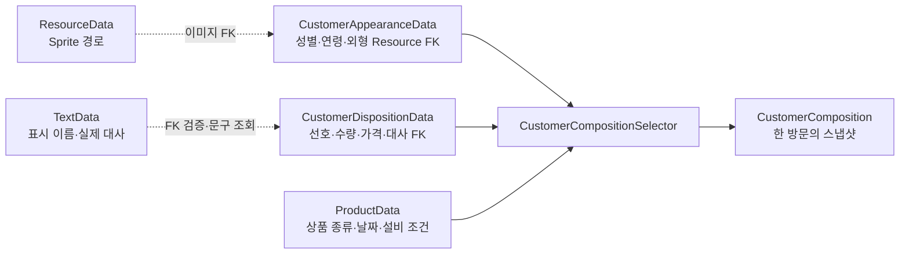

# 웹 GPT 전달용 작성 브리프: CSV 기반 손님 구성 시스템

## 0. 이 문서의 사용 목적

이 문서는 아래 Notion 포트폴리오의 **3-2 항목**을 웹 GPT에게 작성하도록 요청할 때 함께 전달하는 근거 자료다.

- 대상 문서: <https://app.notion.com/p/3df0faae3f33802f80c8da632c874286#3df0faae3f3380419388e9924f6db817>
- 작성 주제: 분리된 손님 관련 CSV 구조를 이해하고, 여러 테이블을 해석·조합해 런타임 손님 구성을 만드는 과정
- 작성자: 김승욱 (`kimsu00215@naver.com`)
- 핵심 원칙: 손님 시스템 전체나 최초 DataTable 분리 작업을 본인 단독 구현으로 표현하지 않는다.

웹 GPT는 이 문서를 사실관계의 기준으로 사용하되, 기존 Notion 문서의 문체·분량·레이아웃을 먼저 확인하고 그 형식에 맞춰 결과를 작성한다.

---

## 1. 웹 GPT에게 요청할 작업

다음 요구사항으로 Notion 3-2 항목을 작성한다.

1. 기존 Notion 포트폴리오의 3-1 및 인접 항목을 읽고 제목 체계, 문장 길이, 강조 방식, 이미지·표 사용 방식을 맞춘다.
2. 아래 Git 근거와 구현 파일을 기준으로 김승욱이 직접 담당한 범위만 서술한다.
3. 핵심 주제를 단순한 “CSV 사용 경험”이 아니라 다음 흐름으로 설명한다.
   - 이미 분리되어 있던 외형·성향 DataTable 구조 이해
   - 외형·성향·상품·텍스트 테이블의 PK/FK 관계 해석
   - 여러 테이블을 조합해 한 명의 손님 구성을 확정
   - 선택 결과를 런타임 불변 스냅샷으로 전달
   - 성별 및 연령별 대사 구조로 확장
   - 잘못된 CSV와 FK를 로딩 단계에서 검증
4. 다른 개발자의 기반 구현과 공동 작업 범위를 명확하게 구분한다.
5. 아래 “피해야 할 표현”은 사용하지 않는다.
6. 실제 문서에 들어갈 본문뿐 아니라 필요한 경우 표, 코드 조각, 흐름도, 이미지 캡션까지 제안한다.
7. 구현 파일명과 클래스명은 근거를 보여줄 때만 사용하고, 본문은 채용 담당자가 이해할 수 있는 언어로 설명한다.

---

## 2. 이 항목에서 전달할 핵심 메시지

가장 정확한 한 문장은 다음과 같다.

> 팀원이 분리해 둔 손님 외형·성향 DataTable 구조를 분석하고, 외형·성향·상품·대사 CSV를 조합하여 한 명의 런타임 손님 구성을 확정하는 선택 로직과 데이터 확장을 담당했다.

이 항목의 중심은 “테이블을 최초로 분리했다”가 아니다. 중심은 다음 세 가지다.

- 분리된 데이터의 관계를 이해하고 사용하는 능력
- 데이터 규칙을 실제 게임 동작으로 변환하는 조합 로직
- 요구사항이 성별에서 연령까지 확장될 때 기존 데이터 구조와 검증을 함께 확장한 경험

---

## 3. 책임 범위와 소유권 경계

### 3.1 다른 개발자가 만든 기반

다음 구조의 최초 구현은 강성규(`tjdrb70@gmail.com`)의 커밋이다.

- 커밋: `dc26b7ef0f42401c791d36a9e9251c81e1055cf8`
- 제목: `Integrate MainScene gameplay and organize data tables by ownership`
- 주요 기반:
  - `CustomerAppearanceData`
  - `CustomerAppearanceDataTable`
  - `CustomerDispositionData`
  - `CustomerDispositionDataTable`
  - `CustomerCatalog`
  - 각 테이블의 `IDataLoad` 기반 로딩과 `TryGetData` 조회 구조

따라서 김승욱의 포트폴리오에서 아래 내용을 본인 최초 설계로 주장하면 안 된다.

- 외형 테이블과 성향 테이블을 처음 분리한 것
- 손님 전용 DataTable 로더 전체를 처음 설계한 것
- `CustomerCatalog` 전체를 처음 만든 것
- 손님 생성·거래·대기열 시스템 전체를 단독 구현한 것

### 3.2 김승욱이 직접 맡은 핵심 범위

Git 작성자와 실제 diff로 확인되는 핵심 기여는 다음과 같다.

1. 외형·성향·상품 데이터를 조합하는 `CustomerCompositionSelector` 구현
2. 선택 결과를 고정하는 `CustomerComposition` 불변 스냅샷 구현
3. 명성 가중치, 성향 타입, 선호 상품, 날짜, 설비 조건을 손님 구성에 연결
4. 성향 CSV에 성별별 상황 대사 FK 배열 추가
5. `TextData.csv`에 실제 대사를 등록하고 성향 CSV에서는 ID로 참조
6. 성별에 맞는 입장·판매 결과·재촉·이탈 대사 후보 선택
7. 일반 손님의 대사를 아동·성인·노년 및 성별 기준으로 확장
8. 외형 CSV의 성별·연령·성향 분류를 실제 외형 선택에 연결
9. 누락·0·중복 ID, 잘못된 enum, 필수 대사 후보 및 FK를 검증하는 코드·테스트 확장

### 3.3 공동 작업 또는 제한해서 표현할 범위

- 손님의 거래 판정과 `CustomerVisit` 전체는 여러 개발자의 변경이 누적된 영역이다.
- 대기열 전체 구현은 다른 개발자의 기반과 김승욱의 대사 선택 확장이 함께 존재한다.
- 손님 외형 아트 제작 자체와 Addressables 전체 설계는 별도 작업자가 참여한 범위가 포함된다.
- 최종 MainScene 통합, UI 표현, 상품·명성·설비 시스템 전체를 김승욱 단독 기여로 묶지 않는다.

이 영역은 다음처럼 제한해 표현한다.

> 기존 손님 생성·대기열 흐름에 성향·성별·연령 기반 데이터 선택을 연결했다.

> 기존 외형 로딩 구조에 CSV 분류값을 사용한 후보 필터링을 추가했다.

---

## 4. 근거가 되는 주요 커밋

### 4.1 손님 구성 선택 기능

- 커밋: `798e32b129bed53bca8b0d033ba418b05f9ed6bf`
- 제목: `손님 구성 선택 기능 추가`
- 작성자: 김승욱
- 핵심 신규 파일:
  - `Assets/Scripts/Customer/CustomerComposition.cs`
  - `Assets/Scripts/Customer/CustomerCompositionSelector.cs`
  - `Assets/Scripts/Customer/CustomerGeneratorCompatibility.cs`
  - `Assets/Scripts/Finance/ReputationDispositionRules.cs`
- 관련 데이터·연결:
  - `CustomerDispositionData.csv`
  - `ProductCategoryData.csv`
  - `ProductData.csv`
  - `DayProgress`
  - `CustomerGenerator`
- 관련 검증:
  - `CustomerCompositionSelectorTests`
  - `CustomerCompositionSelectorIntegrationTests`
  - `CustomerCompositionTests`
  - `ReputationDispositionRulesTests`

포트폴리오에서 강조할 구현 판단:

- 성향 행의 수가 많아져도 동일 타입 행 수가 타입 출현 확률을 왜곡하지 않도록 **타입을 먼저 선택하고 해당 타입 안에서 행을 선택**했다.
- 선호 상품 종류와 개별 선호 상품 ID를 OR 방식으로 합쳤다.
- 상품 후보는 선호 판정 전에 활성 여부, 등장 날짜, 필요 설비 조건을 통과시켰다.
- 외형·성향·구매 목록·대사·가격 규칙을 `CustomerComposition`에 복사해 한 방문의 결과를 고정했다.
- 동일 난수 seed의 재현성과 잘못된 데이터 거부를 테스트했다.

### 4.2 성향·성별별 대사 데이터 재구성

- 커밋: `21b384a73024859d1cdf9bdefdb113f6e6604344`
- 제목: `손님 대화 데이터베이스 재구성, 성향과 성별까지 구분`
- 작성자: 김승욱
- 핵심 변경:
  - `TextData.csv`에 대사 140개 추가
  - `CustomerDispositionData.csv`에 남성·여성별 7개 상황 후보 배열 연결
  - `CustomerDispositionData` DTO에 성별별 CSV 매핑 추가
  - `CustomerCompositionSelector`에서 성별에 맞는 후보 선택
  - `CustomerQueue`에서 같은 방문의 성별에 맞는 재촉·이탈 대사 선택
  - `CustomerCatalog`에서 모든 TextData FK 존재 여부 검증
  - CSV·선택기·대기열 테스트 확장

대화 기록에서 확인되는 요구사항:

> 확정된 대사를 게임 분위기에 맞는지 검토하고, `TextData.csv`와 `CustomerDispositionData`에 반영한 뒤 성별을 판단해 맞는 대사를 출력하도록 구현한다.

구현 과정에서 함께 처리한 데이터 품질 문제:

- 오탈자 교정
- 중복 문장 정리
- 보이지 않는 NBSP 문자 제거
- 신규 TextData ID 충돌 확인
- 남성·여성별 필수 후보의 누락·0·중복 검증

### 4.3 아동·노년 대사 확장

- 커밋: `0f72c972d470eacf1fcb26e9711cdb4b878e701b`
- 제목: `아이, 노인도 대사 나눠서 분리되서 출력되는거 구현`
- 작성자: 김승욱
- 핵심 변경:
  - 일반 손님의 대사를 성인·아동·노년으로 확장
  - 각 연령군을 다시 남성·여성으로 분리
  - 입장, 기준가, 할인, 착취, 거부, 재촉, 이탈 대사 후보 연결
  - 연령·성별 조합별 후보 선택과 필수값 검증 추가

이 작업은 새로운 별도 시스템을 만든 것이 아니라, 기존 성별 기반 선택 구조를 연령까지 일관되게 확장한 경험으로 설명한다.

### 4.4 외형 CSV와 선택 결과 연결

- 커밋: `e584e5659946e879f1d2cde099c80a7d5a9b37d8`
- 제목: `손님 외형 리소스 데이터 반영 및 성향,성별에 따른 외형 선택 기능 구현`
- 작성자: 김승욱
- 핵심 변경:
  - `CustomerAppearanceData.csv`에 외형 리소스와 성별·연령·성향 분류 반영
  - 선택된 속성과 맞는 외형 후보만 필터링
  - 이미지 FK를 `ResourceData`와 연결
  - 잘못된 분류값과 존재하지 않는 조합 검증
  - 외형 표시 크기·위치 계산 및 관련 테스트 확장

이 커밋은 범위가 넓으므로 포트폴리오 3-2에서는 **CSV 분류값을 런타임 선택에 연결한 부분**에 집중한다. UI·아트 배치 전체를 본인의 데이터 구조 경험으로 과장하지 않는다.

---

## 5. 실제 데이터 구조

### 5.1 외형 테이블

실제 파일:

`Assets/Datas/Customer/CustomerAppearanceData.csv`

핵심 헤더:

```csv
idx,nameidx,image_resource_idx,normal_resource_idx,gender,age,disposition_type
```

| 컬럼 | 의미 |
|---|---|
| `idx` | 외형 행의 PK |
| `nameidx` | `TextData.idx`를 참조하는 표시 이름 FK |
| `image_resource_idx` | 기본 Sprite의 `ResourceData.idx` FK |
| `normal_resource_idx` | 조명용 Normal 리소스 FK |
| `gender` | 성별 enum 값 |
| `age` | 연령 분류 값 |
| `disposition_type` | 이 외형에 허용되는 성향 분류 |

포트폴리오에서 “손님 테이블”이라고만 부르면 실제 역할이 모호하다. 가능하면 **손님 외형 테이블** 또는 **외형·정체성 데이터**라고 쓴다.

### 5.2 성향 테이블

실제 파일:

`Assets/Datas/Customer/CustomerDispositionData.csv`

전체 헤더는 매우 길기 때문에 포트폴리오에는 대표 컬럼만 보여준다.

```csv
idx,
nameidx,
disposition_type,
preferred_product_types,
preferred_product_idxs,
preferred_selection_chance,
min_product_kinds,
max_product_kinds,
min_quantity,
max_quantity,
price_tolerance,
male_entry_text_idxs,
female_entry_text_idxs,
male_child_entry_text_idxs,
female_child_entry_text_idxs,
male_elderly_entry_text_idxs,
female_elderly_entry_text_idxs
```

| 컬럼군 | 역할 |
|---|---|
| PK·표시명 | 행 식별과 TextData 이름 참조 |
| `disposition_type` | Normal, PriceSensitive, Wealthy, Hasty, Poor 등 성향 타입 |
| 선호 상품 | 상품 종류 배열과 개별 상품 ID 배열 |
| 구성 범위 | 구매 상품 종류 수와 각 상품 수량 범위 |
| 가격 규칙 | 제안 가격 허용 배율과 정가 판정 범위 |
| 대사 FK 배열 | 성별·연령·거래 결과·대기 상황별 TextData 후보 |

### 5.3 상품 테이블

손님 구성 선택에서 읽는 대표 정보:

- 상품 PK
- 상품 종류 `ProductType`
- 등장 가능 날짜
- 활성 여부
- 필요 설비 FK
- 이름 및 이미지 FK

### 5.4 텍스트 테이블

대사 문자열은 성향 테이블에 중복 저장하지 않는다.

```text
CustomerDispositionData의 대사 ID 배열
                    ↓ FK
             TextData.idx
                    ↓
             TextData.text
```

이 구조로 행동 규칙과 실제 문장을 분리했다. 문장 수정 시 성향 로직을 바꿀 필요가 없고, 성향 행에서는 어떤 문장을 사용할지만 ID로 관리한다.

### 5.5 ID 배열 변환

CSV의 배열은 `_` 구분 문자열로 저장한다.

```csv
male_entry_text_idxs
8249_8250
```

런타임에서는 기존 converter를 통해 숫자 배열로 해석한다.

```text
"8249_8250"
     ↓ UIntArrayConverter
IReadOnlyList<uint> { 8249, 8250 }
```

포트폴리오에서 수동 `Split` 구현으로 설명하지 않는다. 프로젝트는 CsvHelper와 전용 converter를 사용한다.

---

## 6. 런타임 구현 흐름

### 6.1 전체 흐름

```text
DataTableManager가 CSV 로드
        ↓
각 DTO의 타입·필수값·enum·배열 검사
        ↓
CustomerCatalog가 테이블 간 PK/FK 전체 검증
        ↓
하루 시작 명성으로 성향 타입 가중치 결정
        ↓
선택된 타입 안에서 실제 성향 행 선택
        ↓
성별·연령 속성 결정
        ↓
속성과 일치하는 외형 후보 선택
        ↓
날짜·활성·설비 조건으로 상품 후보 필터링
        ↓
선호 종류·개별 선호 ID를 반영해 구매 목록 생성
        ↓
성별·연령·상황에 맞는 대사 FK 선택
        ↓
CustomerComposition 불변 스냅샷 생성
        ↓
CustomerGenerator가 CustomerVisit으로 전달
```

### 6.2 성향 선택

- 하루 시작 시점의 명성 데이터에서 성향 타입별 가중치를 읽는다.
- 가중치로 타입을 먼저 선택한다.
- 같은 타입의 성향 행은 PK 순서로 정렬한 뒤 그 안에서 선택한다.
- 행을 먼저 무작위로 고르지 않는 이유는, 동일 타입의 행이 많아질수록 해당 타입의 출현 확률이 의도치 않게 증가하는 문제를 막기 위해서다.

### 6.3 속성과 외형 선택

- 첫 손님의 성별은 난수로 선택하고 이후 손님은 직전 손님과 반대 성별을 사용한다.
- 성별과 연령이 확정된 후 `CustomerAppearanceData`에서 조건이 모두 맞는 후보만 필터링한다.
- 외형 ID만으로 성별이나 연령을 추측하지 않는다.
- 조건 조합에 맞는 외형이 없으면 임의 외형으로 대체하지 않고 오류로 다룬다.

### 6.4 상품 후보와 구매 목록

- `IsAvailable`, `AvailableDay`, `RequiredFacilityIdx`를 먼저 검사한다.
- 그 후 성향의 `preferred_product_types`와 `preferred_product_idxs`를 평가한다.
- 선호 후보가 있으면 `preferred_selection_chance`에 따라 선호군을 선택한다.
- 상품 종류 수와 수량은 성향 CSV의 최소·최대 범위를 사용한다.
- 같은 상품을 여러 줄로 만들지 않고 하나의 상품과 수량으로 표현한다.

### 6.5 대사 선택

- 손님 생성 시 확정된 성별·연령을 기준으로 대사 후보군을 선택한다.
- 입장 및 거래 결과 대사는 `CustomerCompositionSelector`에서 선택한다.
- 재촉과 이탈 대사는 `CustomerQueue`가 같은 방문의 속성을 사용해 선택한다.
- 상황별 후보는 다음과 같다.
  - 입장
  - 기준가 판매
  - 할인 판매
  - 착취 판매
  - 결제 거부
  - 대기 중 재촉
  - 대기열 이탈

### 6.6 불변 스냅샷

`CustomerComposition`에는 다음 결과를 복사한다.

- 외형 PK
- 성향 PK와 성향 타입
- 성별·연령 속성
- 구매 목록
- 상황별 대사 FK
- 가격 허용 배율
- 생성 시점의 사용 가능 상품 목록

원본 DTO를 그대로 보관하지 않고 값을 복사하는 이유:

- 생성 후 테이블 상태가 달라져도 방문 결과를 유지
- 외부 컬렉션 변경이 이미 생성된 손님에게 영향을 주는 것을 차단
- 생성 단계와 거래 단계의 책임을 분리
- 테스트에서 동일 입력과 seed의 결과를 재현하기 쉽게 만듦

---

## 7. 데이터 검증에서 강조할 내용

이 작업은 정상 데이터만 읽는 로직뿐 아니라, 잘못된 데이터가 런타임으로 공개되지 않게 하는 검증을 포함한다.

### DTO와 테이블 내부 검증

- 필수 header 존재
- 숫자와 enum 변환
- 확률 및 배율 범위
- 배열의 null, 빈 값, 0, 중복 ID
- 최소값과 최대값의 관계
- 필수 성별·연령 대사 후보 존재

### 테이블 간 FK 검증

- `nameidx → TextData.idx`
- 대사 후보 ID → `TextData.idx`
- 선호 상품 ID → `ProductData.idx`
- 상품 종류 → `ProductCategoryData`
- 외형 이미지 ID → `ResourceData.idx`
- 필요 설비 ID → `FacilityData.idx`

### 실패 정책

- 잘못된 FK를 기본값이나 임의 대사로 숨기지 않는다.
- 데이터 전체 검증이 끝난 뒤 catalog를 공개한다.
- 문제가 있는 행을 일부만 정상 데이터처럼 사용하지 않는다.
- 오류에는 가능한 경우 CSV, PK, 컬럼, 잘못된 FK 정보를 포함한다.

### 테스트 관점

다음 항목이 관련 테스트에 포함되었다.

- 동일 seed 재현성
- 성향 타입 가중치 선택
- 같은 타입의 여러 행이 타입 확률을 왜곡하지 않는지
- 선호 상품과 일반 상품 선택
- 설비 활성 전후 상품 후보 차이
- 잘못된 PK/FK 및 enum 거부
- 성별·연령별 대사 후보 선택
- 필수 대사 열 누락 거부
- 외형 분류 조합 일치
- 실패한 생성이 다음 성별 교대 상태를 잘못 소비하지 않는지

과거 특정 테스트 수치는 현재 전체 프로젝트 상태와 혼동될 수 있으므로, Notion 본문에서는 숫자를 꼭 써야 할 때만 해당 커밋 당시 검증 문서와 함께 제시한다.

---

## 8. 포트폴리오에서 강조할 기술적 판단

### 8.1 데이터 분리의 의미를 “조합 책임”까지 설명

외형과 성향을 분리했다는 사실만 설명하지 않는다. 분리된 뒤 누가 언제 조합하는지가 더 중요했다.

권장 설명:

> 외형과 성향을 독립 데이터로 관리하되, 손님 생성 시점에 선택기가 두 테이블과 상품 데이터를 조합해 한 방문의 구성을 확정하도록 책임을 모았다.

### 8.2 문자열 대신 PK/FK 사용

권장 설명:

> 성향 테이블에는 실제 대사 문자열 대신 TextData ID 배열을 저장해 행동 규칙과 표시 문구를 분리했다. 로딩 단계에서 모든 FK를 검증해 잘못된 대사가 게임 중 뒤늦게 발견되지 않도록 했다.

### 8.3 데이터 행 수가 확률을 왜곡하지 않도록 선택 순서 설계

권장 설명:

> 같은 성향 타입에 상품 선호별 행이 추가되더라도 등장 확률이 변하지 않도록, 행을 바로 추첨하지 않고 성향 타입을 먼저 선택한 뒤 해당 타입 안에서 행을 선택했다.

### 8.4 결과를 스냅샷으로 고정

권장 설명:

> CSV DTO를 방문 객체가 직접 계속 참조하지 않고, 생성에 필요한 값만 `CustomerComposition`으로 복사했다. 덕분에 영업 중 외부 가격이나 컬렉션이 바뀌어도 이미 생성된 손님의 구성은 유지된다.

### 8.5 데이터 확장과 검증을 함께 변경

권장 설명:

> 성별 대사를 아동·성인·노년으로 확장할 때 CSV 열만 추가하지 않고 DTO 매핑, 후보 선택, FK 검증과 테스트를 같은 변경에서 갱신했다.

---

## 9. 배운 점과 회고 소재

웹 GPT는 아래에서 2~4개를 골라 자연스럽게 작성한다.

- CSV는 단순 설정 파일이 아니라 코드와 기획 데이터 사이의 계약이라는 점
- 테이블 분리 자체보다 PK/FK와 조합 시점이 명확해야 유지보수가 가능하다는 점
- 문자열을 직접 분기 키로 쓰기보다 enum과 숫자 ID를 사용해야 오탈자와 중복을 줄일 수 있다는 점
- 배열 형태의 CSV 값도 converter, 중복 검사, FK 검증이 함께 있어야 안전하다는 점
- 데이터 행이 늘어나면 단순 무작위 선택이 기존 확률을 바꿀 수 있으므로 선택 단계를 분리해야 한다는 점
- 런타임 객체가 원본 데이터와 외부 컬렉션을 계속 참조하면 상태 변화에 취약하다는 점
- 요구사항 확장 시 CSV, DTO, 선택 로직, 소비자와 테스트를 하나의 변경 단위로 다뤄야 한다는 점
- 잘못된 데이터를 임의 fallback으로 숨기기보다 로딩 단계에서 구체적으로 실패시키는 편이 디버깅과 협업에 유리하다는 점
- 팀원이 만든 기반 구조를 이해하고 소유권 경계를 지키면서 기능을 확장하는 것도 중요한 협업 역량이라는 점

---

## 10. 피해야 할 표현과 교정안

| 피해야 할 표현 | 문제 | 권장 표현 |
|---|---|---|
| 손님 테이블과 성향 테이블을 분리 설계했다 | 최초 분리 구현은 다른 개발자 기여 | 분리된 외형·성향 DataTable 구조를 분석하고 조합 로직을 구현했다 |
| 손님 시스템 전체를 개발했다 | 거래·대기열·UI·데이터 기반이 공동 작업 | 손님 구성 선택과 성별·연령 기반 데이터 연결을 담당했다 |
| 손님 생성기를 처음부터 만들었다 | 기존 생성기와 방문 모델이 존재 | 기존 생성 흐름에 `CustomerCompositionSelector`와 스냅샷 단계를 추가했다 |
| 손님 AI를 구현했다 | 이 시스템은 행동 AI보다 데이터 기반 구성·상태 모델에 가까움 | 데이터 기반 손님 구성 및 선택 로직을 구현했다 |
| DB를 설계했다 | 실제 저장소는 CSV/DataTable이며 관계형 DB가 아님 | CSV 스키마와 PK/FK 기반 데이터 관계를 확장했다 |
| CSV를 파싱했다 | 공용 CsvHelper/DataTable 기반이 이미 존재 | 기존 파서와 converter를 사용해 새 컬럼을 매핑하고 검증했다 |
| 문자열을 Split해서 배열로 변환했다 | 실제 구현은 전용 converter 사용 | `_` 구분 ID 배열을 기존 converter로 숫자 ID 목록으로 변환했다 |
| 성향에 따라 외형을 결정했다 | 일반 손님은 성별·연령 중심이고 성향 조건 적용 범위가 세부 규칙에 따라 다름 | 확정된 성별·연령·허용 성향 조건과 일치하는 외형 후보를 선택했다 |
| 대사를 랜덤으로 출력했다 | 먼저 성별·연령·상황별 후보군을 결정함 | 손님의 확정 속성과 거래 상황에 맞는 후보군 안에서 대사를 선택했다 |
| 모든 오류에 fallback을 제공했다 | 필수 런타임 CSV는 누락을 거부함 | 필수 데이터와 FK 오류는 로딩 단계에서 거부하고 공개를 차단했다 |
| 완전한 불변 객체를 설계했다 | 클래스 자체의 의도는 불변 스냅샷이지만 표현을 과도하게 확대하지 않음 | 생성 시 필요한 값을 읽기 전용 스냅샷으로 복사했다 |
| 100% 안전성을 보장했다 | 테스트 범위를 넘어서는 주장 | 경계값·잘못된 데이터·FK·재현성을 자동 테스트로 검증했다 |

추가로 피할 것:

- 다른 개발자의 이름이나 기여를 부정적으로 비교하지 않는다.
- “다른 개발자가 못한 부분을 고쳤다”는 식으로 서술하지 않는다.
- 현재 CSV의 긴 헤더 전체를 본문에 그대로 넣어 가독성을 해치지 않는다.
- 코드 줄 수나 CSV 열 수만으로 작업 난이도를 과장하지 않는다.
- 과거 테스트 결과를 현재 프로젝트 전체의 최신 품질 지표처럼 사용하지 않는다.
- `CustomerAppearanceData`를 단순히 “손님 테이블”이라고만 적어 성향·방문·외형의 의미를 혼동시키지 않는다.

---

## 11. 권장 3-2 문서 구성

### 제목 후보

1. `CSV 데이터를 조합한 손님 구성 시스템`
2. `분리된 손님 데이터를 런타임 구성으로 연결하기`
3. `외형·성향·대사를 연결하는 데이터 기반 손님 생성`

첫 번째 제목을 기본 권장한다.

### 권장 소제목

#### 1. 문제와 기존 구조

- 외형과 성향이 독립 CSV로 관리되는 이유
- 본인이 맡은 범위는 분리가 아니라 조합과 확장이라는 점

#### 2. CSV 관계와 데이터 흐름

- 외형·성향·상품·TextData 관계 표
- PK/FK와 배열 converter 설명

#### 3. 주요 구현

- 성향 타입 우선 선택
- 조건 기반 상품·외형 필터링
- 성별·연령·상황별 대사 선택
- `CustomerComposition` 스냅샷

#### 4. 데이터 검증

- DTO 검증
- catalog FK 검증
- 잘못된 데이터 공개 차단
- 관련 자동 테스트

#### 5. 배운 점

- 데이터 계약
- 조합 책임
- 확장 시 스키마·코드·검증 동시 변경
- 협업 소유권 경계

---

## 12. 권장 시각 자료

### 12.1 테이블 관계도



관계도에서는 DataTable 로더를 모두 그려 복잡하게 만들기보다, 어떤 데이터가 선택기에 들어가 어떤 결과가 나오는지에 집중한다.

### 12.2 대사 해석 예시

```text
male_child_entry_text_idxs = 8422_8423
                    ↓
          UIntArrayConverter
                    ↓
           [8422, 8423]
                    ↓
      남성 + 아동 + 입장 상황 판정
                    ↓
          후보 중 하나 선택
                    ↓
           TextData.text 조회
```

### 12.3 구현 전후 비교

```text
기존
성향별 공용 대사 후보

확장 후
성향
 └─ 성별
     └─ 연령
         └─ 입장·판매 결과·재촉·이탈 상황
             └─ TextData FK 후보
```

“기존”은 김승욱이 만들기 전 프로젝트 구조라는 뜻이지, 다른 개발자의 구현이 잘못됐다는 의미로 표현하지 않는다. 요구사항이 확장되면서 데이터 축을 추가한 것으로 설명한다.

---

## 13. 웹 GPT가 사용할 수 있는 본문 초안

아래 문장은 사실관계 초안이다. Notion의 기존 문체에 맞게 다듬되 책임 범위를 넓히지 않는다.

> 프로젝트의 손님 데이터는 외형과 성향이 독립된 CSV/DataTable로 관리되고 있었습니다. 해당 분리 구조는 팀원이 구축했으며, 저는 이를 분석해 외형·성향·상품·대사 데이터를 조합하고 실제 한 명의 손님 구성을 확정하는 로직을 담당했습니다.
>
> `CustomerCompositionSelector`는 하루 시작 명성으로 성향 타입을 고른 뒤, 해당 타입의 성향 행과 성별·연령을 결정합니다. 이후 날짜와 설비 조건을 통과한 상품 중 성향의 선호 종류와 개별 상품 ID를 반영해 구매 목록을 만들고, 확정된 속성과 일치하는 외형 및 대사 후보를 선택합니다.
>
> 같은 성향 타입에 선호 상품별 행이 추가되더라도 등장 확률이 달라지지 않도록 성향 행을 바로 추첨하지 않고 타입을 먼저 선택했습니다. 또한 선택 결과는 원본 CSV 객체를 계속 참조하지 않고 `CustomerComposition`에 복사했습니다. 이를 통해 외부 데이터나 가격 상태가 바뀌더라도 이미 생성된 손님의 외형, 구매 목록과 대사가 변경되지 않도록 했습니다.
>
> 대사는 성향 CSV에 문자열을 직접 저장하지 않고 `TextData`의 ID 배열을 참조하도록 구성했습니다. 처음에는 성향과 성별에 따라 입장, 판매 결과, 재촉과 이탈 대사를 구분했고, 이후 일반 손님을 아동·성인·노년으로 확장했습니다. 이때 CSV 열만 추가하지 않고 DTO 매핑, 후보 선택, FK 검증과 테스트를 함께 수정했습니다.
>
> 이 작업을 통해 CSV를 단순한 수치 저장 파일이 아니라 코드와 기획 데이터를 연결하는 계약으로 이해하게 되었습니다. 특히 데이터를 여러 테이블로 나누는 것만큼, 어떤 시점에 조합하고 어떤 결과를 런타임 상태로 고정할 것인지가 중요하다는 점을 배웠습니다.

---

## 14. 최종 작성 전 사실 확인 체크리스트

웹 GPT는 Notion에 반영하기 전에 다음을 확인한다.

- [ ] 3-2의 앞뒤 문단과 제목 수준을 확인했는가?
- [ ] 최초 DataTable 분리를 김승욱의 작업으로 쓰지 않았는가?
- [ ] `CustomerAppearanceData`를 외형 테이블로 정확히 설명했는가?
- [ ] 손님 시스템 전체가 아니라 구성 선택·데이터 연결 범위로 한정했는가?
- [ ] `CustomerCompositionSelector`와 `CustomerComposition`의 역할을 구분했는가?
- [ ] 성향 타입 우선 선택 이유를 정확히 설명했는가?
- [ ] 대사가 문자열이 아니라 TextData FK 배열로 연결된다는 점을 반영했는가?
- [ ] 성별·연령·상황 순으로 후보군을 좁힌다는 점을 반영했는가?
- [ ] CsvHelper와 기존 converter를 사용했다는 사실과 충돌하지 않는가?
- [ ] PK/FK 및 실패 데이터 공개 차단 경험을 포함했는가?
- [ ] 공동 작업을 존중하는 표현을 사용했는가?
- [ ] 코드명 나열보다 문제·판단·결과·학습을 중심으로 작성했는가?
- [ ] 현재 근거로 확인할 수 없는 성능 수치나 정량 효과를 만들지 않았는가?
- [ ] 과거 테스트 수치를 최신 전체 품질 지표로 과장하지 않았는가?

---

## 15. 저장소 근거 파일

웹 GPT가 저장소 파일을 직접 열 수 있는 환경이라면 다음을 우선 확인한다.

### 데이터

- `Assets/Datas/Customer/CustomerAppearanceData.csv`
- `Assets/Datas/Customer/CustomerDispositionData.csv`
- `Assets/Datas/Customer/ProductData.csv`
- `Assets/Datas/TextData.csv`

### DTO·DataTable·검증

- `Assets/Scripts/Customer/Data/CustomerAppearanceData.cs`
- `Assets/Scripts/Customer/Data/CustomerAppearanceDataTable.cs`
- `Assets/Scripts/Customer/Data/CustomerDispositionData.cs`
- `Assets/Scripts/Customer/Data/CustomerDispositionDataTable.cs`
- `Assets/Scripts/Customer/Data/CustomerCatalog.cs`

### 조합 로직

- `Assets/Scripts/Customer/CustomerComposition.cs`
- `Assets/Scripts/Customer/CustomerCompositionSelector.cs`
- `Assets/Scripts/Customer/CustomerGenerator.cs`
- `Assets/Scripts/Customer/CustomerQueue.cs`

### 기능 명세

- `doc/CUSTOMER_INTEGRATION.md`
- `doc/CUSTOMER_SPAWN_INTEGRATION.md`
- `doc/CUSTOMER_QUEUE_INTEGRATION.md`
- `doc/CUSTOMER_ARTWORK_INTEGRATION.md`
- `doc/CSV_RULES.md`
- `doc/DATA_RULES.md`

### Git 확인 명령 예시

```powershell
git show --stat 798e32b129bed53bca8b0d033ba418b05f9ed6bf
git show --stat 21b384a73024859d1cdf9bdefdb113f6e6604344
git show --stat 0f72c972d470eacf1fcb26e9711cdb4b878e701b
git show --stat e584e5659946e879f1d2cde099c80a7d5a9b37d8
git show --stat dc26b7ef0f42401c791d36a9e9251c81e1055cf8
```

---

## 16. 웹 GPT에 보낼 최종 요청문

아래 요청문과 이 Markdown 파일을 함께 전달한다.

```text
첨부한 Markdown은 Cashier 프로젝트 Git 이력과 실제 구현을 조사해 정리한 사실관계 브리프입니다.

현재 열려 있는 Notion 포트폴리오의 3-2 위치에 들어갈 내용을 작성해 주세요. 먼저 3-1과 인접 항목을 읽고 기존 문체, 제목 단계, 분량, 표와 이미지 사용 방식을 맞춰 주세요.

핵심 주제는 ‘분리된 손님 외형·성향 CSV를 이해하고, 외형·성향·상품·대사 데이터를 조합해 런타임 손님 구성을 만든 경험’입니다. 손님 시스템 전체나 외형·성향 DataTable의 최초 분리를 제가 단독 구현한 것처럼 쓰면 안 됩니다. 제가 맡은 범위는 CustomerCompositionSelector와 CustomerComposition을 중심으로 한 구성 선택, 성향·성별·연령별 대사 데이터 확장, 외형 분류 연결, PK/FK 검증과 관련 테스트입니다.

브리프의 ‘책임 범위’, ‘피해야 할 표현’, ‘사실 확인 체크리스트’를 반드시 지켜 주세요. 구현 설명은 코드명 나열보다 문제, 판단, 구현 흐름, 검증, 배운 점이 드러나도록 작성해 주세요. 근거에 없는 성능 수치나 기여를 만들어내지 마세요.

먼저 최종 반영 전 초안을 보여 주고, 문장별로 브리프의 어떤 근거를 사용했는지 간단한 검토 메모도 함께 작성해 주세요. 제가 확인한 뒤에만 Notion 본문을 수정해 주세요.
```
